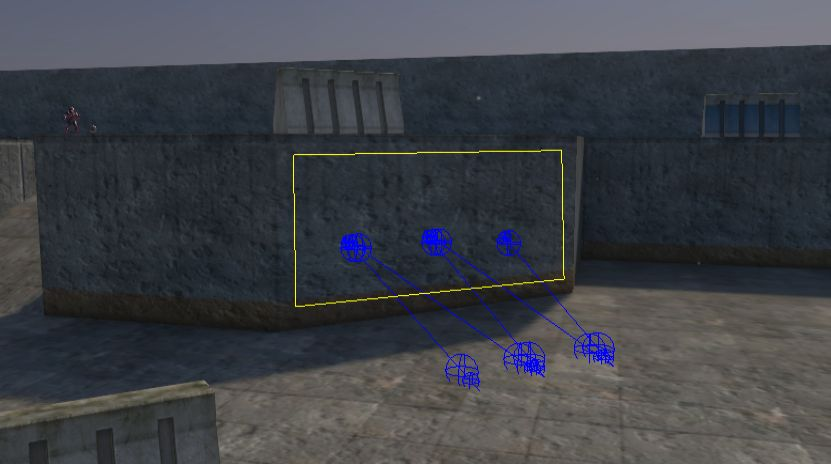
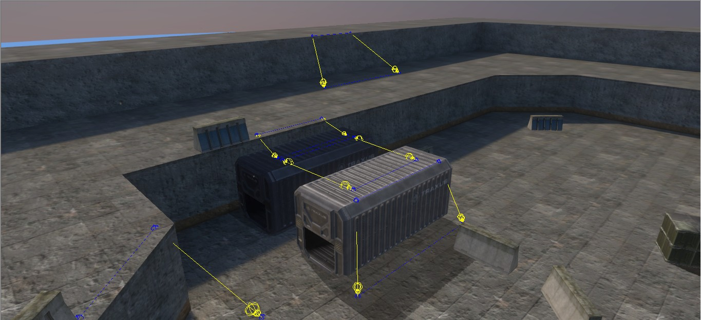
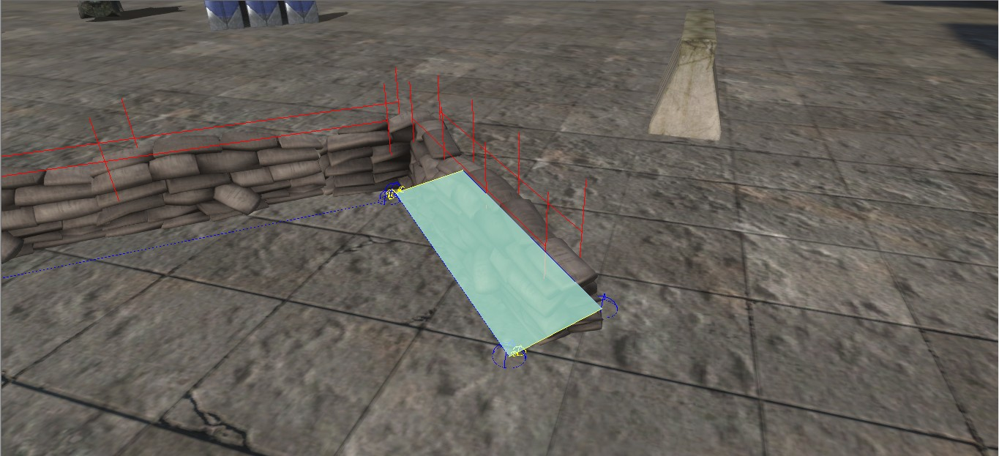
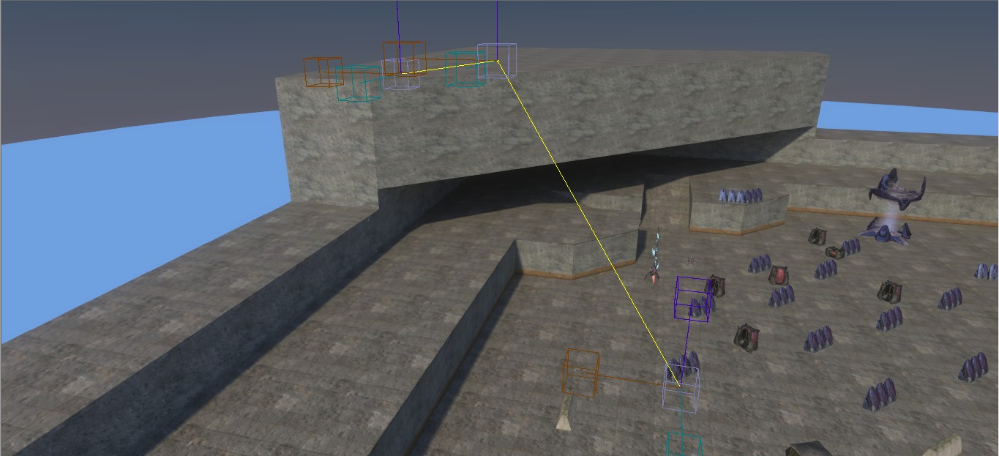
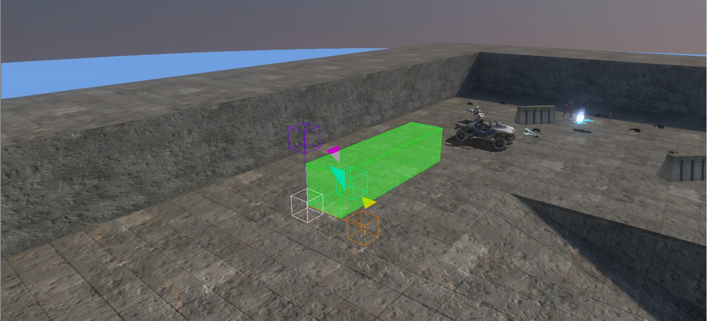
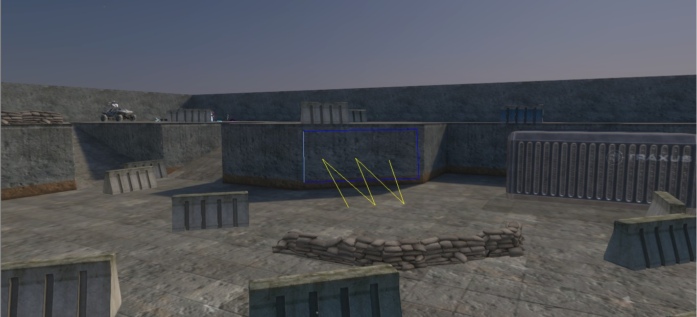

AI in Halo 3, with some exceptions for dynamic objects like [crates](~crate) and [vehicles](~vehicle) utilize pre-caculated pathfinding to navigate level geometry, this is then combined with placed firing positions to act as "goals" to use for behaviors such as firing, covering or just standing on.

When a level is imported, depending on the conditions of the level, the ability for the AI to find a navigable path along the geometry is effected. For example small gaps that players would ignore may cause AI to be unable to transition the platforms between the gap, thus a jump hint would be needed so the AI can bridge the jump.

A notable cause of pathfinding failure on new levels can be from open edges, levels in early itertations of the blam engine rely on collision supplied from BSP calculations, as such levels much be entirely sealed: like a balloon, any holes in this balloon will cause pathfinding failure.

# Usage

While your level may be sealed and pathfinding can take place, this is fundamentally useless to the AI unless they have zones and areas set to them for them to navigate, this section will detail the various types of pathfinding and navigation info needed for proper AI usage.

## Zones

The highest level of the AI pathfinding system for gameplay purposes, [objectives](~) will reference these so that their [tasks](~objectives#tasks) can reference the areas of that zone, squads can reference an initial zone to navigate around (assuming their objective doesn't move them to a different zone).

| Zone properties | Description
|-------|----------
| Manual bsp index | Allows the level designer to bypass the automatic bsp assignment for a zone, defaults to *on*
| Giants zone | Marks the zone for use with [Scarab units](~h3/guides/units/scarab#overview)
| Manual bsp | Lets you set what BSP this zone should be assigned to

## Areas


Scarabs do not use vehicle areas, they use normal infantry areas, keep in mind they still need [giant hints](~pathfinding#hints)


Contains firing positions, contained within zones, [tasks](~objectives) will reference these in order to determine what area of the map this AI (Using this task) shall navigate around. Areas can be marked so that only vehicle units can use them.

The intended method is to assign a zone to an objective, then all tasks will be assigned areas in that zone, trying to assign areas from other zones will **crash sapien**, however if you do **not** set a zone in the objective then tasks will freely allow different areas from other zones to be referenced, though you will lose the visual UI element for adding areas and must manually add them via the properties window

| Area properties | Description
|-------|----------
| Vehicle area | Marks this area for vehicle use, vehicles can only use these areas and firing points, if a task has only vehicle areas assigned, any dismounted infantry squads will be stuck with a [green triangle](~pathfinding#debugging), firing points are marked with a single diagonal line
| Depreciated0 | Unknown, needs additional research
| Manual reference frame (flag) | Unknown, needs additional research
| Turret deployment area | This area will be marked so that AI units carrying undeployed turrets will move to and dynamically deploy their turrets onto and in the direction of it's firing positions, firing points are marked with an external center line and sphere from the front
| Manual reference frame (index) | Unknown, needs additional research

## Firing positions

The lowest level of the AI pathfinding system for gameplay purposes, AI use these individual points as spots they can fire from or move between and these firing positions can be set with various properties using the properties window in Sapien with a firing position selected.


Pictured from left to right: corner right, bunker and corner left, vectors of firing positions facing north


| Posture flags | Description
|-------|----------
| corner_left | allows AI to perch along walls facing to the right of this firing positions vector, uses "corner_cover_left" and "cover_open_left" animations
| corner_right | allows AI to perch along walls facing to the left of this firing positions vector, uses "corner_cover_right" and "cover_open right" animations
| bunker | allows AI to bunker on this firing position when accounting for an enemy presence in front of this firing positions vector, uses "bunker_cover" and "bunker_open" animation

# Creation

Setting up pathfinding is very simple, assuming your level is proper and is lacking geometry errors that would inhibit pathfinding generation, you can start the creation of areas and zones by placing down firing positions.

With [Sapien](~h3/h3-ek/h3-sapien) open, navigate in the main hierarchy window to the AI tab, under this AI tab you will find a *Zones* tab, click this and then click the "New Instance" button, this will create a brand new empty zone from which you can now edit.


Pictured: The hierarchy window in Sapien, showing the zones tab and the "New Instance" button


Now with your zone created, you can give it a name, set some flags and add some firing positions. With your zone still active you can navigate to the firing position tab and click it, now you are in firing position creation mode.

Using right click in the game window you can place new firing positions. You can also use left click and drag firing positions to move them, clicking and selecting a firing position with an area assigned, and then making a new firing position will create it with the area of the previously selected firing position.


Pictured: The hierarchy window in Sapien, showing the current zone selected and some new firing positions


After making your firing positions, you can click and drag to area select firing positions, or hold shift and click more to add, once you have gathered as many firing positions as you want, tap ctrl + N to assign all selected firing positions to a brand new unnamed area. From here you can create as many areas as you want, each new area will be assigned a new color and you can assign areas whatever name you want.


Hint: with a firing position selected, you can use the mouse scroll wheel to change it's area to one of the areas already in this zone


And lastly, once *any* changes or additions to hints or firing positions are made, make sure (re)generate pathfinding in Sapien using the "Generate all pathfinding data" button under the "Scenarios" tab in the top left

# Pathfinding policies

The main setting you control as a map maker is the pathfinding policy used by objects such as [crates](~crate) or [scenery](~). [vehicles](~vehicle) and [bipeds](~biped) use dynamic pathfinding to allow AI to navigate around them, as these objects themselves can move and change orientation.

| Policy type | Description
|-------|----------
| Default | Uses the default pathfinding type that the object itself has, [scenery](~) usually uses cut-out while [crates](~crate) use dynamic
| Dynamic | This policy is typically used on objects that can move around the map, allowing AI to constantly update their pathfinding around and on this object, used for crates and device machines
| Cut-out | This item is cut-out of the pathfinding mesh entirely, being a "dead zone" of sorts that AI will navigate around
| Static | Similar to dynamic but for non-moving objects, stitches them into the pathfinding mesh so AI can navigate around, ontop and through them
| None | This item is ignored entirely for AI pathfinding calculations, AI will not attempt to navigate around this object

# Hints

Hints are used by the scenario editor to allow more fine tuning of the AI navigation when interacting with the level geometry, examples include things like cookie cutters to block pathfinding entirely or climb hints to allow AI to climb walls that are normally impassable. Hints can be viewed using `ai_render_hints 1`.

Most hints will have two general flags:
- bidirectional : AI can use this hint going fowards and backwards across it, some exceptions apply
- closed : Unknown/needs additional research

## Well hint

Using right click you draw a path for certain AI to take to jump on or off walls or ceilings that contain [flood hint sectors](~pathfinding#flood-hint), closing the path with left click.

## Jump hint

Using right and left click you draw a set of vectors (starting from the top two points) that detmermines a direction for AI to take jumps in, can also be used for for vaulting, a section below will detail additional flags.

| Jump hint flags | Description
|-------|----------
| magic lift  | Unknown/needs additional research
| vehicle only  | Unknown/needs additional research
| railing  | Treat this hint as a vault in which AI will try to vault over the obstacle using their vault animations
| vault  | Unknown/needs additional research

## Climb hint

Using right and left click draw a vertical path from which AI will attempt to climb up. Depending on the height of the hint AI will either use hoist step, hoist crouch or hoist stand animations. Place starting point near the base of the climb with the end point slightly inland from the exit of the climb for best results.

## Flight hint

Using right click draw a path of points in which flying AI can use to fly around an area without the use of firing positions, close with left click.

## Cookie Cutter hint

Using right click you create a box that you can alter the dimensions of, inhibits *all* pathfinding through the area of the cookie cutter box.

## Flood hint

Using right click you draw an enclosed area that certain AI will climb on or off, seal this area with left click, typically used for drones or flood pureforms to climb on, walk around and attack from walls, needs [well](~pathfinding#well-hint) hints.

## Giant hint

 hints draw a path between the sector hints")

Consists of two sub-types: sector hints and rail hints, sector hints are used to define the area in which scarabs will pathfind (Used *with* scarab zones) and rail hints are used for the scarab to transition between different sectors, use right click to create vertices in the sector or the starting position of the rail and left click to seal the sector or end the rail, **see [the scarab usage guide ](~h3/guides/units/scarab) for more info about setting up scarab units for gameplay.**

## Object hints

Objects such as [crates](~crate) have the ability to use dynamic hints such as vaulting, mounting and hoisting, these are defined by markers on the [render_model](~)

# Debugging

When spawning in AI, you may notice certain issues with them, among these are colored triangles above their heads: green means no firing positions available to that AI. Yellow can appear if there's a rather limited number of firing positions for the number of AI in the task, or if the AI cannot pathfind to the assigned firing positions. Finally a red triangle can appear if the AI lacks the idle and alert [style](~) behaviors when in those states [(assumed combat status 1 and 2)](~ai#combat-status-and-alertness), but there may be more conditions it can appear under that are not yet known.