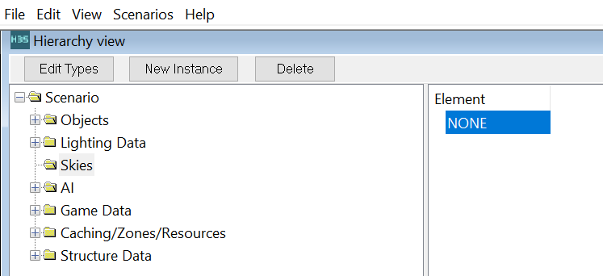
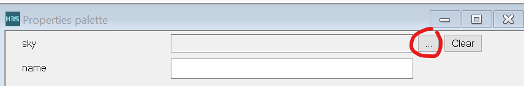
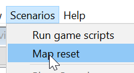
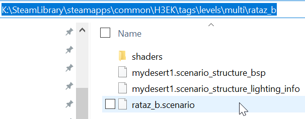

# Basic Lighting

Here we will cover adding a sky and light baking.


By default a level will be unlit, and without a sky. Objects will be black because there is no light in the scene.  Halo has both static baked lighting, and dynamic lighting.  Here we will cover baked lighting.

# Choose a sky for the scene.

1. Select the "Skies" folder and click "New instance"\


2. Select the new instance (called NONE) which was created.  


3. In the Properties pane, click the [...] button.<br> 


4. Add a sky from one of the multiplayer levels, open the a sky folder of one of the multiplayer maps.<br> 

5. Select the .scenery file.<br>  

6. Now reset the map to see the change applied.<br> 


<br><br>

# Baked the outdoor light

To bake light on a bsp, we use the python script in the H3EK folder called ``calc_lm_farm_local``.
Sapien will often close when light is being baked, so be sure to save the scene beforehand.

The general format is:
```python calc_lm_farm_local.py <scenario tag file, w/o .ext> <bsp name> <quality> (<light_group>)```

For example

```python calc_lm_farm_local.py levels\multi\rataz_level1\rataz_level1 mylevel_bsp00 low```

Where the scenario fole is called rataz_level1
The bsp file is called mylevel_bsp00
The lighting quality is set to low.

The available ```<quality>``` inputs are:
- high
- medium
- low
- direct_only
- super_low
- draft
- debug

<br><br>

# Baked indoor lights

Use create a new material, check off ```Halo Material Properties``` and adjust the Halo Scene properties.  Try a power around 25 to start.


Re-bake the bsp and view the result.

You can also use ordinary Blender lights such as point lights.

# Troubleshooting

## Fgather error
No instanced geo can be outside the map.

```
 farm stage: fgather  (0:02:36.812002)
Client tool execution failed, see log for details: faux\111\logs\fgather0.txt
Traceback (most recent call last):
  File "H:\SteamLibrary3\steamapps\common\H3EK\calc_lm_farm_local.py", line 56, in <module>
    launch_farm("fgather", client_number)
  File "H:\SteamLibrary3\steamapps\common\H3EK\calc_lm_farm_local.py", line 39, in launch_farm
    raise RuntimeError("Client error code: " + str(p.returncode))
RuntimeError: Client error code: 4294967295
```

Cause: No instanced geo can be outside the map.

Solution: Delete any objects using instanced geometry which are outside the bounds of the enclosed map area.

## Scenario file name not found

The python script could not find the file.

```
K:\SteamLibrary\steamapps\common\H3EK>python calc_lm_farm_local.py levels\multi\rataz_b\mydesert1  mydesert1  draft
*** faux_data_sync *** (0:00:00)
Using normal photon cache
Dumping of raw samples disabled
LOW FRAGMENTATION HEAP ENABLED
FOUND 12 LOGICAL PROCESSORS
LIGHTMAPPER FAILED: scenario [levels\multi\rataz_b\mydesert1] failed to loadTraceback (most recent call last):
  File "K:\SteamLibrary\steamapps\common\H3EK\calc_lm_farm_local.py", line 45, in <module>
    subprocess.check_call([tool_name, "faux_data_sync", args.scenario, args.bsp_name])
  File "C:\Users\John\AppData\Local\Programs\Python\Python312\Lib\subprocess.py", line 413, in check_call
    raise CalledProcessError(retcode, cmd)
subprocess.CalledProcessError: Command '['tool_fast', 'faux_data_sync', 'levels\\multi\\rataz_b\\mydesert1', 'mydesert1']' returned non-zero exit status 4294967295.
```

The proper input should have been
```python calc_lm_farm_local.py levels\multi\rataz_b\rataz_b mydesert1 draft```


# Other tips

- If the lightmapper is still failing, you can try deleting the ```faux``` folder in H3EK.