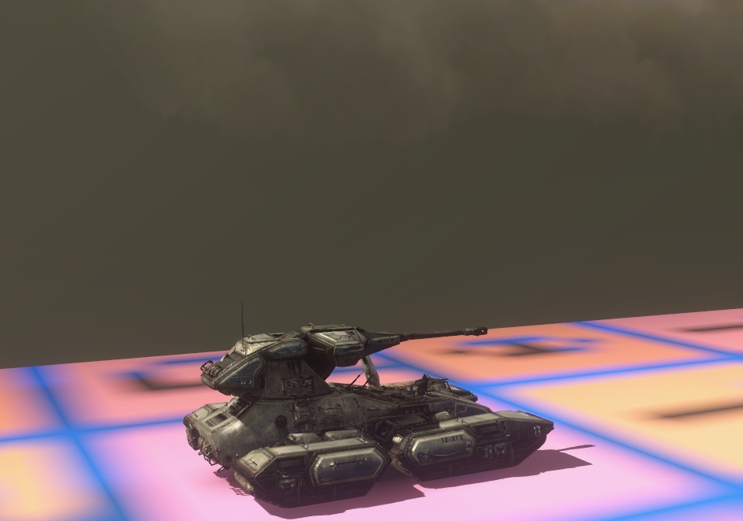
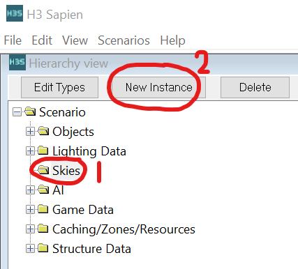
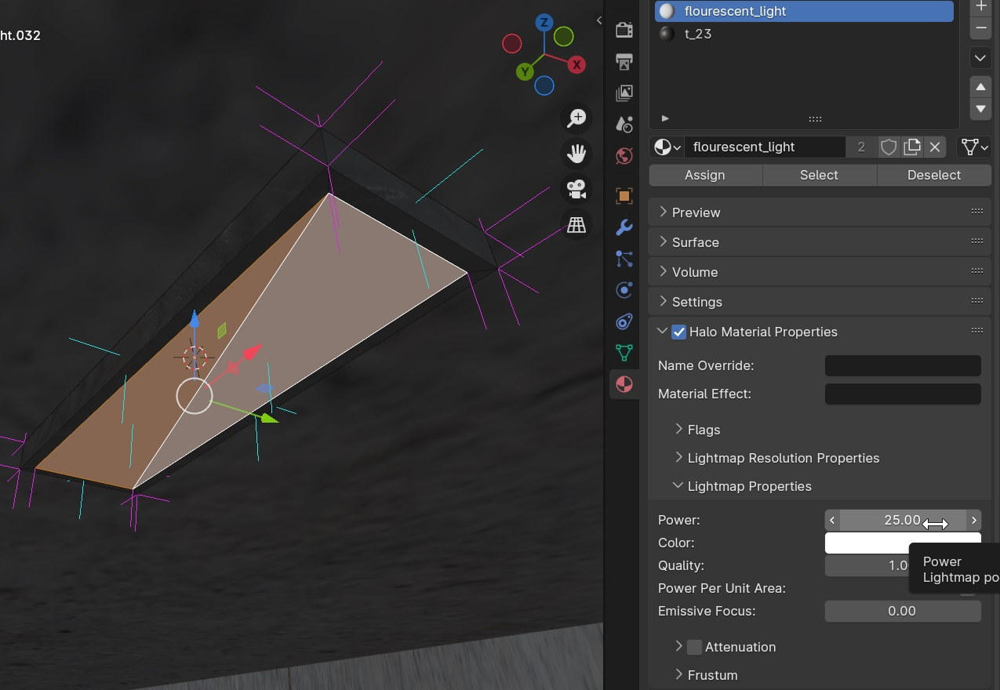

Here we will cover adding a sky to a scenario, setting up light emitting materials, and then lightmapping a BSP of that scenario.

# Basic Lighting

| Non-lightmapped level     | Lightmapped level     |
|---------------------------|-----------------------|
|  |  |

By default a scenario will be unlit, and without a sky. Objects will not be lit realistically because there is no light in the scene, and light-emitting materials will not illuminate their surroundings.

# Choose a sky for the scene

Because the sky affects the light in a scene, before lightmapping a scenario BSP we must choose a sky.

| No sky               | With sky                   |
|----------------------|----------------------------|
|  |  |

Open up your scenario with [Sapien](~h3-sapien), then:

1. Select the "Skies" folder and click "New instance":
  
2. Select the new instance (called NONE) which was created.  
  
3. In the Properties pane, click the [...] button.<br> 
  
4. Add a sky from one of the multiplayer levels, open the a sky folder of one of the multiplayer maps.
  
5. Select the .scenery file.
  
6. Now reset the map to see the change applied.
  

# Set up indoor lighting
Even with a sky set up, you may still have dark areas of your map that you want to illuminate with light emitting materials. This could include indoor lights or outdoor lights for night maps.

1. Create a new material and assign it to an object or some faces of the object.
2. Check off _Halo Material Properties_ and adjust _Lightmap Properties_. Try a power around `25` to start.



Note: You can also use ordinary Blender lights such as point lights.

# Bake lightmaps
With a sky and light emitting materials set up, it's time to bake lighting. This process needs to be re-run any time you want to adjust lighting parameters, such as the lightmap power of materials or which sky your map uses.

To bake light on a bsp, we use the [python](https://www.python.org/) script in the H3EK folder called `calc_lm_farm_local.py`. Sapien will often close when light is being baked, so be sure to save the scene beforehand.

The python script is run via a [command prompt](~command-line). The general format is:
```cmd
python calc_lm_farm_local.py <scenario> <bsp_name> <quality> [light_group]
```

The arguments are:
* **scenario**: A scenario [tag path](~/general/tags#tag-paths-and-references). This is the path to a scenario tag _within_ the `tags` folder, and without the `.scenario` extension.
* **bsp_name**: The name of the BSP to light, since a scenario can have multiple BSPs. You can use `all` to light all BSPs in the scenario.
* **quality**: Lighting quality; higher takes longer. Valid values are:
  * `high`
  * `medium`
  * `low`
  * `direct_only`
  * `super_slow`
  * `draft`
  * `debug`
* **light_group**: This argument is optional so can be omitted. It allows subsets of the BSP to be relit but defaults to `all` which is usually what you want to keep lighting consistent across the level.

For example:

```cmd
python calc_lm_farm_local.py levels\multi\rataz_level1\rataz_level1 mylevel_bsp00 low
```

It is best to start with `draft` or `low` quality until the final design of the level mesh is finalized, because the lightmapping process can take a long time. Once it completes your level should have baked lighting.

# Troubleshooting

## Fgather error
Cause: No instanced geo can be outside the map.

```
 farm stage: fgather  (0:02:36.812002)
Client tool execution failed, see log for details: faux\111\logs\fgather0.txt
Traceback (most recent call last):
  File "H:\SteamLibrary3\steamapps\common\H3EK\calc_lm_farm_local.py", line 56, in <module>
    launch_farm("fgather", client_number)
  File "H:\SteamLibrary3\steamapps\common\H3EK\calc_lm_farm_local.py", line 39, in launch_farm
    raise RuntimeError("Client error code: " + str(p.returncode))
RuntimeError: Client error code: 4294967295
```

Solution: Delete any objects using instanced geometry which are outside the bounds of the enclosed map area.

## Scenario file name not found
Cause: The python script could not find the file.

```
K:\SteamLibrary\steamapps\common\H3EK>python calc_lm_farm_local.py levels\multi\rataz_b\mydesert1  mydesert1  draft
*** faux_data_sync *** (0:00:00)
Using normal photon cache
Dumping of raw samples disabled
LOW FRAGMENTATION HEAP ENABLED
FOUND 12 LOGICAL PROCESSORS
LIGHTMAPPER FAILED: scenario [levels\multi\rataz_b\mydesert1] failed to loadTraceback (most recent call last):
  File "K:\SteamLibrary\steamapps\common\H3EK\calc_lm_farm_local.py", line 45, in <module>
    subprocess.check_call([tool_name, "faux_data_sync", args.scenario, args.bsp_name])
  File "C:\Users\John\AppData\Local\Programs\Python\Python312\Lib\subprocess.py", line 413, in check_call
    raise CalledProcessError(retcode, cmd)
subprocess.CalledProcessError: Command '['tool_fast', 'faux_data_sync', 'levels\\multi\\rataz_b\\mydesert1', 'mydesert1']' returned non-zero exit status 4294967295.
```

Solution: The proper input should have been
```python calc_lm_farm_local.py levels\multi\rataz_b\rataz_b mydesert1 draft```


# Other tips

* If the lightmapper is still failing, one possible solution is deleting the ```faux``` folder in H3EK and re-baking again.
* Use your command prompt's history (press ) to avoid typing the lightmapping command out repeatedly.