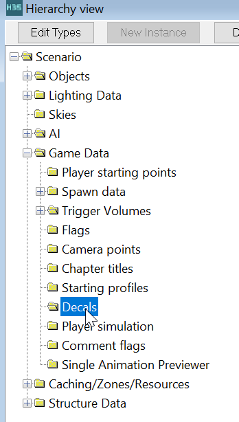
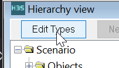
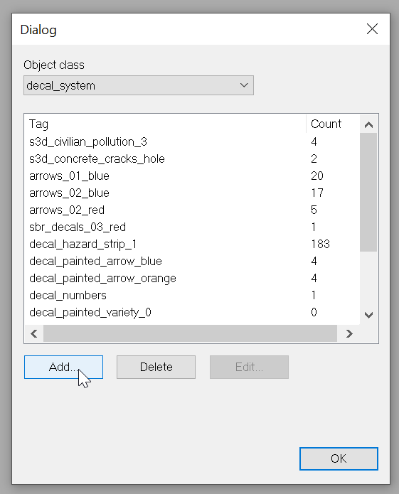
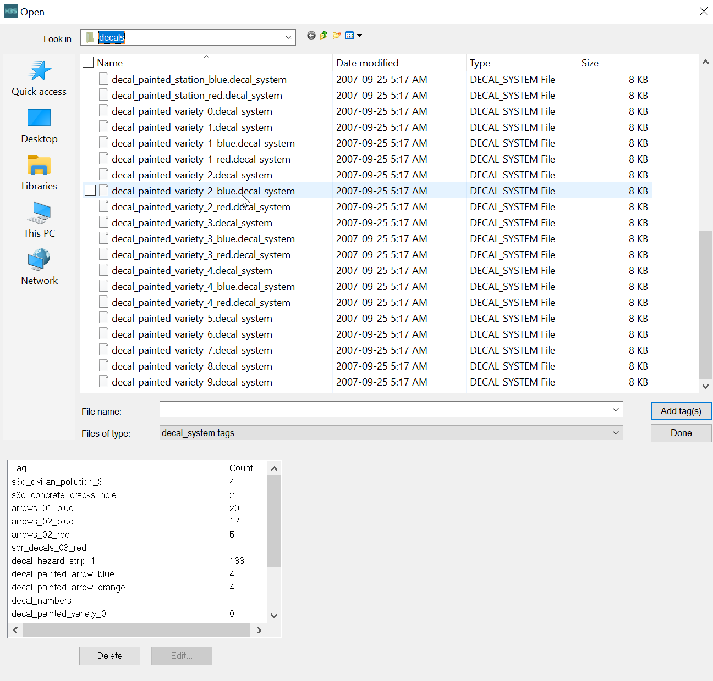
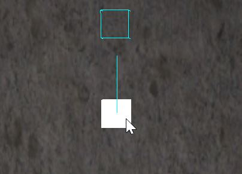
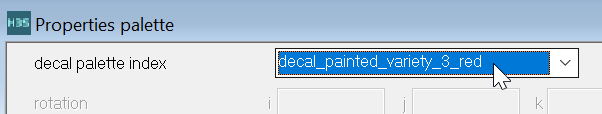
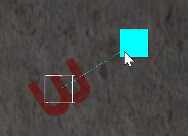

Halo 3 Sapien includes a decal system to decorate maps without baking the details into the map textures. Decals allow signs and scuff mark images to be moved around in the level without re-texturing and relighting the map.

# Usage

1. In Sapien, click the _Decals_ folder to select it. 
  

2. Click edit types. 
  

3. Add a decal system. 
  

4. Add a decal from a map.  sd3 multiplayer maps have a good selection of decals. 
  

5. In the scene view, rightclick a wall to place a decal.
  
    
6. Choose from the properties dropdown which decal it should be. 
  

7. Click and drag the blue handle to rotate decals. 
  