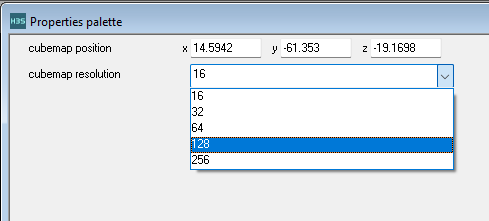
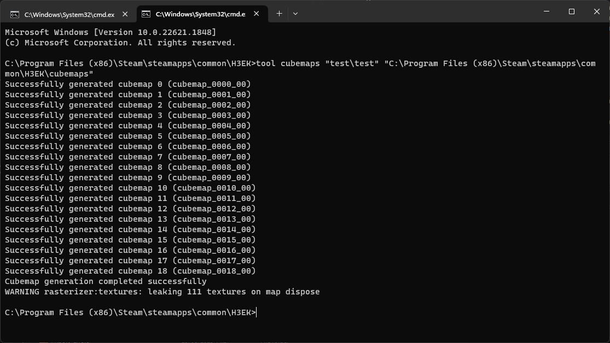
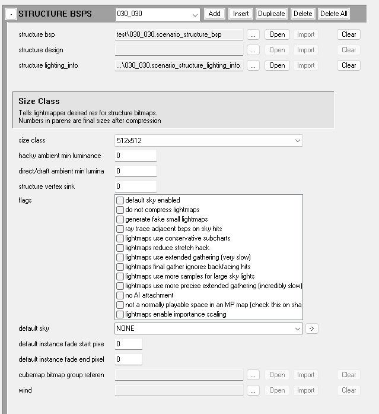
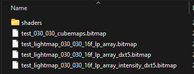

# Introduction

Halo 3 introduced a **dynamic cubemap** system in conjunction with **dynamic environment mapping** which allows you to place down points in a level where cubemaps should be generated, this allows any objects, and map geometry their shaders to display reflections based on where those cubemap points were placed.

For objects, the cubemap changes depending on which point you're closest to.
For level geometry, the cubemap that gets used is determined by which cubemap point is inside of the current cluster.


For shaders to display dynamic cubemaps, you must set the ***environment_mapping*** option at the top of the shader tag to ***dynamic***. Otherwise it'll display the default cubemap.



# Setup

## Placing cubemap points
Cubemap point placement is done through Sapien, to place down points you will need to navigate to _Scenario > Structure Data_ and click on the _Cubemaps_ folder in the **_Hierarchy view_** window, once inside you should now be able to right click inside of the _Game window_ and place down cubemap points which will then appear in the _Hierarchy view_.


### Cubemap resolution
By default any placed cubemap points will be 16x16 in resolution, but you can change that by clicking the cubemap point in either the _Hierarchy view_ window or the _Game window_ and changing the **_cubemap resolution_** option in the **_Properties palette_** window.



Higher Resolutions will result in clearer, more visible reflections but will negatively impact the size of the cubemaps bitmap tag and in turn, the compiled cache file.


## Generating cubemaps
We can now move on to generating the cubemaps. To do this it's recommended you use [Standalone](~h3-standalone-build) (halo3_tag_test.exe).

If you're generating cubemaps for a multiplayer level, use the following console commands in order:

```console
game_multiplayer slayer
; Replace with the path to your actual .scenario tag WITHOUT the extension:
game_start path\to\scenario\scenario
```

If you're generating cubemaps for a campaign level, you will only need to run the `game_start` command using the same format as above.

When you're loaded in the level, open the console and run the following commands:

```console
set terminal_render false
set console_status_string_render false
set events_debug_spam_render false
error_geometry_hide_all
```

This will ensure that no debug text is visible on screen as those will be visible during cubemap generation which we do not want. Finally, open the console once more and run the [`cubemap_dynamic_generate`](~scripting#functions-cubemap-dynamic-generate) command and wait for it to finish.

## Importing cubemaps
### Making the .bitmap tag
We can now import our cubemaps into a [bitmap](~) tag. To do so open a [command prompt](~command-line) window in your **H3EK install folder** and run the `tool cubemaps` command with the first arguement pointing to your scenario tag **(without the .scenario extension)** and the second arguements pointing to the cubemaps folder in the root of your H3EK folder like so:

```sh
tool cubemaps "path\to\scenario\scenario" "(H3EK Folder)\cubemaps"
```



### Referencing the cubemaps bitmap
After all of that, we can finally reference our cubemaps bitmap to our level. Open your level's [scenario](~) tag with [Guerilla](~h3-guerilla) and look for the **_Structure BSPs_** block:


Click on the **...** button next to **_cubemap bitmap group reference_** and navigate to the folder where your scenario is stored. The `cubemaps` command we ran earlier should have generated a bitmap tag that includes your scenario's name, the BSP the cubemaps were taken in, and ends with `_cubemaps`.

For example with a scenario named `test` and a BSP named `030_030`, the bitmap bitmap tag would be `test_030_030_cubemaps.bitmap`:



If you have multiple BSPs setup in your scenario, make sure to assign the correct cubemaps bitmap to each one.

## Fixing highly-compressed cubemaps
Occasionally (and for currently unknown reasons), tool may produce cubemaps that look incredibly low quality, with bad colour compression. See
this example:


This can be fixed, but only *before* cubemap generation.
1. Before you use the `cubemap_dynamic_generate` cubemap command, open the debug menu with the  key.
2. Press  to enter the `Graphics` sub-menu.
3. Press  to enter the `Rasterizer` sub-menu.
4. Use the arrow keys to navigate to the `HDR Multiplier (stops)` option.
5. Use the left arrow key to reduce the value of this option to zero.
6. Now exit out of the debug menu (use  or ) and continue with the rest of the process as normal.

Once you have finished re-generating and re-importing the cubemaps, they should be much better quality! See the following example:


# End result

After you've completed all steps, you should now have a level setup with dynamic cubemaps!


