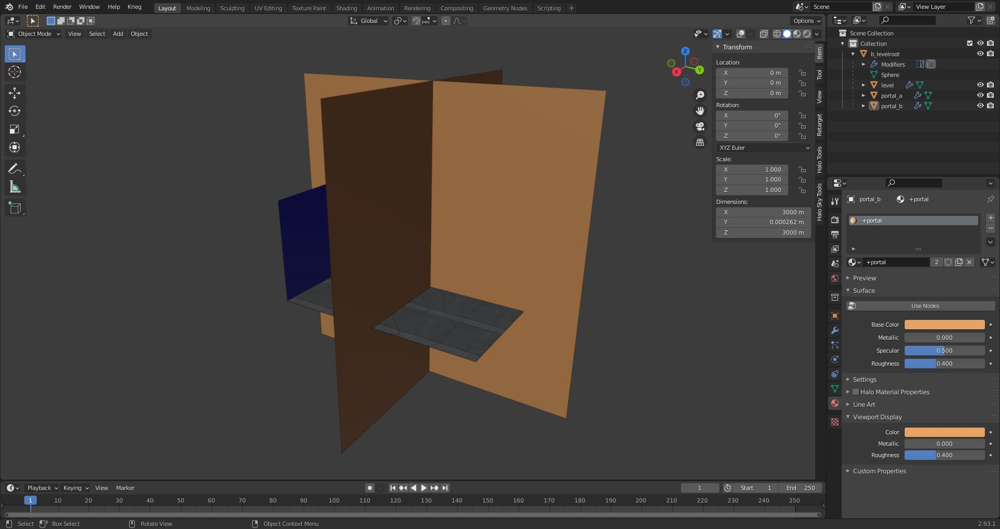

# File List
| File Link                                                                                                           | Description
|-------------------------------------------------------------------------------------------------------------------- | --------------------------------------------------------------------------------
[Multiple Skies Example Blend](https://drive.google.com/file/d/1GxyTNx5mcGwroXOfMEx6wANg5gxpYG4w/view?usp=sharing)    | A blend file showcasing how to use multiple skies in a scene.
[Portals Example Blend](https://drive.google.com/file/d/1VD9kqK4koJ0jWxTND8ccJely4kFRQwGO/view?usp=sharing)           | A blend file showcasing how to use the special +portal material in a level.
[Instance Geometry Example Blend](https://drive.google.com/file/d/1F60i-UsvlfZUuAcB4Trdyww7_9svLyw-/view?usp=sharing) | A blend file showcasing how to use the instance geometry in a level.

# Multiple skies
It's possible to use multiple skies in your level by adding a digit to the end of your `+sky` material. If we wanted three skies in our level for example we would have the following:

```
+sky0
+sky1
+sky2
```

It's important that the digit at the end of the material starts at zero. The digit will be used as an index by the cluster to get a sky tag reference from the scenario skies tag block. You'll also have to make sure that a cluster does not use more than one sky or you will get an error on import.

If you were not aware, a cluster is a section of a level divided by a portal. In the case of the provided blend file above there are 7 clusters. If a map has no portals then there is one cluster. Be sure to also prevent multiple skies from being able to be seen by the player at once, or else the player will see a sudden transition between them when moving between clusters. Tool will output a warning if a sky can see another sky.

Avoid using trailing digits on non-sky material names, or you'll get tool warnings about duplicate shaders, and avoid numbers in shader tag names. Use letters instead if you need to make variants.

# Weather polyhedra
You may be aware of weather polyhedra from previous games. This was a feature that allowed map designers to prevent weather effects from appearing in a certain section of level. I regret to inform you that this is not a feature in Halo 3. It seems to be have been deprecated during the switch from weather tags to atmosphere parameters.

# Multiple BSPs
It is common for singleplayer maps to have multiple BSPs. This helps manage game resources and avoid BSP limits for long missions. To accomplish this, place multiple `ASS` files in the same `structure` folder for the level. Each ASS will be compiled into it's own unique BSP tag for your scenario to use. Do not attempt to use multiple BSPs in an MP scenario.

# Object Symbols
Object symbols are characters that go at the start of the object name.

| Symbol | Description
|------- | -----------------------------------------------------------------------------------------------------------------------------------------------------------------------------------------------------------------------
| `#`    | Marker object prefix. Used to tell the JMS exporter that this object is to be treated as a marker.
| `!`    | World node object prefix. Used to tell the JMI exporter that this object is to be treated as a world node.
| `%`    | Instanced object prefix. Used to tell the ASS exporter that this object is to be treated as instance geo.
| `@`    | Collision object prefix. Used to tell the JMI exporter that the object is to be written to a JMS containing only collision geometry.
| `$`    | Physics object prefix. Used to tell the JMI exporter that the object is to be written to a JMS containing only physics geometry.
| `+`    | Static pathfinding prefix. Used in conjunction with the instance object prefix to tell tool how to handle pathfinding for this object. In the case of this symbol it will generate pathfinding for the mesh.
| `-`    | Not pathfinding prefix. Used in conjunction with the instance object prefix to tell tool how to handle pathfinding for this object. In the case of this symbol ignore the object while generating the pathfinding mesh.
| `?`    | Light object per vertex. Used in conjunction with the instance object prefix to tell tool how to handle lighting for this object. In the case of this symbol it will set the geo to use per vertex for lightmap policy.
| `!`    | Light object per pixel. Used in conjunction with the instance object prefix to tell tool how to handle lighting for this object. In the case of this symbol it will set the geo to use per pixel for lightmap policy.


# Portals
Portals are plane objects that cut through geometry to divide it into sections called clusters. This is either usually to enhance performance or section off a part of a level in order to set specific environment sounds or effects in that area. Portals are defined by the special material name `+portal`. Portals can also intersect without needing to be connected unlike CE. This makes it extremely simple to just generate a set of grid portals to quickly test high poly geometry before making better portals. See the `Portals Example Blend` and [Materials Overview][materials] for examples.



# Instance Geometry
Instance geometry is geometry that is linked and duplicated to cut down on used memory. It's also a decent way to avoid having to stich in geometry into your BSP. Think of it like scenery objects with lightmaps. The ASS exporter checks if an object is an instance by seeing if it has linked mesh data. They should also have the `%` symbol at the start of their object names. The only unique property that instance can have is uniform scale. All instances will otherwise look the same. See the `Instance Geometry Example Blend` for an example on how to use this.

Object data in Blender can be linked with the <kbd>Ctrl</kbd> + <kbd>L</kbd> hotkeys.


# Infinite Water Plane
You may be aware of infinite water planes from Halo 2. This was a feature that allowed map designers to set an infinite water plane at a certain height in the level. I regret to inform you that this is not a feature in Halo 3. It seems to be have been deprecated.

# XREFs

[wiki-polyhedron]: https://en.wikipedia.org/wiki/Convex_polytope


