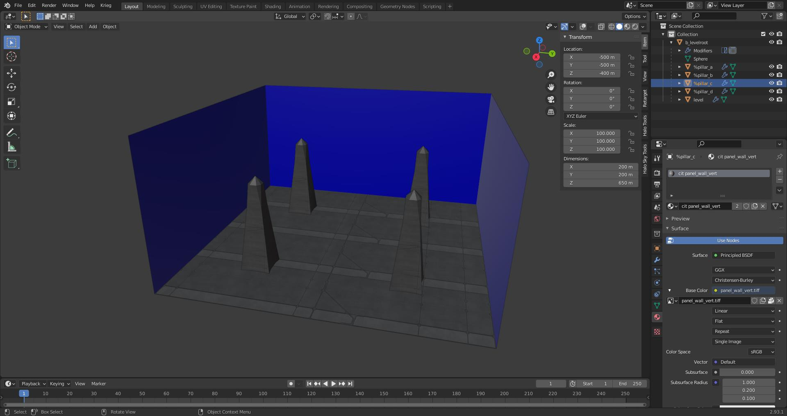

# File List
| File Link                                                                                                           | Description
|-------------------------------------------------------------------------------------------------------------------- | --------------------------------------------------------------------------------
[Multiple Skies Example Blend](https://drive.google.com/file/d/1GxyTNx5mcGwroXOfMEx6wANg5gxpYG4w/view?usp=sharing)    | A blend file showcasing how to use multiple skies in a scene.
[Portals Example Blend](https://drive.google.com/file/d/1VD9kqK4koJ0jWxTND8ccJely4kFRQwGO/view?usp=sharing)           | A blend file showcasing how to use the special +portal material in a level.
[Instance Geometry Example Blend](https://drive.google.com/file/d/1F60i-UsvlfZUuAcB4Trdyww7_9svLyw-/view?usp=sharing) | A blend file showcasing how to use the instance geometry in a level.
[Water Visual Example Blend](https://drive.google.com/file/d/1HH8NMal_PLlXNqpvi0WtGuEHS6iToTy6/view?usp=sharing)      | A blend file showcasing how to create water in a level.
[Water Physical Example Blend](https://drive.google.com/file/d/195Soo5_U3NRjyUhUa07TcERIPFxCCE2D/view?usp=sharing)    | A blend file showcasing how to create water in a structure-design file.
[Design Surfaces Example Blend](https://drive.google.com/file/d/1kLZjYTlr6qEZEWkGWQJh-XoEbsAZEuQp/view?usp=sharing)   | A blend file showcasing how to create barriers in a structure-design file.

# Multiple skies
It's possible to use multiple skies in your level by adding a digit to the end of your `+sky` material. If we wanted three skies in our level for example we would have the following:

```
+sky0
+sky1
+sky2
```

It's important that the digit at the end of the material starts at zero. The digit will be used as an index by the cluster to get a sky tag reference from the scenario skies tag block. You'll also have to make sure that a cluster does not use more than one sky or you will get an error on import.

If you were not aware, a cluster is a section of a level divided by a portal. In the case of the provided blend file above there are 7 clusters. If a map has no portals then there is one cluster. Be sure to also prevent multiple skies from being able to be seen by the player at once, or else the player will see a sudden transition between them when moving between clusters. Tool will output a warning if a sky can see another sky.

Avoid using trailing digits on non-sky material names, or you'll get tool warnings about duplicate shaders, and avoid numbers in shader tag names. Use letters instead if you need to make variants.

# Weather polyhedra
You may be aware of weather polyhedra from previous games. This was a feature that allowed map designers to prevent weather effects from appearing in a certain section of level. I regret to inform you that this is not a feature in Halo 3. It seems to be have been deprecated during the switch from weather tags to atmosphere parameters.

# Multiple BSPs
It is common for singleplayer maps to have multiple BSPs. This helps manage game resources and avoid BSP limits for long missions. To accomplish this, place multiple `ASS` files in the same `structure` folder for the level. Each ASS will be compiled into it's own unique BSP tag for your scenario to use. Do not attempt to use multiple BSPs in an MP scenario.

# Object Symbols
Object symbols are characters that go at the start of the object name.

| Symbol | Description
|------- | -----------------------------------------------------------------------------------------------------------------------------------------------------------------------------------------------------------------------
| `#`    | Marker object prefix. Used to tell the JMS exporter that this object is to be treated as a marker. If used in an ASS file then tool will use the object for direction in structure-design files.
| `!`    | World node object prefix. Used to tell the JMI exporter that this object is to be treated as a world node.
| `%`    | Instanced object prefix. Used to tell the ASS exporter that this object is to be treated as instance geo.
| `@`    | Collision object prefix. Used to tell the JMI exporter that the object is to be written to a JMS containing only collision geometry.
| `$`    | Physics object prefix. Used to tell the JMI exporter that the object is to be written to a JMS containing only physics geometry.
| `+`    | Static pathfinding prefix. Used in conjunction with the instance object prefix to tell tool how to handle pathfinding for this object. In the case of this symbol it will generate pathfinding for the mesh.
| `-`    | Not pathfinding prefix. Used in conjunction with the instance object prefix to tell tool how to handle pathfinding for this object. In the case of this symbol ignore the object while generating the pathfinding mesh.
| `?`    | Light object per vertex. Used in conjunction with the instance object prefix to tell tool how to handle lighting for this object. In the case of this symbol it will set the geo to use per vertex for lightmap policy.
| `!`    | Light object per pixel. Used in conjunction with the instance object prefix to tell tool how to handle lighting for this object. In the case of this symbol it will set the geo to use per pixel for lightmap policy.
| `~`    | Water group object prefix. If used in an ASS file then tool will use the object to generate water in a structure-design file.


# Portals
Portals are plane objects that cut through geometry to divide it into sections called clusters. This is either usually to enhance performance or section off a part of a level in order to set specific environment sounds or effects in that area. Portals are defined by the special material name `+portal`. Portals can also intersect without needing to be connected unlike CE. This makes it extremely simple to just generate a set of grid portals to quickly test high poly geometry before making better portals. See the `Portals Example Blend` and [Materials Overview][materials] for examples.


# Instance Geometry
Instance geometry is geometry that is linked and duplicated to cut down on used memory. It's also a decent way to avoid having to stich in geometry into your BSP. Think of it like scenery objects with lightmaps. The ASS exporter checks if an object is an instance by seeing if it has linked mesh data. They should also have the `%` symbol at the start of their object names. The only unique property that instance can have is uniform scale. All instances will otherwise look the same. See the `Instance Geometry Example Blend` for an example on how to use this.

Object data in Blender can be linked with the <kbd>Ctrl</kbd> + <kbd>L</kbd> hotkeys.



# Infinite Water Plane
You may be aware of infinite water planes from Halo 2. This was a feature that allowed map designers to set an infinite water plane at a certain height in the level. I regret to inform you that this is not a feature in Halo 3. It seems to be have been deprecated.

# XREFs

# Water
We will be using the end result of the level guide for this example but you can look at the completed files in the file list for the items listed here.

Water in Halo 3 is handled by two different files. The ASS file located in the level's `structure` sub directory will handle the visual aspects of our water plane while out of water. The ASS file located in the level's `structure-design` sub directory will handle things related to how our water region interacts with objects in the world. This includes actions such as objects floating on the surface and screen effects while the game camera is inside a water region. Lets go over setting up the visual aspect in the `structure` ASS file first.

## Visual
Starting with the visual aspects of our water, we will create a simple plane in our example level to represent the water in our game world. Do not worry about following the sealed world rules for now. We will be naming our new plane object `water_plane` and give it a Z height of -400 units. The plane should have a scale of `1000` units on the XYZ axis. We will also be giving it the following material name.

`river riverworld_water_rough'`

There are three aspects to this material name

* river - This is the shader_collection prefix that will be used to find the material name that follows after the space. In the case of the river prefix, that will tell tool to search for shaders in `levels\multi\riverworld` as set by the shader_collections.txt file in the `tags\levels` directory.
* riverworld_water_rough - The material name that will be used for the water on our level.
* `'` - This is a material symbol that lets tool know we are intending for this surface to be used as a water surface. This will help satisfy the sealed world rules for this mesh.

Once that is done go ahead and give the water plane four UV channels. The purpose of each UV channel are as follows.

* UV_0 - Used by the visual part of our mesh for displaying the texture.
* UV_1 - Used to mask the color of our water. Move your UV coordinates in the positive Y direction to make the water color more pronounced.
* UV_2 - ???
* UV_3 - ???

This ends everything we need to create in our `structure` ASS file. We can export our current scene and move on the the `structure-design` ASS file in the physical section.

## Physical
Now lets handle our water regions properly. We will start by creating another plane in our example level to represent the water in our game world. Give it a Z height of -400 units and set the scale to `1000` units on the XYZ axis. Go into edit mode and extrude the object down around `-100` units so that it will reach the bottom of our example level. Make sure that the normals are facing outside/away from the center of our object. We will also be giving it the following object name.

`~water_physics00`

There are two aspects to this material name

* `~` - This symbol tells tool to treat the mesh as a water group
* water_physics00 - Just the name for our object. Call it whatever you would like. We will be using water_physics00 in this example.

Now that we've created a water region lets add another object to define the direction objects will flow in. You can skip this step if you do not want there to be direction in a body of water you make. Add an `Arrows` object found under the `Empty` list in the `Add` menu. Set the scale on this object to 600.0 units on the XYZ axis. We will also be giving it the following object name.

`#water_direction00`

* `#` - This symbol tells tool to use the object rotation for direction.
* water_direction00 - Just the name for our object. Call it whatever you would like. We will be using water_direction00 in this example.

We will be using <kbd>Ctrl + P</kbd> with both `#water_direction00` and `~water_physics00` selected with `~water_physics00` being the active object in our scene. This will set `#water_direction00` to use `~water_physics00` as it's parent object. Now we can rotate our `#water_direction00` to define the direction that objects will flow in with the X axis being forward in this case. Lets rotate it 90 degrees.

Now we can export these assets to an ASS file. The ass file we create from the meshes we created must go in a different subdirectory from the assets created in the `Visuals` section. The `structure-design` command will also be used instead of the standard `structure` command to compile our ASS file.

# Design surfaces
Design surfaces are special surfaces that can be used to keep players in a set play space. These barriers do not affect AI and do not need to follow the sealed world rules. They can also be enabled or disabled with the script function `soft_ceiling_enable`.

There are three different types of surfaces.

```
+soft_ceiling
+soft_kill
+slip_surface
```

The following HS commands can be used to debug these.

```
debug_structure_soft_ceilings 1
debug_structure_soft_kill 1
debug_structure_slip_surfaces 1
```

## Soft ceilings
Objects that are set as soft ceilings will produce invisible barriers that prevent users from walking past the facing normal. If a user somehow ends up on the other side of one then walking near one will allow the user back into the play space. The format for these are as follows:

`+soft_ceiling:main_barrier`

There are four aspects to this name so lets break this down.

* `+` - Material symbol that lets tool know this is a special material.
* soft_ceiling - The type of barrier we wish to use for surfaces that have this material assigned.
* `:` - The separator between the barrier type and the name.
* main_barrier - The name for our barrier. This is what the user will give to the `soft_ceiling_enable` script function to disable it.

## Soft kill
Objects that are set as soft kill will produce invisible regions that kill the user once they enter it for longer than a second. The format for these are as follows:

`+soft_kill:death_barrier`

There are four aspects to this name so lets break this down.

* `+` - Material symbol that lets tool know this is a special material.
* soft_kill - The type of barrier we wish to use for surfaces that have this material assigned.
* `:` - The separator between the barrier type and the name.
* death_barrier - The name for our barrier. This is what the user will give to the `soft_ceiling_enable` script function to disable it.

## Slip surface
Objects that are set as slip surface will produce surfaces that cause players to slide back. This will prevent users from walking past the map boundary without making it too obvious that there is an invisible wall. The facing angle for faces marked as slip surfaces should be greater than 35 degrees. Tool will throw out an error otherwise and the surface will be disabled. The format for these are as follows:

`+slip_surface:slip_and_slide`

There are four aspects to this name so lets break this down.

* `+` - Material symbol that lets tool know this is a special material.
* slip_surface - The type of barrier we wish to use for surfaces that have this material assigned.
* `:` - The separator between the barrier type and the name.
* death_barrier - The name for our barrier. This is what the user will give to the `soft_ceiling_enable` script function to disable it.

[wiki-polyhedron]: https://en.wikipedia.org/wiki/Convex_polytope
