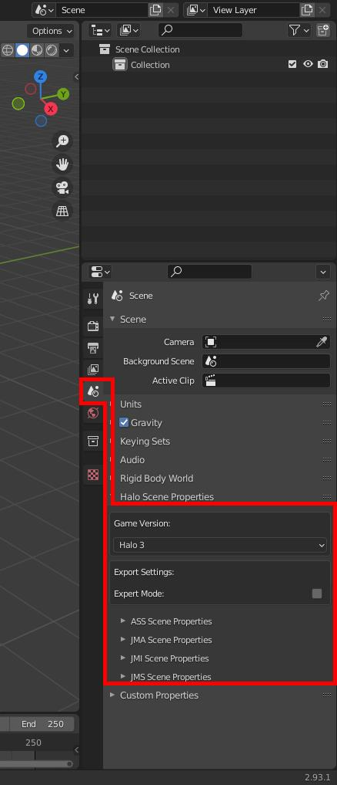

# File list
| File Link                                         | Description
|-------------------------------------------------- | -------------------------------------------------------------------
|[Blender 3D Software](https://www.blender.org/)    | The Blender application that we will be using to create our assets.

# Setting up Blender
[Installing the Blender addon][halo-asset-blender-development-toolset]

See the above link for setting up the Blender addon for exporting Halo assets if you haven't installed the addon already. Beyond that there may be a few other settings you may want to adjust with before starting with any modeling.

## Undo count
Consider increasing the number of edits you can undo in Blender by changing the setting in preferences. Be aware that increasing this setting will use up more of your system RAM, so keep the value reasonable.


## Hotkeys
There will probably be certain Blender functions you will be using repeatedly so it's probably a good idea to setup some quick hotkeys for important functions. You could do this later if you're not sure what you need now.

## Unit measurement
All units given in this guide are given with the expectation that your Blender instance is set to use metric units. If you haven't changed this then it's likely already set to metric by default. All units will also be given with the expectation that you are using global transforms.


## Scene options
An option added by the exporter to keep settings you don't need to care about hidden. Be sure to set game version to Halo 3 as seen below:



## Workspace
Since we are modeling lets be sure to pick the correct workspace for our work. Choose the `Modeling` workspace found in the top left by default. You don't need to see things like the timeline if you're just making a level so this should help simplify the experience.


## Clip start and end
The scale at which Halo levels are modeled is quite large. By default, Blender scenes have a viewport [clipping range][wiki-clipping] of `0.01 m` to `1000 m`. This means that parts of your model may be cut off when zooming out to large scales. Blender's clipping distances can be adjusted in the View settings pane (press <kbd>N</kbd> and select the View tab).

A x100 range of `1 m` to `100 000 m` works well for large outdoor maps:


## Key configuration
All hotkeys given in this guide are given with the expectation that you are using the default Blender 2.8 preset.

---

```.alert success
Ready to start modeling a level? Continue to the [next guide][blender-level-creation-beginner].
```

[wiki-clipping]: https://en.wikipedia.org/wiki/Clipping_(computer_graphics)#Clipping_in_3D_graphics
