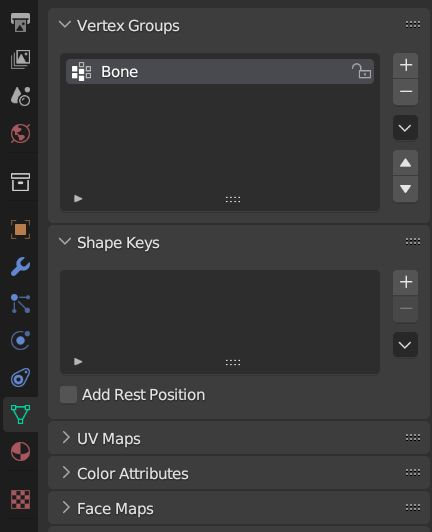
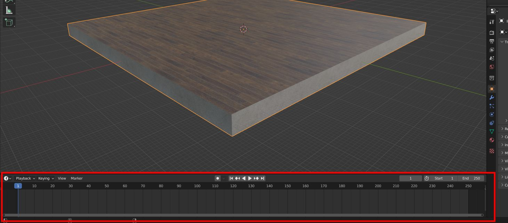
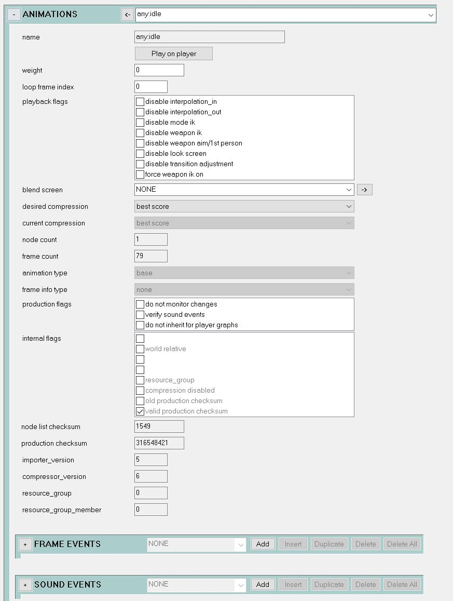


This guide assumes you have already [read/completed the previous tutorials](~object-importing).


# File list
| File Link                                                                                          | Description
|--------------------------------------------------------------------------------------------------- | -----------------------------------
|[End Result](https://drive.google.com/file/d/1zKDSBci0hkruj9X4Qkdd7no4jBMrUs2y/view?usp=sharing)    | The end product of this tutorial for you to examine and compare.

# Introduction
On this page, we will take a look at how to create a basic animation, the process of getting it in-engine, and gain an understanding of the `.model_animation_graph` tag. The overall goal of the following tutorial is to add an animation to our platform scenery to make it move in-engine.

# Animations in Blam!
Animation in the Blam! engine is quite a broad topic and not everything will be covered here, but the following basics should give you a good enough understanding such that you can create animations for any scenery or device machine object you wish. Unlike models, which all use the `.JMS` format for importing, animations use a multitude of formats that determine how `tool` handles them on import. You can see a list of all types [here](~animation-data), but the main two we will focus on are `.JMM` and `.JMO`. Think of `.JMM` as the "base" type of animation - one that causes an object's bones to simply move. The most common use-case is for object idling animations. `.JMO` are overlay animations - these are **additive** meaning that the bone movement data is applied on top of any current base animation on the object. When talking about things that apply to all extension types, I will use `.JMx` to indicate any extension.

Some animations require specific numbers of frames, where certain actions happen on certain frames - this is **not** the case for basic scenery or device machine animations, but is something you should keep in mind in the future. For example, wheel-based vehicle (think Warthog) steering animations only consist of four frames: rest, full-right-turn, rest, full-left-turn.

# Vertex weighting
Vertex weighting is a complex topic - it is the process of determining how the `vertices` in a 3D mesh are manipulated by the movement of bones in an armature. If you'd like to learn more, a good place to start is the [official Blender documentation](https://docs.blender.org/manual/en/latest/modeling/meshes/properties/vertex_groups/introduction.html). Luckily, the weighting that we have to do for our model is extremely simple. As we only have one bone, and we want the entire model to follow the animation of that bone, we can simply weight all of the vertices in our model to that bone, with a value of `1`.

1. Open your Blender file from the last tutorial, or download the [end result](~blender-object-creation-physics) from the previous page.
2. Select the `platform` object, then navigate to the `Object Data` (green) tab in the `Properties` window.
3. At the top, locate the `Vertex Groups` section, and click the `+` symbol. This adds a new vertex group to the model.
4. Vertex groups rely on their name to determine which bone they are tied to. Put simply, rename the vertex group to `Bone` to match the name of the bone in the armature.

5. In the `3D Viewport`, press `Tab` to enter into `Edit Mode`. Set your selection mode to `Vertex` with the buttons to the right of the mode dropdown. You will notice that four new options have popped up underneath the `Vertex Groups` section - `Assign`, `Remove`, `Select` and `Deselect`. `Assign` takes any currently selected vertices, and assigns them to the currently selected vertex group. `Remove` does the opposite. `Select` will highlight any vertices assigned to the currently selected vertex group. `Deselect` does the opposite.
6. Press  in the `3D Viewport` to select all vertices in the model (they will turn orange). Then, in the `Properties` window, hit the `Assign` button with the `Bone` vertex group selected.
7. In the `Properties` window, switch to the `Modifiers` (wrench icon) tab. We need to add an `Armature` modifier to our model, so that the newly added vertex group knows which armature to use (we only have one armature in the scene, but it needs the modifier regardless).
8. Click `Add Modifier`, then choose `Armature` at the top of the `Deform` column.
9. In the newly added `Armature Modifier`, click inside the `Object` field, and choose `Armature`. Ensure that `Bind To Vertex Groups` is checked.

That's it! Our `platform` object will now correctly animate with the armature, once we have created an animation. If you wish to perform a check to make sure you have done these steps correctly, do the following:

1. In the `3D Viewport` window, click the mode select dropdown near the top left and choose `Pose Mode`. Pose mode is a special object mode used to create `keyframes` for animation, but we will use this more in the next section.
2. Expand the Armature in the `Outliner` window, and select the `Bone`.
3. Hover over the `3D Viewport`, and press  to move the bone. As you move your mouse to move the bone around, the `platform` object should follow it. Don't worry that the physics object doesn't do the same - we will talk more about this later.
4. Right-click to stop moving the bone, or use  to undo any changes if you accidentally made them. Then use the mode selection to return to `Object Mode`.

# Creating an animation
Our second goal is to make a simple animation to play on our `.scenery` object - a spinning animation will do nicely, and is easy to create with only a few keyframes.

If you are already comfortable with animating in Blender, you may wish to skip this sub-section and make an animation on your own - the types of animation we will be making in this tutorial do not need to follow any halo-specific rules.


1. Ensure that you can see the `Timeline` window (at the bottom of the screen in the default workspace). It is recommended to expand it vertically slightly for better visibility, as per the image below.

2. In the `Timeline` window, set the `End` value to `80`. This number is the end frame - we start at 1, and the animation now ends at 80. Animations are played at 30 frames per second in-engine, so this animation will last roughly 2.67 seconds.
3. Select the `Armature` object in your scene.
4. Use the `Mode` drop-down menu in the top right of the 3D View to switch to `Pose Mode`.
5. Select the bone in the armature (named `Bone`). You can do this by zooming in and left-clicking the bone in the 3D View, or by expanding the dropdown on the `Armature` object in the `Outliner` view on the right.
6. Make sure the currently active frame is `1`. You can do this by dragging the blue slider in the `Timeline` window to the start, or by typing `1` into the box in the top right, next to the `Start` and `End` frame boxes.
7. Hover your cursor over the `3D Viewport` window, and press . This will open the keyframe window - choose `Rotation`.


You will now notice an orange dot has appeared on the timeline. This is a keyframe - a keyframe, at its most basic, stores specific information about the keyframed object; in this case, the rotational data of our `Bone` in the Armature. It tells Blender that the specified frame, the rotation of the bone should be set to the keyframed value, regardless of what happens on previous or future frames. Let's add the rest of the necessary keyframes, and how they work should become much clearer:


8. Use the timeline slider or the frame number box to set the current frame to `20`.
9. In the `3D Viewport`, press , then , then type . Left-click or press  to confirm. This rotates the bone by 90 degrees, or one-quarter turn, and the `platform` object follows suit.
10. Hit  to open the keyframing menu, and select `Rotation` to store the current rotational data into frame 20.
11. Move the timeline to frame `40`. Once again press , then , then type , followed by a left-click or the  key to apply. As before, use  to open the keyframe menu and keyframe the `Rotation` data.
12. Move the timeline to frame `60`, and repeat the rest of `Step 11`.
13. Move the timeline to frame `80`, then repeat `Step 11` one final time.

On frame `80`, the bone and `platform` should now be back in their original rotation. You've done it - this is all that is required to make an anti-clockwise spinning animation! Press the play button in the top middle of the `Timeline` window to see your animation play on loop. You can use the other controls to skip to the start or end frame, or step through the animation one frame at a time. It should look like this:

However, you may or may not have spotted an issue - the animation looks "jerky", as it slows down and speeds up slightly as it approaches each keyframe. We need to change blender's extrapolation mode to linear to make it nice and smooth:
1. Click the `Editor Type` drop-down in the top left of the `Timeline` window (the clock icon). Select `Graph Editor`.
2. Click the `Channel` heading, the `Extrapolation Mode`, then `Linear Extrapolation`.
3. Open the `Editor Type` drop-down again and set it back to `Timeline`. Play the animation again, and it will loop smoothly.
4. You can now leave `Pose Mode` and return to `Object Mode` in the `3D Viewport`.

# Exporting animations from Blender

As you should already be familiar with exporting `.JMS` files from Blender with the [Blender addon](https://github.com/General-101/Halo-Asset-Blender-Development-Toolset), the export process for animations should feel at least somewhat familiar.

As we have not directly edited the render model, physics model or armature since exporting them in previous tutorials, there is no need to re-export them now.


1. Click `File` -> `Export` and choose `Halo Jointed Model Animation (JMA)`.
2. Navigate to your the `custom_platform`'s data directory - that would be `"H3EK\data\objects\scenery\custom_platform"` if you have been following along exactly.
3. Create a new folder here (the `Create New Directory` button to the left of the file path box), and name it `animations`. As with the `render` and `physics` folders, `tool.exe` looks specifically for this folder name, so make sure it is named correctly.
4. Navigate inside the new `animations` folder.
5. On the right side of the export menu, make sure the `Game Version` is set to `Halo 3`, and the `Extension` is set to `JMM`. Leave everything else default.
6. At the bottom of the export menu, name the file `any idle` exactly.

Naming animations correctly is important, as the name describes to `tool.exe` how the animation should be handled and where it gets put inside the `.model_animation_graph` tag. `any idle` specifies that this is an idle animation that should play under any circumstances.

7. Hit the `Export Animation` button, and wait for the `Export completed successfully` message to appear at the bottom of Blender.

# Importing animations and the model animation graph

Animations are stored in `.model_animation_graph` tags once imported. This tag type is automatically generated on first import, similarly to how a `.render_model` tag is built automatically when you first import a `.JMS`. These tags can contain as many animations as needed, and are re-built whenever the `animations` folder is imported. This re-building process ***deletes any existing animations in the tag***, and then adds those found in the `animations` folder back in. This means that if you no longer have the source `.JMx` files for some animations and attempt to import others, they will be removed.

Let's go through the process of importing our new `any idle.JMM` file:

1. Open up `CMD` in your `H3EK` folder. The command we will be using this time is `model-animations`.
2. Type `tool model-animations "path\to\your\scenery"`, where `path\to\your\scenery` is the **tags-relative** path to your scenery's data folder. For example if you have been following along exactly, this will be `"objects\scenery\custom_platform"`.

You should now see the following output from `tool`, informing us that the `.model_animation_graph` tag has been successfully created (it will be alongside the other tags, e.g. in `"H3EK\tags\objects\scenery\custom_platform"`). The warning and error here can be ignored - they are simply informing us that a new tag is being made from scratch:

Now, go ahead and open up Guerilla, and then open the newly generated `.model_animation_graph` tag in the object's tags folder. This isn't a necessary step, but it's a good idea to familiarise yourself with the tag regardless. There are three important sections of note - the `Skeleton Nodes` block, the `Animations` block, and the `Mode-n-State Graph` block. 

The `Skeleton Nodes` block lists all of the bones used in this model and animation. In Blam!, bones are called `nodes`. We only have one node, and so there is only one entry in this block. The node list of a `.model_animation_graph` and the `.render_model` it is associated with **must match exactly**. You will get an error when importing animations if they do not. If you change something after the fact, such as editing the render model to add new bones but not updating the animation to reflect this, the node lists will no longer match, and the object will refuse to spawn at all.

The `Animations` block is quite obvious - it lists all of the animations held in the tag, and their associated data. Here you can see our named animation. Note that spaces are replaced with colons in Guerilla, such that `any idle.JMM` becomes `any:idle` in the tag. One use of this block is to add sounds that play on certain frames of the animation - this is done in the `Sound Events` sub-block.

The `Mode-n-State Graph` block shows in what states the animations in the graph will play. As we named the animation `any idle`, `tool` recognised that it is to be played under any circumstance, and so it is already set up correctly in this block. This is why naming conventions for `.JMx` files are important, as it tells `tool` how to automatically handle them. Our idle animation will therefore play for any mode, in any weapon class, and in any weapon type. You can see the reference to the `any:idle` animation here in the `Actions` section. `Actions` are base animations, such as `.JMA` and `.JMM`, whereas the `Overlays` section is for `.JMO` animation types.

# Playing the animation in-engine

It's about time we saw that platform spinning in Sapien! We've already done 99% of the hard work, so let's do the final steps:

1. In Guerilla, open the `.model` tag for the platform.
2. Right at the top, locate the `animation` entry - it's in between the entries for the `.render_model` and `.physics_model` that we have already added.
3. Click the `...` next to the animation entry, and open the new `.model_animation_graph` tag.
4. Save the tag.

5. Open Sapien on a map of your choice, and add the platform scenery tag to the scenery palette if you haven't added it already. If you can't remember how to do this, refer to [this section of the render importing guide](~blender-object-creation-render#checking-out-the-object-in-sapien)
6. Place the scenery down anywhere, and witness it spin!


Once you've gotten to this point, you are ready to look at adding a second custom animation and a `.device_machine` tag, so that we can have the platform move us around! This next section is [available here](~blender-object-creation-device-machines)
