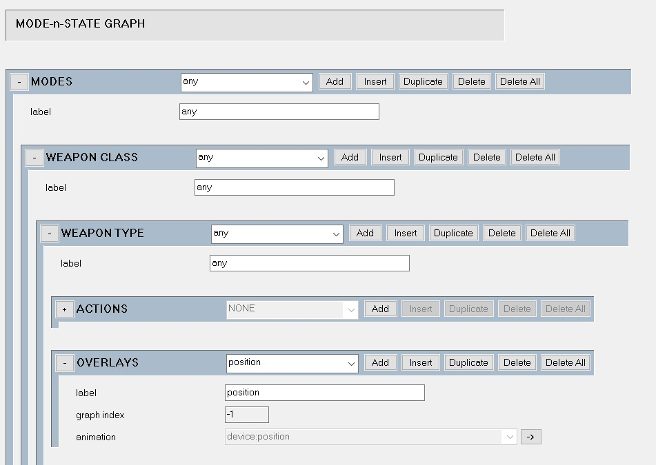


This guide assumes you have already [read/completed the previous tutorials](~object-importing).


# File list
| File Link                                                                                          | Description
|--------------------------------------------------------------------------------------------------- | -----------------------------------
|[End Result](https://drive.google.com/file/d/1asZL-IVOQzrSc738vVLyMh5dsi2FXzxa/view?usp=sharing)    | The end product of this tutorial for you to examine and compare.

# Device machines - what are they?
Now let's take a look at a new tag type we haven't used before - the `.device_machine`. These tags, at first glance, seem no different to animation `.scenery` objects. They have a few key difference though, the major one being dynamic (moving) physics models.

Step onto your newly spinning platform - you will notice that you do not spin with the platform. Walk into the platform from the side - you do not get pushed away by the pointy edges of the platform flying past. If you brush up against the platform enough, you will likely come to the correct conclusion that the physics model is not moving whatsoever. Even if we weighted the physics model to the `Bone` in blender, it would not animate in-engine. This is the main reason for using a `.device_machine` tag, as it *does* allow for all sorts of moving physics shenanigans.

Let's go over a couple of well-known device machine examples throughtout the games (even if you did not know thats what they are!) to gain a better understanding of their wide range of applications. In Halo 2's Cairo Station mission, you may remember the second time you venture into space, and you fight some flying elites on a large platform that moves up and down as part of the mac gun's firing mechanism. This entire area is not part of the level BSP, but is rather a large device machine. As it animates up and down, the physics do too. In Halo 3, remember the huge spinning wheel on Last Resort? That too is a device machine - it's blades push the player and other objects around as the wheel animates, indicating that it has dynamic physics! Most, if not all elevators in H2+ are also device machines for reasons that should now be obvious.

# Creating an elevator animation
In the following sections, we will be making our platform into a makeshift elevator! This requires creating a new animation of the platform changing height, so let's get back to work in Blender:
## Out with the old, in with the new
1. We need to remove the current spinning animation from the platform. First, in the `Timeline` window, set the current frame to frame `1`.
2. In the `Outliner` window, expand the `Armature` object if it isn't already. You should see animation data called `Animation`. Expand this too. Finally, you should now see an animation called `Armature Action`. Select it, then right-click and choose `Delete`.
3. Open `Windows Explorer` and navigate to your platform's animations data folder, e.g. `"H3EK\data\objects\scenery\custom_platform\animations"`. Cut the `any idle.JMM` file and paste it somewhere of your choice for safe keeping. We will not be using it for the time being.

## Creating a new animation
3. Select the armature object, and enter into `Pose Mode`.
4. In the `3D Viewport`, press  and insert a `Location` keyframe on frame 1.
5. In the `Timeline` window, set the currently active frame to `80`.
6. Next, press , ,  to move the bone 200 meters upwards (the Z axis).
7. Press  and insert another `Location` keyframe.

That's it! This is a very simple animation, test it out with the play button in the `Timeline` window. The platform simply rises to 200m over 80 frames, then resets.

Device machine elevator animations *do not need to be reversed in Blender*. The Blam! engine is able to handle reversing the animation automatically, which saves us some work.


# Re-parenting the physics model
In order for the physics model to follow the animation, we must change it's parenting:
1. Select the `$platform_physics` object in the `Outliner` view. Then ctrl-click the `Bone` bone.
2. Hover over the `3D Viewport`, and press  to open the parenting menu. Choose `Bone Relative`.

You can double-check you did it correctly by playing the animation - the physics should now move seamlessley with the render model.

# Exporting a device machine animation
Device machines have a built-in value called `position` ranging from `0` to `1`, that determines how far through it's animation it is. For example an elevator device machine with a current position of `0` would be at the rest/start position. A current position of `1` means that it is at its end position. `0.5` would mean it is at exactly the halfway point in its travel from point A to B. This `position` value can be directly controlled by both in-game buttons (another tag type, `.device_control`), or by game scripting, allowing for controlled management of a device machine's behaviour.

The animation for a device machine is a `.JMO` type. It is not a base type (`.JMA`, `.JMM`) because more complicated device machines can use multiple overlay animations at the same time to achieve complex behvaiours. We will not be covering that in this guide - simply take away that device machines use `.JMO` for their `position` animation. As with our `any idle` animation earlier, the name we give the exported `.JMO` file does matter, as it determines how `tool` sets up the animation graph tag. To be used as the `position` animation, we simply need to export the animation as `device position.JMO`:
1. Back in Blender, click `File` -> `Export` and choose `Halo Jointed Model Animation (JMA)`.
2. In the export menu, make sure the `Game Version` is set to `Halo 3 MCC`, and the `extension` to `JMO`. Leave all other settings default.
3. Set the name of the file at the bottom to `device position`, and export to the `animations` folder.

# Importing the device machine animation
This section will be almost identical to importing the `any idle.JMM` animation from the [previous tutorial](~blender-object-creation-animation#importing-animations-and-the-model-animation-graph). As written in that section, `tool` will remove any missing animations from the `.model_animation_graph` tag. We have moved the `any idle.JMM` file elsewhere - this means that after re-running the `model-animations` command, *we will only have the new device position animation* in the animation graph. If you already feel comfortable or fancy a challenge, try importing the animation on your own! Otherwise, follow these steps:
1. Open up `CMD` in your `H3EK` folder.
2. Type `tool model-animations "path\to\your\scenery"`, where `path\to\your\scenery` is the **tags-relative** path to your scenery's data folder. For example if you have been following along exactly, this will be `"objects\scenery\custom_platform"`.

You should now see the following output from `tool`, informing us that the `device position.JMO` animation has been imported with no errors:

As per the previous tutorial, if you open the `.model_animation_graph` tag in Guerilla and scroll down to the `Mode-n-State Graph` block, you should now see the `device position` animation has automatically been put into the `Overlays` group.

# Creating the device machine tag
Just like with the `.scenery` and `.crate` version of this custom object, we need to create a new top-level tag - the `.device_machine` tag.
1. Open Guerilla. Press  to open the new tag dialog, and choose `device_machine`.
2. Use  to open the save tag dialog, and save it into the platform's root folder (`"H3EK\tags\objects\scenery\custom_platform"`) as `custom_platform.device_machine`.
3. Set the `bounding radius` to 3.
4. Click the `...` next to the `model` entry, and choose the `custom_platform.model` tag.
5. Scroll down to the `$$$ DEVICE $$$` section near the bottom of the tag. Set the `position transition time` to `5`. This is the time our device should take to transition from a position of `0` to `1` or vice versa, in seconds. This means that once started, our elevator will take 5 seconds to reach the top. Adjust to your liking if you wish.
6. Set the `position acceleration time` to `0.4`. This is the time it takes the device to reach "full speed", and the time it takes to slow down from "full speed" to rest, in seconds. A value of 0 means it instantly accelerates from rest to full moving speed. `0.4` means it will take 0.4 seconds to accelerate up to max speed, and 0.4 seconds to accelerate down to rest at the top. It is usually a good idea to set a value here for elevators, to avoid clunky instant starts and stops.
7. Set the `type` to `platform`. There are three options here:
    - Door - door types utilise the `automatic activation radius` to open when the player gets near. It uses the `door open time` to determine how long to wait before closing once the player has left this radius.
    - Platform - these types are used for elevators, or other moving platforms such as gondolas. They do not activate automatically, and so require the use of a `.device_control` or scripting to function.
    - Gear - gear types simply play their animation on an infinite loop. The huge spinning wheel on Last Resort is a good example of this.
8. Tick the `elevator` flag.

# Placing the elevator
It's time to see our elevator device machine in action! Open Sapien on a map of your choice:
1. In the `Hierarchy View`, select `Scenario` -> `Objects` -> `Devices` -> `Machines`.
2. Click `Edit Types`. Click `Add`, navigate to the custom platform folder, and choose the `custom_platform.device_machine` tag.
3. Click `Done`, then `Ok`.
4. With the `Machines` folder still selected in the `Hierarchy View`, right click in the `3D View` to place a new device machine object. In the `Properties Palette`, change the `type` to the custom platform. Give it the name `my_elevator`. Move it around so that the platform is just above the floor.

# Controlling the elevator with scripting
If you are not familiar with HaloScript, this may seem like a duanting task. However, it is as simple as typing a single line into Sapien's console. The HaloScript function we want is `(device_set_position <device> <real>)`. The two parameters are as follows:
- `device` - the *name* of a specific device machine placed on the map, e.g. `my_elevator`.
- `real` - a float, otherwise known as a decimal, between `0` and `1`. This controls the `position` value of the device I mentioned earlier. By setting this to `1` we cause the elevator to move up to the top, and if we set it back to `0` it will move back down to the ground.

Therefore, the command that we want to type into the console to make the elevator move upwards is `(device_set_position "my_elevator" 1)`:
1. Open the console in Sapien. The exact key depends on your keyboard's region - it is usually Tilde  (beneath Escape), or the apostrophe () key.
2. Type or paste the line `(device_set_position "my_elevator" 1)` into the console, and press 

You should now see the elevator rise into the sky! If successful, use `(device_set_position "my_elevator" 0)` in the console to bring the elevator back down to its starting position. Try standing on top of the elevator and then using the command - the physics model will carry you up with the animating render model! If you want to get to grips with the `position` value, try other decimal values such as `0.5` etc.

# Controlling the elevator with a button
The alternative method of controlling a device machine is via the use of a `.device_control` tag. These usually take the form of button panels, with a prompt similar to `Hold E to open the gate` when you get near. Device controls and machines can be linked through the use of `device groups`, which allows one to control the `position` of the other remotely. It is very easy to set up. We will not be covering how to make your own device control in this tutorial, instead we shall make use of one of the many pre-existing controls found in Halo 3. If you happen to be testing your elevator on the map `Last Resort` (Zanzibar), you can skip steps 1 through 3 as the control is already present in the map.
1. In the `Hierarchy View`, select `Scenario` -> `Objects` -> `Devices` -> `Controls`.
2. Click `Edit Types`. Click `Add`. Navigate to `"H3EK\tags\objects\levels\multi\zanzibar\gate_control"`, and add the `house_gate_control.device_control`
3. Click `Done`, then `Ok`.
4. With the `Controls` folder still selected in the `Hierarchy View`, place down a new control.
5. In the `Properties Palette`, set the type to `house_gate_control`. Move the control to anywhere you like.
6. Click the `Device Groups` folder in the `Hierarchy View`, just below `Machines`, `Controls` and `Terminals`.
7. Click `New Instance`. Select the new instance on the right side of the window.
8. In the `Properties Palette`, change the `name` to something recognisable. I will use `elevator_group`. Leave everything else default.
9. Click the `Machines` folder, and select your elevator. In the `Properties Palette` scroll down to find the `Position Group` drop-down, and select the device group name you just added, e.g. `elevator_group.
10. Select the `Controls` folder in the `Hierarchy View`, and assign the `Position Group` in the exact same way on the control you just placed down.

Now run over to the control and hold the interact button (). The elevator will now start to move! Interact with the control again, and you will cause the elevator to return. You can do this an unlimited number of times.


That's all for this tutorial! Now you know how to animate two types of tags, we will be looking at adding a collision model in the next tutorial, so that you can shoot the platform and have the projectiles collide with it. ***The next section is currently under construction***. If you'd like, you can review your progress so far on the [home page](~object-importing).
