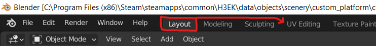
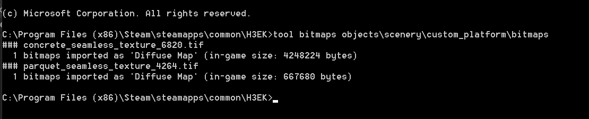
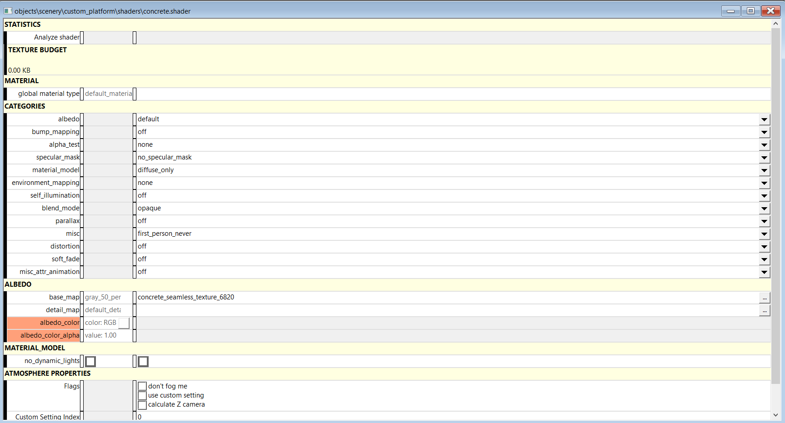
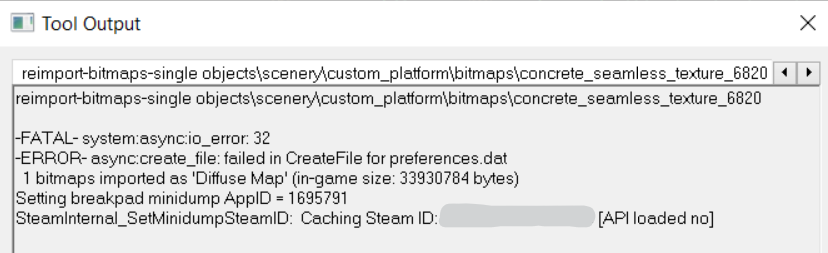


This guide assumes you have already [read/completed the previous tutorials](~object-importing).


# File List
| File Link                                                                                          | Description
|--------------------------------------------------------------------------------------------------- | -----------------------------------
|[Required Textures](https://drive.google.com/file/d/1kLznd8QZZXJma0G3nBwZl7QHsL6b1-K8/view?usp=sharing) | The custom textures used in this tutorial
|[End Result](https://drive.google.com/file/d/1mteG515evA6pH74s-XFSnwx96Xe6MsOY/view?usp=sharing)    | The end product of this tutorial for you to examine and compare.

# Introduction
In this section, we will cover how to set up an object to use custom textures in Blender, and then how to transfer this into Halo, so that our custom object looks presentable. It is highly recommended to read over the [Halo 3 Materials](~h3-materials) page, as the naming conventions and how materials in Blender correspond to shaders in Halo can be a little confusing to those unfamiliar with it. However, a short explanation will be provided below.

# Apply Custom Textures/Materials in Blender
You will need the custom textures from the [file list](~blender-object-creation-materials#file-list) at the top of the page for this section. For the purpose of demonstrating how to use multiple materials on a single object, we will be using a simple tiled wood-effect texture for the top face of our model, and a concrete texture for the sides and bottom.


When renaming the materials, make sure to use lowercase letters only, as Halo tag paths should not contain any uppercase letters.


NB: ***Texturing/shading in blender has no effect on in-game models for Halo.*** The only data exported to the .JMS is the name of our material. The name of the material will be the filename tool.exe searches for when looking for a shader tag to assign to a surface. All texturing and shading for Halo objects is done via the shader tags. We will only be using the textures in Blender so that we can preview how the texture will look on the surface, and as this is helpful for UV mapping.

## Adding Textures
1. Select the Cube object in the Outliner, and navigate to the materials tab. If you have been following along, you should already have a material named `material` applied to the object:
* 
2. Rename the material to `wood`.
3. [Add a new material](https://youtu.be/2yOOzN0zJfQ) named `concrete` to the Cube object.
4. Now we need to assign the textures that you have downloaded to these materials. Make sure `Use Nodes` is checked in the `Surface` section of the material.
5. [Assign an image texture node](https://youtu.be/2yOOzN0zJfQ?t=60) to both of these materials, making sure to navigate to and select the right texture for the right materials. `concrete_seamless_texture_6820` is for the `concrete` material, and `parquet_seamless_texture_4264` is for the `wood` material.

You should now have two materials on the Cube object, both with different textures assigned. Check that your materials tab looks similar to this:
* 

## Assigning Materials to Faces
In Blender, material assignment is done per face on a mesh. As such, we can apply different materials to different faces on our Cube mesh, to vary the look and make it more complex.

You may be wondering why nothing appeared to change when you added the textures to the materials - this is because we are still in `Solid Viewport Shading` mode. To see the textures on our object, we must switch to `Material Preview Viewport Shading` mode. This can be done by pressing  and switching the mode, or by pressing the viewport shading buttons in the top right of the 3D viewport. You can read more about this [here](https://docs.blender.org/manual/en/latest/editors/3dview/display/shading.html). Once you have done this, your Cube will look like this:
* 

After taking a look around the model, you will notice that all sides are using the `wood` material, and our `concrete` material is going completely unused. We will now assign the `concrete` material to all but the top face of the model.
1. Select the Cube object.
2. [Change context mode](https://youtu.be/SVLAYHJSXYA) from object mode to edit mode.
3. Make sure you are in [face selection mode](https://youtu.be/C_X7muZP3XA) so that you can properly select the object faces.
4. [Select all](https://youtu.be/p27vyrHvpkk) faces of the Cube except for the top face.
5. [Select the material](https://youtu.be/2yOOzN0zJfQ) named `concrete` from the materials list in the object.
6. Click the assign button.
7. To make sure you have the `wood` material applied to the top face, [select the material](https://youtu.be/2yOOzN0zJfQ) named `wood` and [assign the material](https://youtu.be/2yOOzN0zJfQ) only to the topside face of the object.

You should now have a Cube object with a wood texture on top, and a concrete texture on the rest of the sides:
* 

## UV Mapping
UV Mapping is the process of projecting a 2D image onto a 3D model's surface. That may sound scary if you haven't encountered it before, but it will begin to make sense when you actually do it. As of right now, you will notice that the wood texture on the top face seems a little too "zoomed in", especially given the scale it will be in Halo. Also, the texturing on the sides of the object is very stretched, which is quite ugly. UV mapping will allow us to solve these issues and make the texture work on the model much more presentable. If you are a complete beginner to 3D modelling/texturing or Blender, and find UV mapping to be too complex at the moment, you are free to skip this section, but the textures on your model will not look very good.

1. Start by switching from the `Layout` workspace to the `UV Editing` workspace in Blender using the tabs along the top of your screen
* 
2. Hover your mouse over the 3D viewport on the right side, press  and select `Material Preview` so that you can see the textures again.
3. Make sure that the [context mode](https://www.youtube.com/watch?v=SVLAYHJSXYA) of the 3D viewport is set to Edit Mode, and that you are in [face select mode](https://www.youtube.com/watch?v=C_X7muZP3XA)

This is the default UV Editing workspace. The left window is the UV Editor, and the right window is the 3D viewport that you are used to from the normal Layout workspace, however it is possible to customize the window positioning to whatever you would like. It is difficult to do such a complex topic as UV editing justice via a text tutorial, so please watch this short [UV editing basics tutorial](https://www.youtube.com/watch?v=dR_TCHUTEw0) for a visual demonstration on how manipulation UV mapping affects how textures are displayed on a 3D object.

Using the information shown in the video, follow these steps:
1. In the 3D Viewport, select only the top (wood) face of the object. You should see the texture appear in the UV window, along with a small square representing the area of the texture that the face is sampling the pixels of. We want to increase the size of this square so that the face covers a much larger texture area.
2. Hover over the UV editing window and press  to scale the face. Press  to scale by 10x in the `X` and `Y` axes, and press  to confirm. You should see that the wood texture on the object is now smaller, and the tiling is more apparent. This will look much nicer in-game compared to the UV mapping we had before.
* 
3. In the 3D Viewport, select only the bottom concrete face of the object. You will notice the texture appears quite pixelated, despite the texture file itself being quite high-res. This is because the UV map for the face isn't large enough.
4. In the UV editing window, press  to open the sidebar if it is not open already, and on the `Image` tab, set the UV Vertex for both X and Y to `0.5`. This will centralize the UV in the center of the texture.
* 
5. Next, press  to scale the face, and then type  to scale by 3x in the `X` and `Y` axes, making the texture appear much nicer on the bottom face.
6. Lastly, we need to sort out the stretching on the concrete textures on the sides of the model. In the 3D Viewport, spin around the model and select only the 4 side faces (remember that you can hold down  to select multiple faces).
7. Press the UV pill menu, select `Smart UV Project`. Set the `Angle Limit` to 66 degrees. Keep the other options at 0, make sure `Correct Aspect` is checked, and `Scale to Bounds` is *un*checked. Hit OK.
* 
8. In the UV editing window, change the UV Vertex option in the siderbar from `0.250` to `0.5` to center the faces.
9. Next, hovering over the UV editing window, press , then , then hit  to rotate the UVs 90 degrees. We must do this so that when we scale, the texture wraps on the X axis and not the Y, as the texture only tiles cleanly on the X axis.
10. Finally, press , , , then hit  to scale the UVs by 10x on the `X` axis.

This is the end of the UV mapping section, and hopefully your object's textures look much nicer as per the images below. You can now return to the `Layout` workspace tab. If you are confident with UV mapping or simply want to play around more, feel free to further edit the UVs to your liking, it won't affect any future parts of the tutorial.
* 
* 
* 

# Updating the Render Model In-Game
1. Now that we have successfully added two materials to our custom platform and fixed up the UVs, we need to re-export from Blender to `.JMS` so that we can bring our updated model into Halo 3. If you have forgotten how to do this, read through the steps again in the [previous tutorial](~blender-object-creation-render#exporting-from-blender). As this is the second time we are exporting, you won't need to create a `render` folder again. Simply overwrite the existing `custom_platform.JMS` file.
2. Once this is done, we need to run the `tool render` command again, to re-import the `.JMS` file. When this happens, `tool` automatically updates/overwrites the old `.render_model` tag, and the model will automatically reload itself if you happen to have `Sapien` open at the same time, which is very useful. If you have forgotten how to open the command prompt in the H3EK directory so that you can enter tool commands, revisit [this section from last time](~blender-object-creation-render#importing-your-render-jms-with-tool). The command we need is the exact same as last time: `tool render objects\scenery\custom_platform draft`

Your object's render model has now been updated. However, it still won't have any texturing in Halo 3, so it can be difficult to tell if it worked. However, if you happened to keep an eye on the model in `Sapien` before and after re-importing it, you will notice that the placeholder texture it has will have moved slightly, due to the new UV mapping.

# Importing Image Textures into Halo 3

For Tool to import a texture file, it must be in the correct .tif file format. No other image file types will work. The textures provided for this tutorial are already in the correct format, but if you decide to use your own custom textures, you must convert them to .tif. This can be done via online converters, or dedicated programs such as [XnConvert](https://www.xnview.com/en/xnconvert/#downloads)


Similarly to `.JMS` files, `tool.exe` will only import texture files from inside the `H3EK\data` folder. Whilst it will import textures from anywhere within here, it is good practice to put your .tif files into a folder named `bitmaps`, within your model's main folder.
1. Create a folder named `bitmaps` in `H3EK\data\objects\scenery\custom_platform`
2. Copy both .tif files from this tutorial's .zip download to the new `bitmaps` folder. For example, you should have `H3EK\data\objects\scenery\custom_platform\bitmaps\concrete_seamless_texture_6820.tif`
3. Open command prompt inside the H3EK folder, as we need to import the textures with a tool command.
4. Enter the tool command `tool bitmaps objects\scenery\custom_platform\bitmaps`. If successful, you should see the following output:
* 

Your textures have now been imported. Halo stores images in a tag type called `.bitmap`. Think of a `.bitmap` tag as a container for one or more images. Your newly generated bitmaps, like with the render model, will have been saved the *mirrored* file location in the `tags` folder. For example, in this tutorial, the bitmaps get saved to `H3EK\tags\objects\scenery\custom_platform\bitmaps`.

 
 *Careful! Do not confuse the proprietary Halo .bitmap tag format with the .BMP bitmap image file type*, these are not the same thing.


# Creating and Applying Shaders
## Shader Information
Shaders are, within the world of Halo, what actually gets directly applied to faces of models and levels. They reference `.bitmap` tags in order to use textures, and support many shading features such as bump maps, height maps, specularity, self-illumination, color-change and more. If you are familiar with 3D modelling programs such as Blender, `.shader` tags are essentially the equivalent of Materials in Blender.

Simply having the textures imported as `.bitmap` tags is not enough to have them appear on our custom model, and we will need to create two basic shaders, one for the wood texture, and one for the concrete texture. As explained previously, when importing a render model, `tool` looks for corresponding `.shader` tags with names that match the names of the materials used in Blender. For example, as we named our materials in Blender `wood` and `concrete`, `tool` looks for shaders called `wood.shader` and `concrete.shader`. It looks for these shaders first within a folder named `shaders` within the model's tag folder. In our case, `tool` will be looking for them in `H3EK\tags\objects\scenery\custom_platform\shaders`. Therefore, the final step we need to do in this tutorial is create these two shader tags. If you wish to refresh your knowledge on this system, or look at more advanced stuff like shader collections, review [this page](~h3-materials).

## Creating Shader Tags
1. Open Guerilla
2. Press . Select `shader` from the dropdown, or type `shader` until it appears, then hit .
3. If you are new to Halo shaders, this tag may look horrific, but we only really need to change one option to get our textures on the model. I won't be going over more advanced shader options here, as this is a basic tutorial.
4. Look for the entry called `base map` under the *ALBEDO* block. This is where your normally put any base texture that you want for the shader. Click the `...` on the right next to it and browse to `H3EK\tags\objects\scenery\custom_platform\bitmaps`. Double-click `concrete_seamless_texture_6820.bitmap` to add it to the shader.
5. Now we need to save this shader tag. Press , and navigate to `H3EK\tags\objects\scenery\custom_platform`. Create a new folder here called `shaders`. Make sure to spell it exactly as shown.
6. Navigate inside the new `shaders` folder, and save the tag here, with the name `concrete` (remember how this needs to exactly match the name of the material in Blender).
* 
7. Usually, `tool` compresses any imported textures, and this can look to them looking a bit green and low-res. To fix this, double-click on the name of the bitmap tag within your shader, and a new window should pop up for the concrete bitmap.
8. Near the top, change the `Curve Mode` option to `Force Pretty`, and the `Force Bitmap Format` option to `Best Uncompressed Color Format`. Press  to save the bitmap tag. It should look like this:
* 
9. Bitmap tag options don't actually get applied to the image until you re-import the bitmap (since it is too late, it has already been compressed etc). The bitmap tag editor in Guerilla contains a handy button for it, so you don't need to manually enter a new tool command. Press the `Reimport Bitmap` button right near the top of the window. Try to ignore any warning or error lines in the new window that pops up, and focus on making sure that one of the lines says `1 bitmaps imported as 'Diffuse Map' (in-game size: 33930784 bytes)` or similar. If it does, this has worked, and you can close this new small window that has appeared.
* 

If you have saved all of the changes in Guerilla, you have successfully made the shader tag for the concrete! You will now need to repeat the previous 9 steps again, but this time making a new shader tag called `wood`, and saving it into that `shaders` folder. Once this is done, we can go to the final step of this tutorial.

## Re-importing the Render Model
Unfortunately, adding new shader files does not mean they get automatically picked up and used by the object that needs them. In order for an object to use newly created .shader tags, you simply need to re-import the object's render model once again, to let `tool` find and assign the shaders.

1. Open CMD in the H3EK folder
2. Just like earlier, run the `tool render` command to re-import our render model `.JMS` file. For this tutorial, use `tool render objects\scenery\custom_platform draft`.

If you don't have it open already, open Sapien and place down your custom platform scenery object! It should now have all of the textures correctly applied to it. If you can't remember how to add or place objects in Sapien, review [this part](~blender-object-creation-render#checking-out-the-object-in-sapien) of the previous tutorial. Your model should hopefully look something like this:
* 
* 

Not a bad looking first model! If something has gone wrong and you would like to check my source files and tags, feel free to grab the files from the link at the [top of the page](~blender-object-creation-materials#file-list)


Once you've gotten to this point, you are ready to look at adding a custom physics model, so that we can stand on the platform! This next section is [available here](~blender-object-creation-physics)
