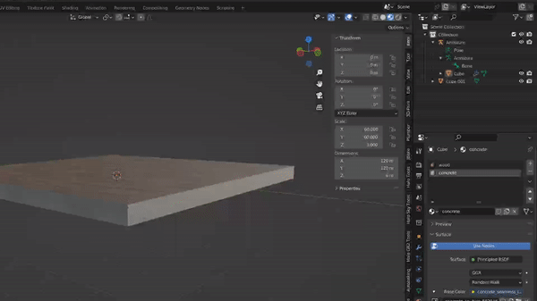
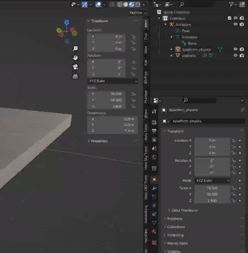


This guide assumes you have already [read/completed the previous tutorials](~object-importing).


# File List
| File Link                                                                                          | Description
|--------------------------------------------------------------------------------------------------- | -----------------------------------
|[End Result](https://drive.google.com/file/d/1_XAJ1ZUPvQedONuiVW0g5uh1h084t2ys/view?usp=share_link)    | The end product of this tutorial for you to examine and compare.

# Introduction
In this section, we will cover how to create a basic physics model for our custom platform, look at making it a `.crate` tag, as well as go over the differences between `collision models` and `physics models` to clear up any confusion.

The goal of the following tutorial is to make a `.crate` tag for our custom platform, so that you can learn the difference between the tag types.

# Collision Vs Physics
In the Blam! engine, collision models and physics models are used to handle different types of "collisions". Both types are generally highly simplified 3D meshes of the render model, as using the render model would be too computationally expensive.

Physics models are used by the Havok engine to manage environment collisions and most player collisions, and are required for certain types of tags to function, such as `.vehicle` and `.crate` tags. For example, a physics model is what allows a `.vehicle` to sit on or crash into the environment, or a `.crate` to fall dynamically and roll around.

Collision models are mainly used to handle projectile collisions - you will not be able to shoot a model in-game if it does not have a collision model, the projectiles will simply pass right through. An edge case here is that collision models can be used as a stand-in for a physics model in the case of static tags such as `.scenery`, allowing for players to collide with the model even without a physics model. This is where some confusion can arise.

Physics models are typically much less complex than collision models, for several reasons. First, the physics model doesn't need to be completely accurate, as it is invisible and most players won't be able to tell. Secondly, calculating physics can be expensive (less so on modern PCs, but definitely on the X360), so the more basic the better. Finally, physics models must be made of *strictly-convex* shapes only, which limits how easily they can be made to fit the model perfectly. Don't worry if you don't understand what this means, it will be covered [later](#additional-information).

On the other hand, collision models are usually a much closer representation of the render model. This is because players will find it odd if projectiles don't seem to collide with the visual model and the shapes do not need to follow strictly-convex rules. See the following pictures for a visual idea of how the two differ.

TL;DR - Physics models are used for player and environment interaction, collision models are for projectile collisions.


# Example Mongoose Collision and Physics Models

 overlayed on the render model. Note how much less complex the physics model is.")

# Creating the Crate Tag
1. Open Guerilla.
2. Press + or `File -> New`.
3. Type `crate`, or find it in the list. Press `Ok`.
4. A new `.crate` tag will open. Press + or `File -> Save`. Navigate to our `custom_platform` folder in `H3EK\tags\objects\scenery\custom_platform`. Name the file `custom_plaftorm`, and hit `Save`.
5. In the tag, set the `bounding radius` to 3. Next, press the `...` next to the `model` box and choose our `custom_platform.model`. Save the tag.

We've now successfully made a `.crate` tag for our platform! I wonder what will happen when we try to spawn it in...

1. Open a scenario in Sapien.
2. In the `Hierarchy View`, navigate to `Scenario -> Objects -> Crates` and select the folder.
3. Click `Edit Types`, click `Add`.
4. Navigate to our custom platform folder, and double click the new `.crate` tag we made.
5. Click `Done`, and then `Ok` to close the dialog.
6. Right click on the ground in the `Game Window` to place a new crate object
7. In the `Propeties Palette`, change the `Type` to `custom_platform`

...Oh dear, we seem to have an error! You should see an error that reads:  
`WARNING objects: Could not construct crate object. Make sure you have a model and physics model linked up to the object definition for (crate custom_platform)`  
`-FATAL- objects: (CHECK WARNINGS: object_type_new failed) error creating custom_platform`

If you were paying attention in [this section](#collision-vs-physics) earlier, you may already realise the issue - `.crate` tags *require* a physics model in order to be spawned, similarly to `.vehicle` tags.

# Making a Physics Model
Making a basic physics model, especially for a render model as simple as our platform, is actually quite straightforward. In the following steps we will add a basic cuboid to act as a physics mesh for our model. We will also edit our render model to be a bit thicker, as I think it will help demonstrate things better down the line.

1. Open your Blender file from the last tutorial, or download the [end result](~blender-object-creation-materials) from the previous page.
2. Select the platform object.
3. Press  to scale, press  for Z-axis only, and then press  to make the platform thrice as thick. Press  or  to confirm.

Now that the render model edit is out of the way, lets move on to making the physics object:

1. Press + to open the Add menu, then select `Mesh`, then click `Cube`. This will add a new cube object to the blend scene.
2. Before anything else, we should parent the cube to the Armature. Failure to do so will mean the cube won't get exported! In the `Outliner`, click the cube object to make sure it's selected, then click on the `Armature` object *whilst holding *.
3. Now, with your mouse over the `3D view` (not the `Outliner`), press + to open the `Parenting` menu. Now click `Object (Keep Transform)`. The new cube object should now appear with the same indentation (hierarchy) as the render model in the `Outliner`. Here is a gif demonstrating the process:

4. Double click the new cube object, or press  with it selected, to be able to change it's name. Name the object starting with a , the rest of the name is up to you but I will name it `$platform_physics` to keep things simple.
    
    The Blender addon looks for certain symbols in object names to determine what type of object they should be treated as. Here, the `$` symbol denotes that this is a physics mesh, and should only be exported into the physics model. Without this symbol, it would be exported as part of the render model instead.
    
5. For clarity's sake, I will rename the render model object to `platform` as well, but this step is optional.

6. The next step is to make the physics model big enough to roughly match the render model. Select your physics object, then press , followed by +, then . Now hit left click or . The physics object is now almost as wide and long as the render model.
7. Next, press , then , then  to make it the right height too. You may have noticed this isn't *quite* as big as the render model. This is personal preference, but I typically make physics models slightly smaller than the object they represent to allow the player to feel like they can get as naturally close to the object as they should be able to.
8. Finally, we need to add a material to the physics model. This does not need to be a halo shader name, it can be anything but you might like to match it to a global material such as `hard_metal_thick`. Select the physics object, and switch to the `Material Properties` tab.
    
    ***Physics models must always have a material applied to them*** or you will experience a crash when importing the physics model. If you ever see the following crash, not having a material on the physics model is the cause:  
    -FATAL- ### ASSERTION FAILED:  at e:\jenkins\workspace\mcch3code-release\mcc\release\h3\source\memory\array.cpp,#264  
    -FATAL-   index>=0 && index<array->count
    
9. Click `New`. Double click or press  to rename the material to your liking. I will name it `tough_organic_wood` as the platform is wooden.

That's about all there is to making a very basic physics model!

# Exporting
If you're already comfortable exporting models from blender for Halo, the physics `.JMS` file simply needs to be put into the `physics` folder. If you aren't, follow these steps:

1. In Blender, select File -> Export -> Halo Jointed Model Skeleton (.jms)
2. When the dialog box appears, navigate to your `custom_platform` folder in `data`, e.g. `H3EK\data\objects\scenery\custom_platform`
3. Make a new folder called `physics`. It should be in the same place as your `render` folder. Enter into this folder.
4. Make sure to set the game version to `H3 MCC`, and set the Mask Options to only have `Hidden`, `Non-Render` and `Physics` ticked.
5. Leave all other settings default, name the file `custom_platform`, and hit `Export JMS`.

# Importing
This process will be very similar to importing the render model we did in a previous tutorial. See [here](~blender-object-creation-render#importing-your-render-jms-with-tool) if you need to re-read how to use Tool in CMD.

With CMD open in the H3EK folder, you only need to type one command to import the physics. The exact parameter of the command will differ depending on where you saved your JMS. In the case that you have been following along exactly, the JMS is in `H3EK\data\objects\scenery\custom_platform\physics`. The `Tool` command only needs the path *after* the data folder, *to* the folder that contains the `physics` folder. So in this case it would be `objects\scenery\custom_platform`

The full `Tool` command you need to type in this case would be:
**tool physics objects\scenery\custom_platform**

If you have spaces in your filepath, e.g. `objects\scenery\my stuff\platform`, don't forget to wrap your path in quotation marks 


# Getting up and running
If all the previous steps have gone well, you should now have a new `.physics_model` tag in `H3EK\tags\objects\scenery\custom_platform`. The very final step of the process, and an important one not to forget, is to reference this new tag in the `.model` tag of the object!

1. Open Guerilla
2. Open your `.model` tag, likely in `objects\scenery\custom_platform`
3. Near the top, look for the `physics_model` box just below the `render_model` reference. Click the `...`
4. Select the new `.physics_model` tag
5. Save the tag. Done!

With that, your platform scenery object should now be player-collidable. Check it out in Sapien!
After you've made sure that is working, try to re-place the `.crate` version using the same steps from [earlier](#creating-the-crate-tag). If everything is working, you should notice that the object falls to the ground in dynamic fashion! This is the key difference between `scenery` and `crate` tags - `scenery` is purely static, usually decorative objects, whereas `crates` are dynamic, well, crates (and barrels, and boxes, and anything else that you want to be moved by the player, guns, explosions, etc).

# Stricly Convex Explanation
In the *Halo* engines, presumably to save on resources physics models have a restriction where each shape used can only be convex, with no concave surfaces. If you are unfamiliar with 3D geometry, this can be a little tricky to get your head around at first, but with the help of a diagram and example it should become easier to grasp.

Firstly, one of the best ways to determine if a shape is strictly convex is to draw a line through it. If the line passes through more than two edges/faces, then the shape is not strictly convex. See the following very crudely drawn diagram as an example:

Note how it is impossible to draw a line anywhere through the regular Pentagon that passes through more than two edges - this is because the pentagon is a strictly-convex shape. On the other hand, the line in the right diagram shows how in some places on the abstract shape, it is possible to do so. Although this example is in 2D, the exact same thinking can be applied to a 3D object as well.

Blender has a built-in function that can be used to determine if the 3D mesh you have made is strictly-convex or not - the `Convex Hull` tool. Here's an example of how to use it:

1. Create some 3D shape in Blender.
2. Select the object, and press  to enter into `Edit Mode`.
3. Press  to make sure that all vertices are selected.
4. Along the top bar, click `Mesh`, then `Convex Hull`.
5. Blender will force your 3D mesh to be strictly-convex. If the model changed at all, it will need editing to be strictly-convex (or you can use Blender's convex hulled version). If it didn't change, the congratulations your shape is strictly-convex and will work well as a physics model!

If any of your physics shapes are not strictly-convex, the Blender addon will still export them, and `Tool` will not complain when you import the physics model. However, during import, Tool will run a process similar to Blender's `Convex Hull` where it will force the shape(s) to be convex. It can be difficult to notice as it isn't visible, but the object's physics model will feel `wrong` to collide with in areas that `Tool` has re-arranged.



Once you've gotten to this point, you are ready to look at adding a custom animation and creating a `.device_machine` tag, so that we can have the platform move us around! This page is currently under construction, check back here in the future or [return to the hub to review your progress.](~object-importing)
