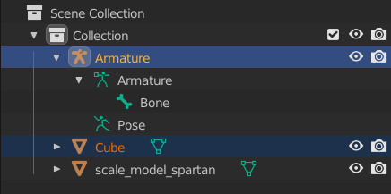

```.alert
This guide assumes you have already [prepared Blender][blender-prep].
```

# File list
| File Link                                                                                          | Description
|--------------------------------------------------------------------------------------------------- | -----------------------------------
|[End Result](https://drive.google.com/file/d/1BZnqoOTQqkad1vhbF_LawKX5meDf7wrP/view?usp=sharing)    | The end product of this tutorial for you to examine and compare.
|[Tutorial Textures](https://drive.google.com/file/d/1Xndpgz-35igbhoNoGDslzhSKpQmikDQz/view?usp=sharing) | The textures we will be using in this guide. Make sure to have this ready.

# Introduction
Welcome to the Halo 3 custom object importing guide. If you have any experience with importing objects in previous then you should feel mostly at home for better or worse. In this guide we will be showing you how to go about with creating your very own custom scenery object for Halo 3 in the 3D modeling software app known as Blender. This guide will include a completed version of our work as an example for you to contrast and compare but be sure to follow along.

If there are any images that you find difficult to read then try opening the image in a new tab to view it in full resolution.

By the end of this guide, the aim is to create a basic "platform" of sorts, with a custom texture, that the player can stand on and interact with. On top of that, there will be an extra section for adding a custom animation, to turn it into a moving platform device machine that can carry the player around, sort of like an elevator.

# Directory setup and Blender scene
Here, we will simply create a new empty blender scene, and save it inside your `H3EK\data` directory, making the sub-folders for the new object as we go:

1. Open Blender, New File, General
2. Press <kbd>A</kbd> to select all, hit <kbd>X</kbd> and click delete to confirm
3. Press File -> Save As, or simply hit <kbd>Ctrl+S</kbd>
4. Inside the save window that pops up, navigate to your `H3EK` directory
5. Enter the `data` folder. Enter the `objects` folder, or create it if it does not exist.
6. Enter the `scenery` folder, or create it if it does not exist.
7. Create a new folder called `custom_platform`, navigate inside it, and save your .blend file here, naming it `custom_platform.blend`.

# Creation of an Armature
All objects created for Halo, be they vehicles, scenery, weapons, or any other type, are required to have at least one `node`. A Halo `node` is essentially the same thing as a `bone` in Blender, which are usually used for animating. This requirement means that it is always necessary to have an Armature object as the root object in the Blender scene for a custom object, and you will become used to creating these often. For basic objects such as ours, the Armature usually requires little to no fiddling, as we will not be animating the object with more than one bone.

To create an Armature, do the following:

1. Press <kbd>Shift+A</kbd> to open the Add menu
2. Select Armature from the list  
* 

For now, this is all we need to do with the Armature. The Armature can remain named the default, or you can rename it if you so wish.
* 


# Creation of a simple model
For the purposes of this tutorial, the model we will be creating shall be extremely simple. However if you can 3D model, feel free to make a more complex custom model here, but bare in mind that this may make other sections of the tutorial, such as materials/shader creation, longer and more complex.

## Creating a simple cube

1. Press <kbd>Shift+A</kbd> to open the Add menu
2. Select Mesh, then Cube to add a new cube to the scene
* 
3. You should now see a basic cube in the center of your scene

## Matching Halo scale
The scale of Halo objects in Blender is actually very large, and so we will need to both scale the Cube to be much larger, as well as adjusting our camera clipping in Blender to make sure we can always see what we are doing.

To adjust the camera clipping:
1. Locate the sidebar to the right of your 3D viewport. If you cannot see it, press <kbd>N</kbd> to open it.
2. Make sure to select the "View" tab.
* 
3. Near the top, change the "Clip Start" value to `1`, and the "End" value to a large value >10,000, such as `100000`

To determine how big objects need to be in Blender, the addon you installed earlier comes with handy scale helper models that can be added to your scene, which accurately depict the size of different Halo objects in Blender, such as characters and vehicles. We want a platform that is big enough for at least a couple of Spartans to stand on, so we will use the Master Chief model as a reference for how big to make the cube:

1. Once again look to the sidebar, but this time change the tab to `Halo Tools`. Open the `Scale Model Helper` section.
2. Set `Game` to Halo 3, `Unit Type` to Character, and `Model` to Master Chief. Hit the `Generate Scale Model` button.
3. As Halo scale is so large, you will likely have to use your mouse scroll wheel to zoom out of the scene until the Spartan model is well within view

Your scene should now hopefully look like this:
* 

As you can see, we need to scale the cube up quite a bit to fit a full-grown Spartan!
1. Select your Cube object
2. Press <kbd>S</kbd> to scale the object, and press <kbd>Shift+Z</kbd> to prevent scaling along the Z-axis
3. You will notice that as you move your mouse, the cube scales in the X and Y directions. You can also input numbers with your keyboard to define how much to scale by.
4. If you wish to follow my example exactly, I scale by 60 on the X and Y axis.
5. The exact input required would be: <kbd>S</kbd>,<kbd>Shift+Z</kbd>,<kbd>60</kbd>,<kbd>Enter</kbd>

The cube in your scene should now look something like this, which for now will serve us quite well as a basic platform object
* 

# Application of materials
Halo Materials can be quite a tricky topic to understande for newcomers, and so it is HIGHLY recommended that the [Materials Overview][materials] page be read at some point before the texturing page. However, this information won't be required for this section, as we are not applying any custom textures for now. However, it is good practice to apply a material now, as we will be using it later.

## Creating new materials
1. Select the cube object and navigate to the materials tab.
	*   
2. [Add a material](https://youtu.be/2yOOzN0zJfQ) named `material` to your cube object. We will rename this at a later stage. Keep the color default, as it is common practice for only physics and collision meshes to use solid colors to stand out.

For now, this material is simply a placeholder. As we will not yet be importing any custom textures into Halo 3, the cube will simply use the default/missing "DaVinci" texture that Halo assings to faces with no texture.

# Setting up the Armature
Right now, the Armature and Cube are two separate entities, and have no way to interact. We need the Cube to be a child object of the Armature, or else it will not be included when we export the scene to Halo. To do this, we make use of Blender's Parenting feature:
1. Select your Cube
2. Holding <kbd>Ctrl</kbd>, click/select the Armature object in the outliner (the list in the top right that shows all of the objects in your scene)
3. You should have both objects selected, with the Cube being a darker orange
* 
4. With your mouse over the 3D Viewport, press <kbd>Ctrl+P</kbd> to show the Parenting menu.
5. Select `Object (Keep Transform)`. Your Cube should now appear inside the Armature in the Outliner.
* 

# Saving your progress!
We are pretty much done with the Blender part of this tutorial, so now would be a very good time to make sure you have saved your Blender scene recently. It is also a good idea to make backups often of stuff you wouldn't want to lose, or when you make major changes to a file.

The file as is will be used for future sections in this tutorial, so be careful not to delete it!

# Exporting from Blender
Thanks to *General_101*'s fantastic Import/Export addon for halo formats, exporting our work into a format Halo 3 can understand is quite trivial. For render/physics/collision models, this means exporting to the propriety Halo .JMS format. Don't worry too much about understanding what JMS is or how it works, just know that it stores all of the object data you export from Blender, and is the primary format for importing models into Halo 3.

You may be wondering what to do about the scale model we still have in our scene. The exporter will *only* export meshes that are parented to the Armature, so it won't include the scale model in the JMS file, so don't worry about it. That being said, we won't really need it again, so feel free to delete it from your Blender scene, it won't be showing up again.

1. In Blender, navigate to `File` -> `Export` -> `Halo Jointed Model Skeleton (.JMS)`.
2. The export box should open into your `custom_platform` directory. Create a new folder called `render`, and navigate into it.
3. Type `custom_platform` as the name for your file.
4. Select `Game Version: Halo 3 MCC` from the drop-down on the right
5. Whilst not strictly necessary as we have no collision or physics data in the scene, it is good practice to uncheck the `Export Collision Geometry` and `Export Physics Geometry` boxes.
6. Check `Fix Rotations` to ensure that nothing goes wrong with your bone rotations.
7. Hit Export JMS! If you see `Export Completed Succesfully` along the bottom in Blender, everything is good.

```.alert success
Once you've gotten to this point your level is ready to export. Proceed to the [next section][exporting]
```
