This guide provides general info on how to set up the scarab in a custom scenario. The Scarab is a fun opponent to add to custom scenarios, but requires more steps to set up than other AI characters.

# Overview

1. Add giant tag.
2. Add character tag.
3. Create a Zone with `giants zone` ticked.
4. Create giant hints.
5. Create a squad with scarab as the character, and set the initial zone to the giants zone.
6. Optionally put gunners on the plasma turrets using scripting.

# Importing the Scarab
Two different tags must be included in Sapien to have a working scarab: the scarab [giant](~) and its [character](~).

## Import the giant tag

1. Edit Types 

   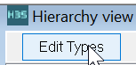

2. Select `giant`

    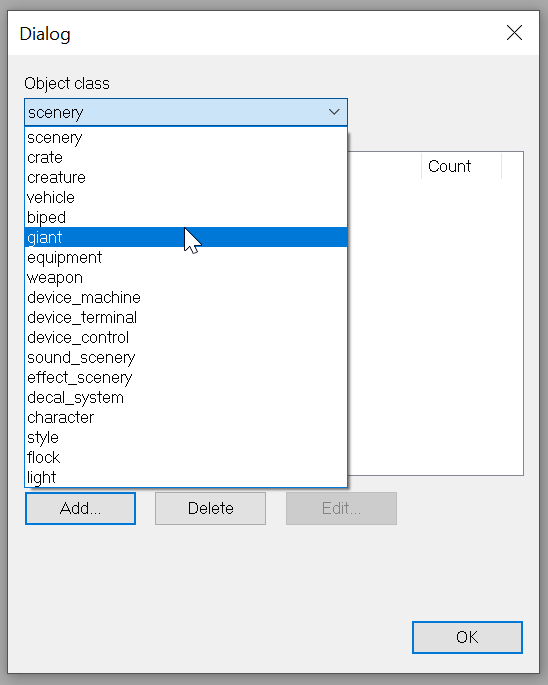

3. Add

    

4. Find scarab giants folder

    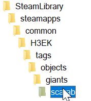

5. Add the `scarab.giant` tag

    

## Import the character tag

1. Edit Types

    

2. Choose `character`

    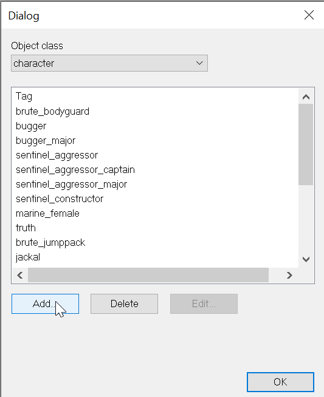

3. Find the scarab AI folder

    

4. Add the `scarab.character` tag

    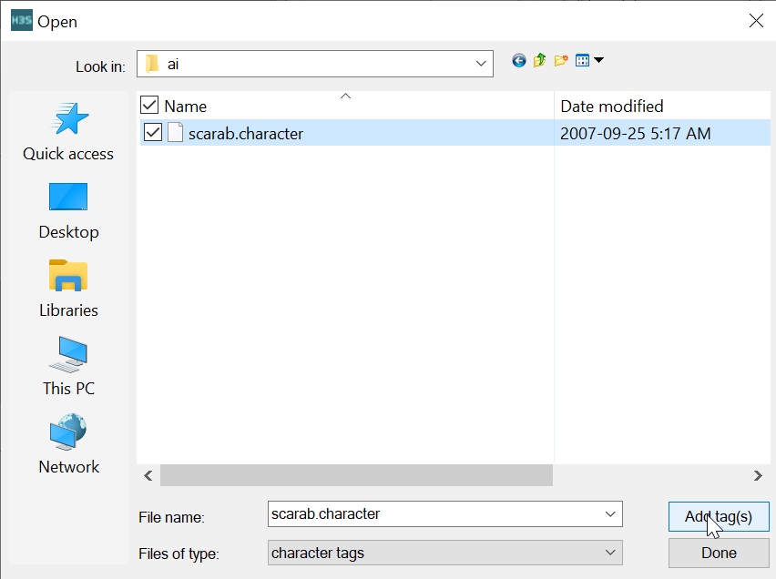


# Create a giants zone

1. Selecting the Zones folder.
2. Click New Instance.
3. Select Areas.
4. New Instance.
5. Right click to place a point.
6. Set the area of the point.
7. Place a lot of points.
3. Name the zone something memorable like `scarabzone`.
2. Set the zone to be a `giants zone`.

    


# Create giant hints


4. Open _AI > Hints > Giant sector hints_ in the Hierarchy window.
    
    

6. Right click in the scene view to place points to mark out an area where the scarab is allowed to walk.

    

7. Left click to finish.
8. Hover over the corners and drag them around with leftclick.

    

7. Place a couple _Giant rail hints_ within the giant sector hints area using right click.

    

    

8. Click _Scenarios > Generate all pathfinding data_

    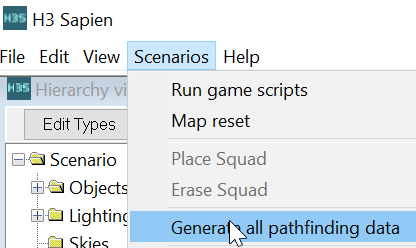

9. Click _Scenarios > Map reset_.

# Set up a squad

1. Select _Squads_ folder.

    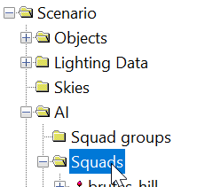

2. New Instance.

    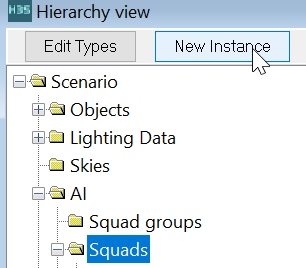

3. Select _Fire teams_

    

4. Set the fireteam _normal diff count_ to `1`.

5. Select _Starting points_.

    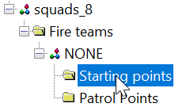

6. Place a starting point by right clicking in the scene view.

    

7. Set character of the fireteam to `scarab`.

    

8. Select the squad and rename it something memorable like `scarab squad`.

9. Set the scarab squad's _initial zone_ to the giants zone created earlier in this guide.
    
    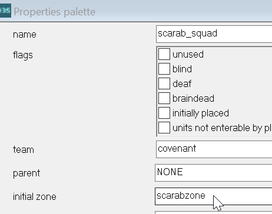

10. Right click the squad and click "Place squad" to spawn the scarab.

    

11. Use  to spawn in and the Scarab will attack and walk around.


## Adding side gunners.

1. Add 3 more starting points to the squad and increase _Normal diff count_ to `4`.
2. On the new starting points, set the character type to Brute or Grunt.

    

3. Name the gunner starting points to `gnr1`, `gnr2`, `gnr3`

    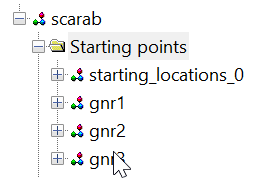

4. Use `vehicle_load_magic` and `object_get_turret` in a script to put the gunners on the turrets. An example script is provided below. The script assumes that the squad is called `scarab_squad`.

```hsc
(script startup my_mission
  (print "Mission begin")
  (place_scarab)
)

(script static void place_scarab
  ; Place the squad
  (ai_place scarab_squad)

  ; Put gunners on the turrets
  (vehicle_load_magic (object_get_turret (ai_get_object scarab_squad/starting_locations_0) 0) "turret_g" (ai_actors scarab_squad/gnr1))
  (vehicle_load_magic (object_get_turret (ai_get_object scarab_squad/starting_locations_0) 1) "turret_g" (ai_actors scarab_squad/gnr2))
  (vehicle_load_magic (object_get_turret (ai_get_object scarab_squad/starting_locations_0) 2) "turret_g" (ai_actors scarab_squad/gnr3))
)
```
