General info on how to set up the scarab in a custom scenario.

# Scarab

The Scarab is a fun opponent to add to custom scenarios. It reqiures more steps to set up than other ai characters.


# AI Scarab setup

## Importing the Scarab.

Two different tags must be imported to have a working scarab.

### Summary

1. Add giant tag.
2. Add character tag.
3. Create a Zone with `giants zone` ticked.
4. Create giant hints.
5. Create a squad with scarab as the character, and set the initial zone to the giants zone.
6. Optionally put gunners on the plasma turrets using scripting.


### Import the giant tag

1.  Edit Types 

    

2. Select `giant`

    

3. Add

    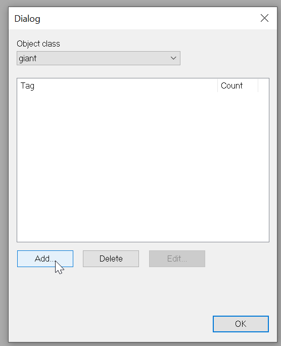

4. Find scarab giants folder

    

5. Add the `scarab.giant` tag

    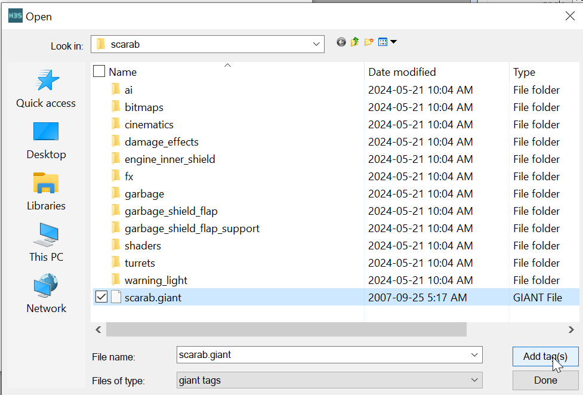

### Import the character tag

1. Edit Types

    

2. Choose `character`

    

3. Find the scarab ai folder

    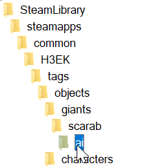

4. Add the `scarab.character` tag

    


## Create a giants zone

1. Selecting the Zones folder.
2. Click New Instance.
3. Select Areas.
4. New Instance.
5. Right click to place a point.
6. Set the area of the point.
7. Place a lot of points.
3. Name the zone something memorable like `scarabzone`.
2. Set the zone to be a `giants zone`.

    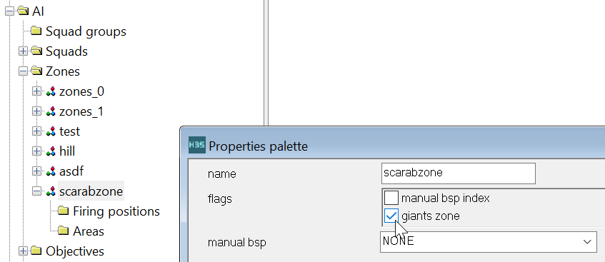
    

## Create giant hints


4. Under AI/Hints, Select `Giant sector hints`
    
    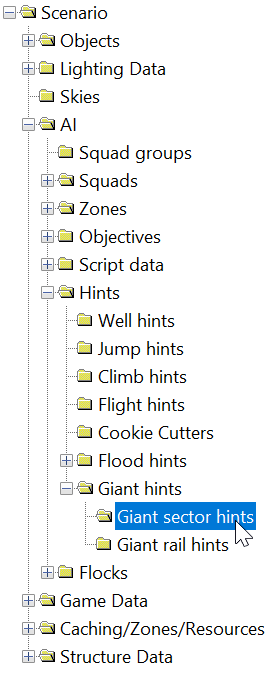

6. Right click in the scene view to place points to mark out an area where the scarab is allowed to walk.  

    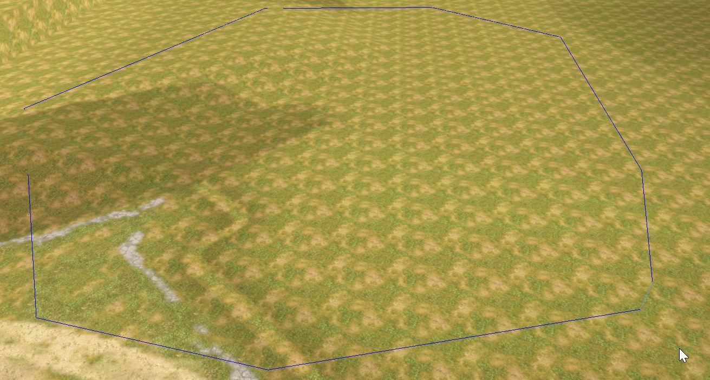

7. Left click to finish.
8. Hover over the corners and drag them around with leftclick.

    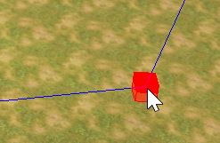

7. Place a couple `Giant rail hints` within the giant sector hints area using rightclick.

    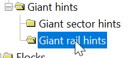

    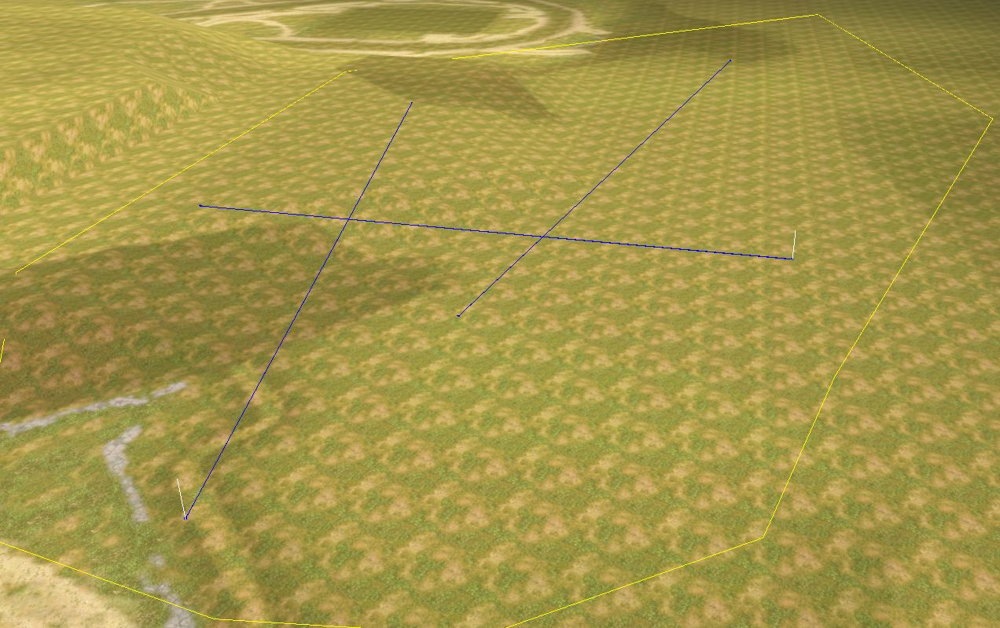

8. Click `Generate All Pathfinding`.

    

9. Click Scenarios -> Map reset.

## Set up a squad

1. Select Squads folder.

    

2. New Instance.

    

3. Select `Fire Teams`

    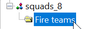

4. Set the fireteam `normal diff count` to 1.

5. Select `Starting points`.

    

6. Place a startingpoint by rightclicking in the scene view.

    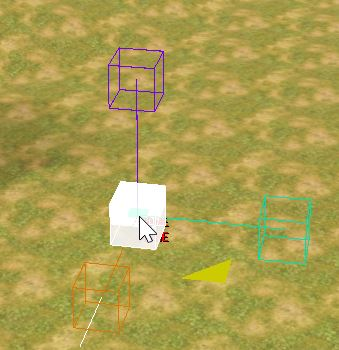

7. Set character of the fireteam to `scarab`.

    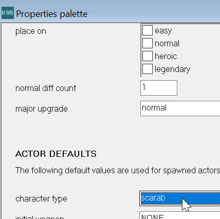

8. Select the squad and rename it something memorable like `scarab squad`.

9. Set the scarab squad's `initial zone` to the giants zone created earlier in this guide.
    
    

10. Right click the squad and click "Place squad" to spawn the scarab.

    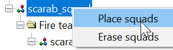

11. Use `ctrl+q` to spawn in and the Scarab will attack and walk around.


## Adding side gunners.

1. Add 3 more starting points to the squad and increase Normal Diff Count to 4.
2. On the new starting points, set the character type to Brute or Grunt

    

3. Name the gunner starting points to `gnr1`, `gnr2`, `gnr3`

    

4. Use `vehicle_load_magic` and `object_get_turret` in a script to put the gunners on the turrets.  An example script is provided below.  The script assumes that the squad is called `scarab_squad`


    ```
    (script startup mymission
        (print "Mission begin")
        (placeScarab)
    )

    (script static void placeScarab

      ;Place the squad
      (ai_place scarab_squad)


      ;Put gunners on the turrets
      (vehicle_load_magic (object_get_turret (ai_get_object scarab_squad/starting_locations_0)  0) "turret_g" (ai_actors scarab_squad/gnr1))
      (vehicle_load_magic (object_get_turret (ai_get_object scarab_squad/starting_locations_0)  1) "turret_g" (ai_actors scarab_squad/gnr2))
      (vehicle_load_magic (object_get_turret (ai_get_object scarab_squad/starting_locations_0)  2) "turret_g" (ai_actors scarab_squad/gnr3))
    )
    ```

