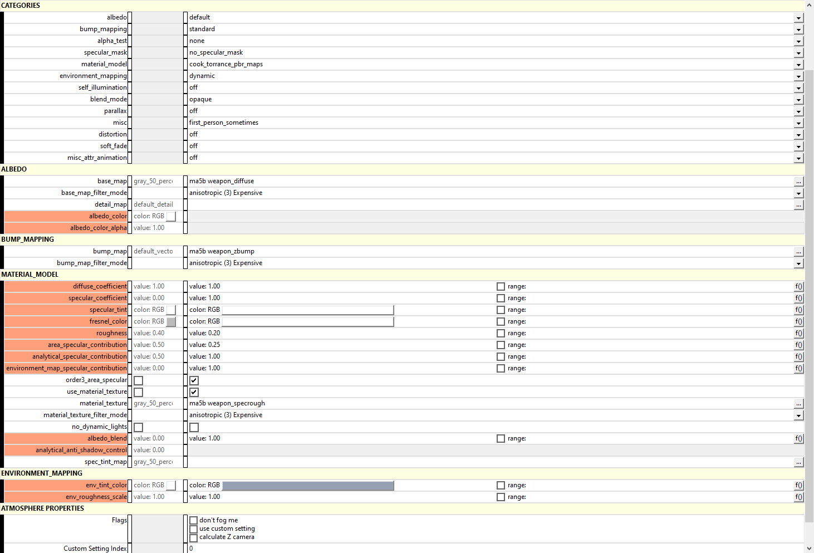

* 

Halo 3 includes a PBR-like shader that allows artists to convert their premade PBR assets to work with Halo 3's shader system. This guide will explain how to convert your existing PBR assets into Halo 3. 

# What is PBR?

* 

Physically based rendering (PBR) is a way of rendering images that mimics how light works in the real world. Most modern game engines have a form of this method in there shading systems. 

# Halo 3's "PBR"

* 

With the release of the weapon and vehicle skins update to Halo 3 MCC, 343 Industries implemented a new material_model called **cook_torrance_pbr_maps**. This allowed for the menu skins that were authored in PBR to be replicated in-engine when enabled. While not 100% true PBR, this shader allows artists to now have a more modern rendering technique in Halo 3.

The PBR shader needs three types of textures to work with:
- Diffuse Map
- Control Map
- Normal Map

**NOTE -** *Optional textures to have:*
- *Emission Map*
- *Parallax/Displacement Map*

# Step 1: Creating a Diffuse map

Halo 3 does not use Albedo maps. Instead it uses Diffuse maps, which is a combo of the Albedo map and Ambient Occulsion map. This way you can have baked shadows in your shader.

You will need two textures for creating a Diffuse map:

  - Albedo/Base Color
  - Ambient Occulsion

Conversion steps

1. Open up your Albedo map in your photo editing program.
  * 
2. Create a new layer over your Albedo map.
3. Copy and paste your Ambient Occulsion map into the new empty layer.
4. Set the blend mode of the Ambient Occulsion to **Multiply**.
  * 
5. Save your new Diffuse map as .TIF in your asset's bitmaps folder.

You now have a converted Diffuse map. Make sure to save a editable copy of the Diffuse map in case you wish to make changes later.

# Step 2: Creating a Specular map

**NOTE**: *If you have a texture set that does not include a **Metallic map**, you do not need to make a Specular map. You can skip this step.*

You will need three textures for creating a Halo 3 Specular map:

  - Metallic
  - Roughness
  - Ambient Occulsion

Conversion steps

1. Open up your Metallic map in your photo editing program.
  * 
2. Create a new layer over your Metallic map. 
3. Copy and paste your Roughness map into the new empty layer.
4. Press <kbd>Ctrl + I</kbd> to invert the Roughness map.
5. Set the blend mode of the Roughness map to **Lighten**
  * 
6. Create a new layer over your inverted Roughness map.
7. Copy and paste your Ambient Occulsion map into the new empty layer.
8. Set the blend mode of the Ambient Occulsion to **Multiply** and the opacity to **75%**.
  * 
9. Save your new Specular map as .TIF in your asset's bitmaps folder.    

And there you go, you should now have a working Specular map. Make sure to save a editable copy of the Specular map in case you wish to make changes later.

# Step 3: Creating a Control Map

Halo 3's PBR shader needs one more texture map to complete the shader. This Control map hold two texture maps in the RGB color channels. In the red channel is the Specular map and in the green channel is the Roughness map. The blue channel is just a solid white. This is the most important step. Without the correct Control map setup, your asset will not look correct in-engine.

Setup steps

1. Merge all the layers of your Specular map.
2. Copy your Specular map.
3. Create a new image with the exact same pixel resolution of the Specular map.
4. Open the color channels of the new image and paste the Specular map in the red channel.
  * 
   1. **NOTE**: *If you do not have a Metallic map, make the red channel solid black.*
5. Copy your unaltered Roughness map and paste it into the green channel.
6. Make the blue channel solid white.
  * 
7. Save your new Control map as .TIF in your asset's bitmaps folder.    

The final Control map should resemble a pink and blue texture, with the pink colors representing the reflective surfaces and the blue colors the dull surfaces. If you have a material that has no metal, the Control map should only have blue colors. 

* 

# Step 4: Converting a Normal Map

Make sure to identify what type of Normal map you have. Halo 3 uses DirectX normals and does not need to be converted to work with the engine. Simply save the normal as a .TIF in your asset's bitmaps folder and you will be good to go.

However, you have an OpenGL normal map, you will need to do the following:

Conversion Steps
1. Open up your OpenGL Normal map in your photo editing program.
2. Go to the color channels of the Normal map.
3. Select ONLY the green channel and press <kbd>Ctrl + I</kbd> to invert the green channel.
* 
4. Re-enable all the color channels and save your converted Normal map as .TIF in your asset's bitmaps folder.

# Step 4: Bitmap Settings

Once everything has been exported as .TIFs and imported into Guerilla, the textures (known as bitmaps in Halo 3) need to be configured to render correctly. Below is the bitmap settings you need to use for your PBR asset:

Diffuse Bitmap:

* 

Control Bitmap:

* 

Normal Bitmap:

* 

*Emission Bitmap:*

* 

*Parallax Bitmap*

* 

# Step 5: Shader Settings

The final step in this process is configuring the shader settings. Below is a picture showcasing what your shader values and settings need to be set to:

* 

- The base_map field is where your Diffuse map goes.
- The bump_map field is where your Normal map goes.
- The material_texture field is where your Control map goes.

**NOTE:** *To enable the emission and parallax fields, make sure to enable them in the Categories section.*
- *Set self_illumination to **Simple**.*
- *Set parallax to **simple** or if you want the best quality **interpolated**.*

*Here is an example of the default settings for emission and parallax:*

* 

The only settings that you should really play with while using the PBR shader is:
- <kbd>area_specular_contribution</kbd>
- <kbd>analytical_specular_contribution</kbd>
- <kbd>environment_map_specular_contribution</kbd>

With everything combined and set, you should now have your asset rendering with the PBR shader.

* 
# Acknowledgements

Thanks to the following individuals for their research or contributions to this topic:

- TheChunkierBean (Writing this page.)

