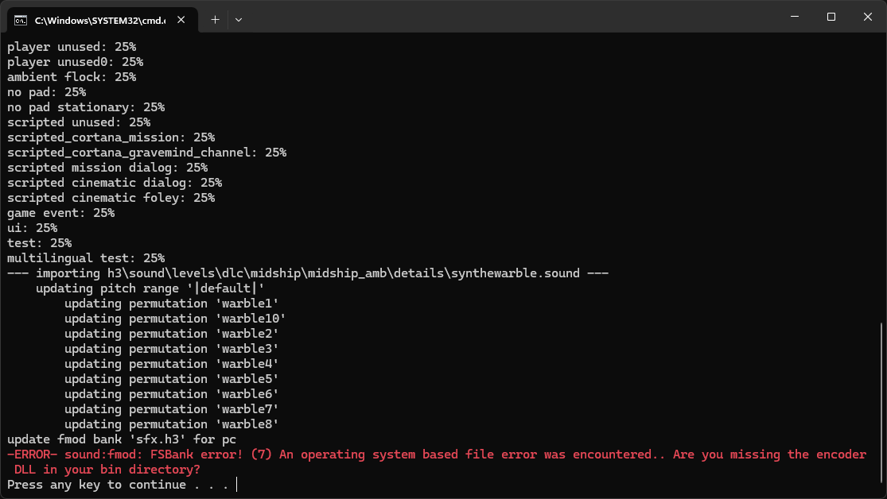
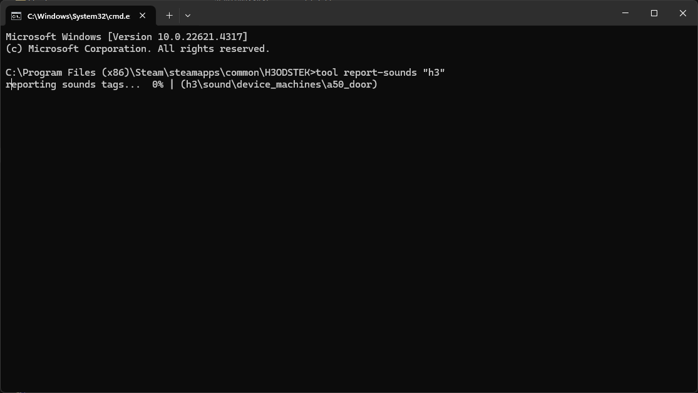
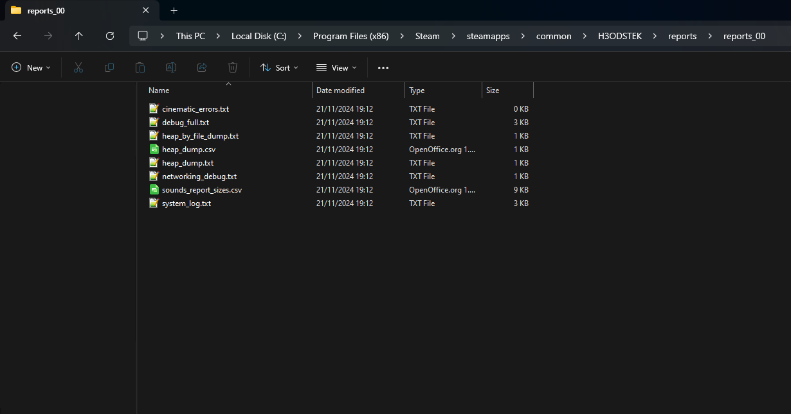


This guide assumes you are importing your sounds into a custom FMOD sound bank.



You do not need to rebuild your FMOD sound banks after every import. You can import as many sounds as you'd like and you'd only rebuild your FMOD sound banks once you're done importing your sounds.


# Introduction
This guide will teach you how to rebuild all of your FMOD sound banks without having to go through the process of reimporting every single sound. This is especially useful if you're running into any FMOD errors such as `sound:fmod: FSBank error! (7) An operating system based file error was encountered.. Are you missing the encoder DLL iny our bin directory?` when importing sounds.

This guide is also compatible with the [H3ODSTEK](../../../../h3odst/h3odst-ek) and [HREK](../../../../hr/hr-ek), just replace any mentions of "H3EK" with the correct editing kit.


# Setup

## Exporting sound tags
First, we need to export all of our sound tags into a `.csv` file. Fortunately, Tool includes a command specifically for this.

Open the [command prompt](~command-line) window in your **H3EK install folder** and run the `tool report-sounds` command with the first argument pointing to the folder containing all your sound tags, as follows:
```sh
tool report-sounds "sound"
```


After the command is run, a `sounds_report_sizes.csv` file will be generated in the `reports\reports_00` folder. Make sure to run this command everytime you want to rebuild your FMOD sound banks so that the `sounds_report_sizes.csv` file stays up-to-date with your newly imported sounds, if you have any.



## Rebuilding the FMOD sound bank(s)

Now that we have our sound tags exported to a `.csv` file, we can start to rebuild our FMOD sound bank(s).

Open the [command prompt](~command-line) window in your **H3EK install folder** again and run the `tool export-fmod-banks` command with the first argument pointing to the `sounds_report_sizes.csv` file, the second argument being `pc`, the third argument being the type of bank you want to rebuild (either `sfx` or `languages`) and the fourth and final argument being the name of the FMOD sound bank(s) your sounds originated from (including the `-bank:` prefix), as follows:
```sh
tool export-fmod-banks "reports\reports_00\sounds_report_sizes.csv" pc sfx -bank:h3
```


Choosing "languages" as the bank type will rebuild all of the sound banks for all the language specific data folders at once.



## Finishing up

Once your FMOD sound banks have been rebuilt, you should hear the sounds you've imported when playing them back in-game or through Guerilla! A `bank_name.report.csv` file is generated in the `fmod\pc` folder, which is located in the same folder as the `sounds_report_sizes.csv` file. This report contains information about the FMOD hashes and such.