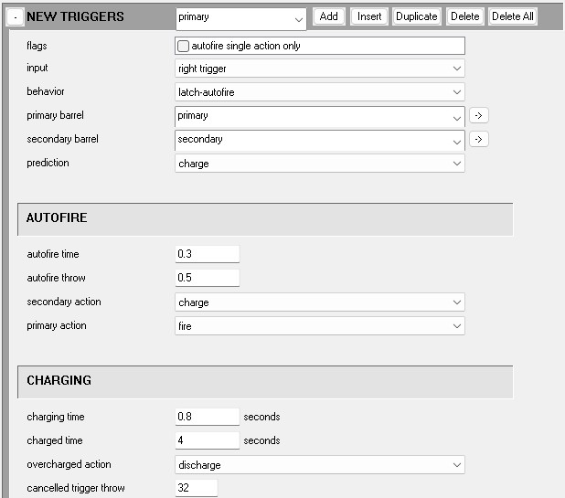
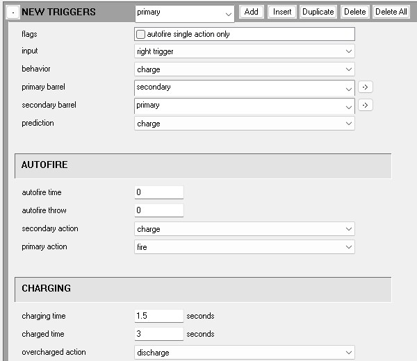
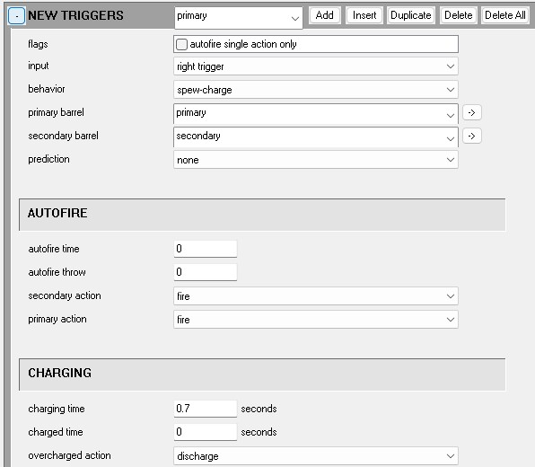
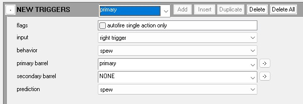
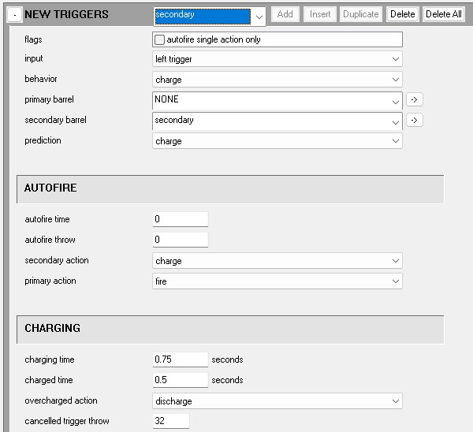

[Weapons](~weapon) in Halo have a variety of different mechanics and firemodes, some of these include the ability to use an alternate form of attack such as an overcharge or a scoped-in fire mode, this page will serve as a guide for setting these features up within your weapon tag.

Alternate fire modes in Halo are mostly hard-coded behavior types associated with specific [trigger types](~weapon#new-triggers), as such these will be our alternate fire methods.

Make sure to reference the **weapon tag** page itself for more in-depth details of the fields and how they work.

## Latch autofire

Easily the most common type used in the franchise, the plasma pistol is notable for using this trigger type, behaving as latch when tapping the trigger or fire keys quickly, but if the key or trigger is held for longer than the *autofire time* the secondary barrel begins charging, to be released upon command when fully charged, or should the barrel overcharge.

After setting your trigger type to latch autofire, you may then specify your barrels, the primary barrel will be when the weapon is not charging, and the secondary will be for fully charged, assign your barrels to these as you desire

## Charge

The quirky sibling of latch-autofire, charge behaves in almost the same way except with the focus being on charging the secondary barrel and only firing the primary barrel if the secondary fails to be fully charged when the key is released.

Can be set up the same way as latch autofire, but ignores the autofire time field.

## Spew Charge

As common as the spartan laser itself, this unique trigger type is only used for that specific weapon, but generally it's an automatic fire weapon that fires it's first barrel while charging it's second, once the second barrel finishes charging it then takes over firing as a semi-auto or burst attack.

After setting your trigger type to spew charge, you may then specify your barrels, the primary barrel will be when the weapon is charging, and the secondary will be for fully charged, assign your barrels to these as you desire

## Latch zoom

Perhaps the easiest to understand and set up, this type of alternate fire is used for semi-auto/burst weapons that gain an alternate fire mode when zooming in, due to the limitations of this trigger type, no automatic fire modes are possible.

After setting your trigger type to latch zoom, you may then specify your barrels, the primary barrel will be when the weapon is unzoomed, and the secondary will be for zoomed, assign your barrels to these as you desire

## Secondary trigger

Being the most archaic method of implementing an alternate fire, this method doesn't use any special trigger types at all, but instead uses a whole seperate trigger with it's own button input, this allows the issues of prior types to be ignored, but comes at a cost.

Simply add another trigger block and assign it to a differing input such as melee or left trigger, be aware that these buttons have preestablished functions such as melee, zooming or vehicle boosting, for handheld weapons it would advised to disabled binoculars and grenade throwing so there are no keybind conflictions across keyboard or controller.

