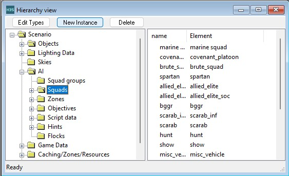
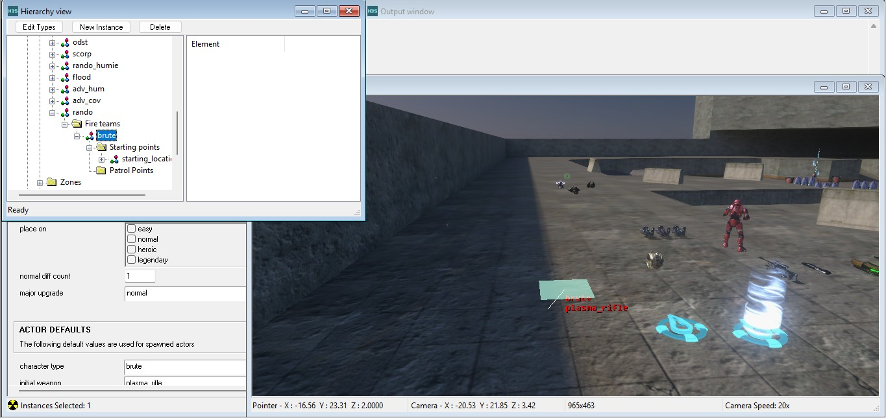
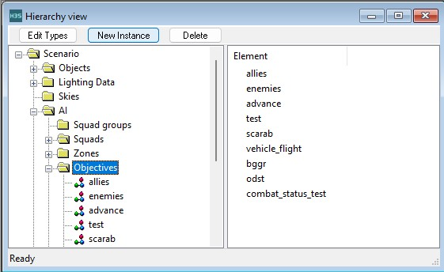
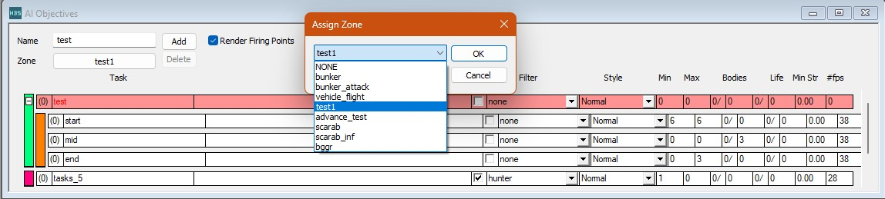
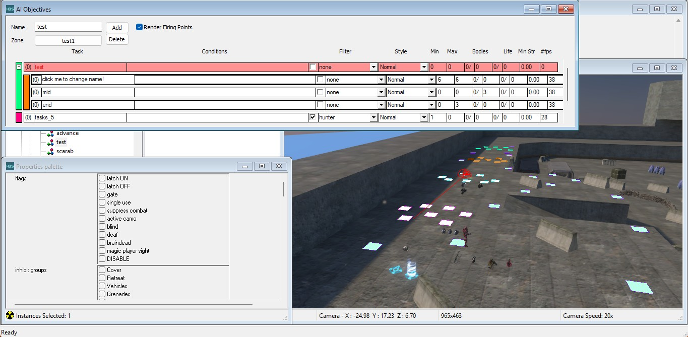
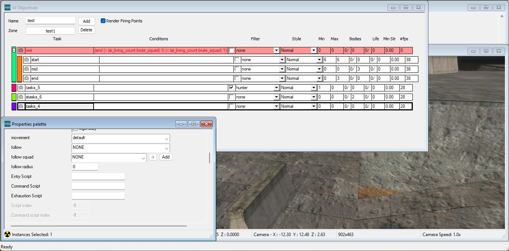

This guide provides general info on how to set up AI to follow you around a level, this guide assumes you have basic understanding of navigating [sapien](~), [pathfinding](~) and the [objective](~) system, as having these is very useful.

# The squad
Within sapien scroll down to the AI section, click on the squads option and then click "new instance"

Now, within your new squad open it up to fireteams and add a new fireteam, configure this fireteam with whatever AI unit you want and place down starting positions by using *right click* in the game window.

# The objectives
Within sapien, scroll down to the AI section and click on objectives, click "new instance"

Open your new objective and assign it a default zone, give it a name you will recognize later and click "add" to create a new task

Clicking on the task will allow you to edit properties such as it's name and allow clicking areas to assign them to this task

# The task
Within your new task, set the follow policy to your desired option and assign a follow radius (assumed in world units), remember; AI are not following a target between firing positions, but rather *between areas* inside the task

# The result
In sapien under the AI section you can now go to your AI squad and assign them the new objective and task you just made, now save the scenario (ctrl + S), do a map reset (ctrl + R) and then place your AI squad down and observe your results