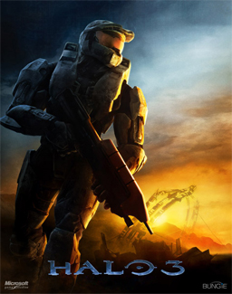

<figure>
  
  <figcaption>
    
Halo 3's art de la boîte mettant en vedette le Master Chief

  </figcaption>
</figure>

**Halo 3** est le troisième volet de la série de jeux Halo et la suite de [Halo 2][h2]. Il a été créé par [Bungie][bungie] et initialement publié sur la Xbox 360 en 2007 par l’éditeur / propriétaire [Microsoft][]. En 2014, le jeu a été réédité dans le cadre de *Halo: The Master Chief Collection* sur Xbox One et plus tard en 2020 a été porté sur Microsoft Windows aux côtés d’autres titres halo de la collection.

Comme d’autres jeux de la série, Halo 3 utilise le propriétaire de Bungie [Blam!][engine] avec une multitude de mises à niveau par rapport à la version Halo 2 du moteur.

## Xbox (Bungie, Septembre 2007)
Il s’agit de la première version classique de Halo 3 pour Xbox 360.

### Modding
Il existe plusieurs outils et mods pour le jeu de base ou des programmes externes que les utilisateurs peuvent saisir pour améliorer leur expérience. Exemples:

* [Assembly][assembly] - Un outil d’édition de cache pour divers titres de la série Halo. Les utilisateurs peuvent utiliser cet outil pour apporter des modifications permanentes aux fichiers en cache et apporter des modifications en temps réel. Bien qu’il ne s’agisse pas d’un flux de travail traditionnel pour la création de maps, il s’agit d’un outil puissant qui peut être utilisé pour créer des expériences intéressantes. 
* [TagTool][tagtool] - Un outil d’édition de cache conçu pour permettre *porting* la tag données entre différentes versions et du moteur Blam, ainsi que l’importation de tout nouveau contenu.

Comme tous les jeux Halo [tags][] jouer un rôle important dans le modding.

## MCC (PC et Xbox One, 343 Industries, 2014-Jour actuel)
Halo: The Master Chief collection (MCC) est activement maintenu par [343 Industries][343i] pour PC et Xbox One. Il rassemble la série Halo sous un seul [Jeu en tant que service][gaas_fr], y compris des expériences unifiées de jumelage et de progression. Le port PC utilise [Unreal Engine][unreal] en tant que menu et couche d’entrée sur les moteurs respectifs de chaque jeu Halo inclus.

En 2014, Halo 3 a été réédité sur Xbox One dans le cadre de halo: The Master Chief Collection. Souvent appelé **H3 MCC** par la communauté.

### Modding
Il existe plusieurs outils et mods pour le jeu de base ou des programmes externes que les utilisateurs peuvent saisir pour améliorer leur expérience. En voici quelques exemples:

* [Halo 3 Editing Kit][h3-ek] - La suite d’édition officielle publiée pour la version MCC de Halo 3 est largement basée sur des outils internes développés par Bungie et utilisés plus tard par 343 Industries et [Saber Interactive][saber]. Certaines modifications ont été apportées pour rendre les outils plus conviviaux et stables, ainsi que pour prendre en charge l’importation de contenu à partir de logiciels de modélisation 3D modernes.
* [Halo Asset Blender Development Toolset][halo-asset-blender-development-toolset] - Une collection d’outils pour Blender qui peuvent être utilisés pour exporter les fichiers intermédiaires utilisés par le kit d’édition Halo 3.
* [Assembly][assembly] - Un outil d’édition de cache pour divers titres de la série Halo. Les utilisateurs peuvent utiliser cet outil pour apporter des modifications permanentes aux fichiers en cache et apporter des modifications en temps réel. Bien qu’il ne s’agisse pas d’un flux de travail traditionnel pour la création de cartes, il s’agit d’un outil puissant qui peut être utilisé pour créer des expériences intéressantes. 
* [TagTool][tagtool] - Un outil d’édition de cache conçu pour permettre *porting* la tag données entre différentes versions et du moteur Blam, ainsi que l’importation de tout nouveau contenu.

[bungie]: https://fr.wikipedia.org/wiki/Bungie
[microsoft]: https://fr.wikipedia.org/wiki/Xbox_Game_Studios
[saber]: https://fr.wikipedia.org/wiki/Saber_Interactive
[343i]: https://fr.wikipedia.org/wiki/343_Industries
[gaas_fr]: https://fr.wikipedia.org/wiki/Jeu_vid%C3%A9o_en_tant_que_service
[unreal]: https://fr.wikipedia.org/wiki/Unreal_Engine
