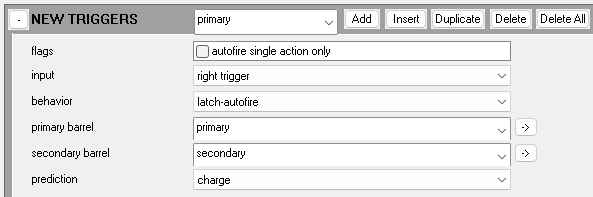

--- 
title: weapon
about: 'tag:h3/weapon'
img: weapon.jpg
caption: Various items all classified as weapons
keywords:
  - gun
  - pistol
  - carbine
  - cannon
  - sword
  - rifle
  - launcher
thanks:
  odchylanie_uderzenia: writing and research
--- 
**Weapons** are most commonly seen as the wieldable items dropped by AI and found in the environment. However, they are also used for items like the CTF flag, oddball, and weapons attached to [vehicles](~vehicle) or [bipeds](~biped). 

Weapons are intended to fire instances of the [projectile](~) tag or [crate](~) tag. Thrown grenades are not a type of weapon, but rather a [projectile referenced by globals](~globals).

Weapons through their parent [object](~) tag can be assigned a [render mesh](~render_model), [collision box](~collision_model), [animation set](~model_animation_graph) and [physics shape](~physics_model). 

# Flags

These are general purpose flags that change the behavior of the weapon, more specific flags for individual parts of the weapon can be found further down in their specific section.

| Weapon flags | Description
|-------|----------
| must be readied | Prevents weapon from being used, attempting to attack with weapon will force drop it.
| doesn't count towards maximum | Allows weapon to become a third or fourth weapon for the player
| aim assists only when zoomed | Disables bullet magnetism, red reticle and aim magnetism when unzoomed
| prevents grenade throwing | Prevents grenade throwing while weapon is equiped and held, unknown else behavior
| prevents melee attack | Disables melee attacks with weapon
| detonates when dropped | When this weapon is not being held by a [unit](~) or model it explodes, uses the parent [item](~) tag for detonation values and references
| cannot fire at max age | Causes weapon to be unable to be fired once it reaches max age
| secondary trigger overrides grenades | If the secondary trigger key is also bound to grenade throw, this flag forces no grenade throw
| support weapon | Causes weapon to be dropped when a melee attack is performed and disables grenade throwing
| AIs use melee damage | Causes [AI](~) to use the melee damage of the weapon instead of their biped melee damage value
| forces no binoculars | Disables binoculars on weapon, binoculars are separate from weapon zoom
| loop fp firing animation | Unknown
| prevents crouching | Prevents players from crouching while this weapon is equipped, not applicable to AI
| cannot fire while boosting | Weapon is not allowed to fire while unit is boosting, used for weapons on [vehicles](~vehicle) with a boost
| use empty melee on empty | Used on melee weapons to force empty melee animation when weapon has reached max age
| uses 3rd person camera | Forces third person camera when weapon is equipped
| can be dual wielded | Allows this weapon to be dual wielded with other weapons with this flag
| can only be dual wielded | Weapon can *only* be picked up when holding another dual wield weapon to duel wield with
| melee only | Weapon becomes a melee weapon, primary trigger becomes melee attack
| can't fire if parent dead | Unknown/Needs additional research
| weapon ages with each kill | Seems to apply to melee weapons only, causes age to be incurred when killing an enemy
| weapon uses old dual fire error code | When dual wielding and firing a single weapon, use single weapon error value, without flag means use dual wield error value regardless of firing both weapons at the same time or not
| allows unaimed lunge | Allows melee weapons to play lunge melee animation even when not in range of a target to lunge at
| cannot be used by player | Weapon cannot be picked up by player, if held is dropped
| hold fp firing animation | Unknown/Needs additional research
| strict deviation angle | Disables bullet magnetism while keeping red reticle

| Secondary flags | Description
|-------|----------
| magnetizes only when zoomed | Disables aim magnetism when unzoomed
| force enable equipment tossing | Unknown/Needs additional research
| non- lunge melee dash disabled | Disables lunge movement when enacting a melee on a target

| Fields | Tag/data type | Description
|-------|----------|--------------
| maximum alternate shots loaded | short | Unknown/Needs additional research
| turn on time | real | The time in seconds it takes from the weapon being readied for the function "turned_on" to transition from 0 to 1
| ready time | real | Unknown/Needs additional research
| ready effect | [sound](~) / [effect](~) | Unknown/Needs additional research
| ready damage effect | [damage_effect](~) / [damage_response_definition](~) | Unknown/Needs additional research

| Secondary trigger mode | Description
|-------|----------
| normal | Unknown/Needs additional research
| slaved to primary | Unknown/Needs additional research
| inhibits primary | Unknown/Needs additional research
| loads alternate ammunition | Unknown/Needs additional research
| loads multiple primary ammunition | Unknown/Needs additional research

# Heat

This section is responsible for various properties and responses to weapon heat, generally weapons without the need to reload have a heat system to normalize their output.


- For values of 0 to 1 these represent percentages, so 0.2 = 20%

- Heat gained while firing the weapon is handled by the weapon [barrel](~weapon#misc-and-recoil) being fired


| Fields | Tag/data type| Description
|-------|----------|--------------
| heat recovery threshold | real | From 0 to 1 determines at what level of heat the weapon is allowed to fire again after being overheated
| overheated threshold | real | From 0 to 1 determines at what level of heat the weapon becomes overheated, needs to be higher than the recovery threshold
| heat detonation threshold | real | From 0 to 1 determines when the weapon is allowed to explode after surpassing the given value of heat
| heat detonation fraction | real | From 0 to 1 determines the chance the weapon explodes when it's heat has surpassed the detonation threshold and it is fired
| heat loss per second | real | From 0 to 1 determines how much heat the weapon loses while it is not being fired, or in- between firing
| heat illumination | real | From 0 to 1 determines how much the illumination function is raised as the weapon gains heat
| overheated heat loss per second | real | From 0 to 1 determines how much heat the weapon loses while it is in the overheated state, this state ends when the heat level reaches the recovery threshold
| overheated | [sound](~) / [effect](~) | Effect or sound played when weapon enters overheated state or explodes due to trigger overcharge
| overheated damage effect | [damage_effect](~) / [damage_response_definition](~) | Damage or damage response played when weapon enters overheated state or explodes due to trigger overcharge
| detonation | [sound](~) /  [effect](~) | The sound or effect that plays upon weapon detonation due to heat conditions or trigger explode
| detonation damage effect | [damage_effect](~) / [damage_response_definition](~) | The damage or damage response played when the weapon detonates due to heat conditions
| player melee damage | [damage_effect](~) | Unknown/Needs additional research
| player melee response | [damage_effect](~) / [damage_response_definition](~) | Unknown/Needs additional research

# Melee

Melee attacks for the player are not natural to the player unit themself, but rather the weapon they hold. With this we can set different weapons to deal different amounts and types of melee damage: this section contains the references for such [damage_effect]() tags.

| Melee damage parameters | Data type | Description
|-------|----------|--------------
| damage pyramid angles | euler | Two values that define the angles the melee attack is thrown out/Needs additional research
| damage pyramid depth | real | When initiating a melee attack, the damage itself is thrown this far out, can be farther than the melee lunge range


It is currently understood that only the energy sword can initiate a clang, and only on another energy sword when lunging at each other


| Melee combo damage | Tag/data type | Description
|-------|----------|--------------
|1st hit melee damage | [damage_effect](~) | Damage effect played on a target hit by the melee key melee
|1st hit melee response | [damage_effect](~) / [damage_response_definition](~) | damage response played on the player when hitting a target
|2nd hit melee damage | [damage_effect](~) | Unused
|2nd hit melee response | [damage_effect](~) / [damage_response_definition](~) | Unused
|3rd hit melee damage | [damage_effect](~) | Unused
|3rd hit melee response | [damage_effect](~) / [damage_response_definition](~) | Unused
|lunge melee damage | [damage_effect](~) | Damage effect played on a target hit by melee weapon lunge attack
|lunge melee response | [damage_effect](~) / [damage_response_definition](~) | Damage response played on the player when hitting a target with a lunge attack
|empty melee damage | [damage_effect](~) | Damage effect used for melee weapons when the weapon flag "use empty melee on empty" is enabled
|empty melee response | [damage_effect](~) / [damage_response_definition](~) | Damage response played on player for empty melee on melee weapons using the "use empty melee on empty" weapon flag
|clang melee damage | [damage_effect](~) | Damage effect played on targets hit by a clang attack
|clang melee response | [damage_effect](~) / [damage_response_definition](~) | Damage response played on players engaging in a melee clash against each other
|clang effect | [sound](~) / [effect](~) | Effect played on players who engage in a melee clash against each other
|melee damage reporting type | enum | Dropdown selector for various weapon and vehicle types, unknown/unused effects

# Zoom

This section defines weapon zoom properties, zooming increases the range of [aim assist properties](~weapon#weapon-aim-assist) according to the zoom level.

| Fields | Data type | Description
|-------|----------|--------------
| magnification levels | short | Value determining how many levels of zoom this weapon provides, 2 is soft limit for compatible [chud_definition](~) tags
| magnification range | real | A set of values for min and max, for a weapon with more than 1 zoom level the min is used for the first level of zoom and the max is used for the last level of zoom, if a single zoom level is set the min zoom value is used

# Weapon aim assist


For **melee** weapons the lunge range is set as the autoaim range & falloff range, lunge range however is *effectively* capped at a value of 5.2 for the autoaim fields, past this the lunge is either disabled or is inconsistent


This section defines weapon assist features to make target aquisition easier, especially for controller. **autoaim** is more commonly known as *bullet magnetism* and is where your projectiles deviate towards targets without input from the player, making the ability to hit targets easier. **magnetism** is more commonly known as *aim assist* where your reticle is gently pulled onto targets without player input, this makes target aquisition and tracking much easier.

| Fields | Data type | Description
|-------|----------|--------------
| autoaim angle | angle | Angle in which projectiles from this weapon are magnetized towards targets within autoaim range, max value must be less than 90 degrees
| autoaim range | real | Maximum range of red reticle and in which projectiles can be magnetized towards targets
| autoaim falloff range | real | At what range does the strength of projectile magnetism begin to fall off before the maximum distance
| magnetism angle | angle | Angle in which the game applies aim assist to controllers when aiming over a target within magnetism range
| magnetism range | real | Maximum range in which the game will apply aim assist to controllers aiming over a target
| magnetism falloff range | real | Range in which the strength of aim assist for controllers begins to fall off before maximum distance
| deviation angle | angle | Funtions the same as "autoaim angle", but ignores the ["strict deviation angle" weapon flag](~weapon#flags)

# Movement

This section is responsible for movement **penalty** properties, slowing the players movement under certain conditions.


Movement penalty values work as percentages in increments of 0.1, incorrect values will be rounded down
(example: 0.28 = 28% movement speed penalty but this will be rounded down to 0.2 or 20%)


| Movement penalized | Description
|-------|----------
| always | movement is always penalized
| when zoomed | movement is penalized only when zoomed
| when zoomed or reloading | movement is penalized except when reloading

| Fields | Data type | Description
|-------|----------|--------------
| forward movement penalty | real | Value of 0 to 1 as a fraction of player forwards and backwards speed lost when their movement is penalized
| sideways movement penalty | real | Value of 0 to 1 as a fraction of player sideways speed lost when their movement is penalized

# AI targeting parameters

ai scariness (real): This value defines how much scariness this weapon contributes against other AI characters, allowing it to trigger certain behaviors like retreating or taking cover. see the [character](~) tag for more info about how AI scariness is calculated and what thresholds are used for certain behaviors.

# Miscellaneous

This section contains a mix-match of various properties with various effects.

| Fields | Tag/data type | Description
|-------|----------|--------------
| weapon power-on time | real | When the power key is used, this value determines how long the "power" function takes to fully turn on
| weapon power-off time | real | When the power key is used, this value determines how long the "power" function takes to fully turn of"
| weapon power-on effect | [sound](~) / [effect](~) | The sound or effect played on the weapon when switching the power on using the power key
| weapon power-off effect | [sound](~) / [effect](~) | The sound or effect played on the weapon when switching the power off using the power key
| age heat recovery penalty | real | A value that represent how much of the weapons heat recovery value lost as the weapon gains age, includes overheat and non-overheat heat recovery, a value of 1 means the heat loss is halved, 3 is quartered
| age rate of fire penalty | real | A value that represent how much of the weapons rate of fire lost as the weapon gains age, a value of 1 means the final rate of fire is halved, 3 is quartered
| age misfire start | real | A value from 0 to 1 that represents the age value a weapon must reach to begin misfiring
| age misfire chance | real | A value from 0 to 1 that represents the chance a weapon can misfire once it has passed the "age misfire start" value
| pickup sound | [sound](~) | Sound played on weapon when picked up
| zoom-in sound | [sound](~) | Sound played on weapon when zooming in, including to other zoom levels
| zoom-out sound | [sound](~) | Sound played on weapon when zooming out, including to other zoom levels
| active camo ding | real | A value that defines how much active camo is lost when firing this weapon, assumed percentile per shot
| active camo regrowth rate | real | A value that defines how fast active camo is regained after firing this weapon, unknown parameters
| handle node | string | Unknown/Needs additional research

# Weapon Labels

This section is used in conjunction with **third** person animations to define what animation sets to use.

| Fields | Data type | Description
|-------|----------|--------------
| weapon class | string | A string value that corresponds to a **weapon class** entry in [model_animation_graphs](~model_animation_graph) of the unit holding this weapon, needed for units to be able to hold this weapon
| weapon name | string | A string value that corresponds to a **weapon type** entry in [model_animation_graphs](~model_animation_graph) of the unit holding this weapon, needed to define the animations a unit can use with this weapon
| multiplayer weapon type | enum | A dropdown of various multiplayer objective items such as the flag or oddball that can be used to interact with other items for objectives during gameplay

# More miscellaneous

This section contains properties for weapon types and properties related to projectile tracking.


Despite using the "no tracking" option, the needler still possesses tracking abilities, this may be due to the weapon type


| Weapon type | Description
|-------|----------
| undefined | No unique effect
| shotgun | Allows usage of continuous and partial reload animations
| needler | Unknown, possibly allows projectile tracking despite no tracking type specified
| plasma pistol | Unknown
| plasma rifle | Unknown
| rocket launcher | Unknown
| energy blade | Unknown, possibly allows melee clang
| splazer | Unknown

| Tracking type | Description
|-------|----------
| no tracking | No tracking of any type allowed for this weapon
| human tracking | Allows tracking of targets whose model and biped tags defines targets with human tracking flags enabled
| plasma tracking | Allows tracking of targets whose model and biped tags defines targets with plasma tracking flags enabled

# Interface

This section defines what UI tags to use to display things like the reticle and ammo and other elements.


First entry of this block is for biped type 0 and 2 (spartans), and the second entry is for biped type 1,3 and 4 (elites) and this is regardless of game mode selection


*first person (and chud)*

| Fields | Tag type | Description
|-------|----------|--------------
| first person model | [render_model](~) | The render model to be used in first person for this weapon and biped type
| first person animations | [model_animation_graph](~) | The animation graph to be used on this weapon for this biped type
| chud interface | [chud_definition](~) | The UI tag to be used for this weapon, applies regardless of camera mode of the weapon

# Magazines

Generally, weapons either use **age** or a **ammo** system to limit their total firepower output, this section contains properties for setting up the latter.


First entry into this block will be the primary magazine, second entry will be secondary magazine


| Magazine flags | Description
|-------|----------
| wastes rounds when reloaded | When the weapon is reloaded, any round left in the magazine are deleted
| every round must be chambered | Unknown, likely used with the shotgun weapon type dropdown to force chambering each shot

| Fields | Tags/data type | Description
|-------|----------|--------------
| rounds recharged | short | Number of rounds restored every second into the magazine, applies regardless of if the weapon is currently equipped
| rounds total initial | short | Number of rounds the weapon starts with, will fill the magazine first then overflow into reserve ammunition
| rounds total maximum | short | Number of total rounds the weapon can carry, including magazine and then defines the size of the reserve pool
| rounds loaded maximum | short | Number of rounds the magazine can hold, once depleted needs reloading
| runtime rounds inventory maximum | short | Unknown/Needs additional research
| reload time | real | Unknown/Needs additional research
| rounds reloaded | short | Number of rounds removed from reserve ammunition and placed into the magazine after a reload
| chamber time | real | Unknown/Needs additional research
| reloading effect | [sound](~) / [effect](~) | Sound or effect played once the reload key is pressed, if an effect duration is not set then the effect will play for 1 tick
| reloading damage effect | [damage_effect](~) | Unknown/Needs additional research
| chambering effect | [sound](~) / [effect](~) | Unknown/Needs additional research
| chambering damage effect | [damage_effect](~) | Unknown/Needs additional research

## Magazines (ammo packs)

Instead of walking over an exact copy of your current weapon to grab more ammunition for it, ammo packs can be used to refill ammo for multiple weapons.


In order to allow these items to be picked up, they must be defined in the [biped tag](~biped) of the unit you are playing as


| Fields | Tags/data types | Description
|-------|----------|--------------
| rounds | short | The number of rounds input into the weapon when the below equipment tag is picked up
| equipment | [equipment](~) | The equipment tag that once the player runs over will input the above value of rounds into the weapon

# New triggers

The main componenent of how a player interacts with a weapon, trigger properties are mandatory for non-melee weapons to be useable.


First entry into this block becomes the primary trigger, second entry becomes the secondary trigger


| Trigger flags               | Description
|-----------------------------|------------
| autofire single action only | Unknown/needs additional research

| Input | Description
|-------|----------
| right trigger | Uses right trigger key
| left trigger | Uses left trigger key: will also trigger binoculars, zoom or boost if those are the same keybind so make sure to disable them
| melee attack | Uses the melee attack key, used for vehicles like the banshee so that left trigger can be the boost key

| Behavior | Description
|-------|----------
| spew |When trigger is pressed the weapon will continuously fire the barrel, under normal circumstances will fire in bursts of 2
| latch | When pressed the barrel is fired and then halts until the trigger is let go and repressed
| latch-autofire | Functions like latch until the trigger is held down for the period of time specified in **autofire time**, then begins charging the second barrel and will fire once the trigger is released, forces plasma tracking to only enable on targets who are currently shielded, is also linked to the plasma track widget flag in the weapon [interface](~chud_definition) tag
| charge | Functions similar to latch-autofire, but does not wait for the **autofire time** and will begin charging the secondary barrel the moment the trigger is pressed, should the secondary barrel not fully charge, fire the primary instead.
| latch-zoom | Same as latch but allows a second barrel to be used when the weapon is zoomed
| latch-rocketlauncher | Same as latch but is needed to also allow target locking onto human tracked targets by holding the trigger on the target and then releasing the trigger to fire once locked on
| spew-charge | Functions like spew for the period of time specified in charging time before charging the secondary barrel
| sword-charge | Unknown, seems to function like latch-autofire but triggers a melee while releasing the charge

| Barrel assignment | Description
|-------|----------
| primary barrel | The first (primary) or second (secondary) barrel assigned for this current trigger
| secondary barrel | The first (primary) or second (secondary) barrel assigned for this current trigger


Prediction properties effect networking for non-host players


| Prediction | Description
|-------|----------
| none | Unsure, generally used for single-shot or burst fire weapons using the latch trigger type
| spew | Unsure, generally used for automatic weapons using the spew trigger type and not firing multiple shots per fire
| charge | Unsure, generally used for weapons using latch-autofire or charge trigger types

| Autofire | Data type | Description
|-------|----------|--------------
| autofire time | real | Unknown: presumably how much controller triggers must be depressed to begin action behavior, also used for latch-autofire to determine time until charging begins after latching
| autofire throw | real | Unknown, presumably how much controller triggers must be depressed to end action behavior


Secondary action seems to be when starting the autofire behavior and primary action seems to be when ending it


| Secondary/Primary action | Description
|-------|----------
| fire | Fires the trigger
| charge | Charges the trigger
| track | Unknown/Unused
| fire other | Unknown/Needs additional research

## Charging

This subsection defines advanced trigger properties in relation to weapon charging.

| Overcharged action | Description
|-------|----------
| none | No action
| explode | Deletes the weapon from the players inventory and uses [heat](~weapon#heat) detonation properties, will trigger when "charged time" passes or when the trigger is released during the time period of "charged time"
| discharge | Fires the overcharge normally

| Fields | Tag/data type | Description
|-------|----------|--------------
| charging time | real | The time taken to charge try the trigger to full charge
| charged time | real | After fully charged, how long the trigger can stay charged until performing it's overcharged action
| cancelled trigger throw | short | Unknown
| charged illumination | real | From 0 to 1 what value of illumination as a percentage is given off as the weapon reaches full charge
| spew time | real | Unknown, Unused
| charging effect | [sound](~) / [effect](~) | The Sound or effect played on the weapon as it charges
| charging damage effect | [damage_effect](~) / [damage_response_definition](~) | The damage or damage response played when the weapon begins charging, only plays 1 time at charge start
| charging continuous damage response | [damage_response_definition](~) | The response played on the player as the weapon is being charged, and as it remains charged
| charged drain rate | real | The amount of weapon age drained in percent per second as the charge is held past the charge time duration
| discharge effect | [sound](~) / [effect](~) | The sound or effect played on the weapon once the overcharge has been released
| discharge damage effect | [damage_effect](~) / [damage_response_definition](~) | The damage or damage response played when the weapon is discharging, only plays 1 time at time of discharge (firing), seems redundant due an entry for this property in firing effects
| lock-on hold time | real | The time in seconds the weapon stays locked onto a human-tracking target once aquired
| lock-on aquire time | real | The time in seconds it takes for the weapon to lock onto a human-tracking target
| lock-on grace time | real | The time in seconds to continue acquire progress on target even when target is no longer in red reticle, once this time has passed without being refreshed all acquire progress is reset

# Barrels

Triggers are tied to barrels, barrels themselves are the most important part of the weapon. This section contains flags related to the properties of the current barrel and the projectiles spawned from it. 

| Flags | Description
|-------|----------
| tracks fired projectile | Allows projectiles to track targets on weapons used by the player, AI seem to ignore this flags presence
| random firing effects | Unknown/Needs additional research
| can fire with partial ammo | Normally when a weapon does not have enough ammo in the magazine to fulfill a barrel fire, the weapon will force reload, this flag allows the weapon to still be used and fire the normal number of shots regardless of incomplete ammo requirement
| projectiles use weapon origin | Only applicable to players, causes weapon to fire projectiles from the third person weapon trigger markers, rather than the player camera
| ejects during chamber | Unknown/Unused/Causes 3rd person shotgun ejection port to not open after chambering
| use error when unzoomed | Causes barrel error values to only be applied when not zoomed with the weapon, zero error when zoomed
| projectile vector cannot be adjusted | Forces projectiles to emit from the 3rd person weapon trigger marker, in the exact direction the marker is pointing, regardless of player aim or bullet magnetism. Also disables all weapon projectile tracking for all users.
| projectiles have identical error | Unknown/Needs additional research
| projectiles fire parallel | Unknown/Needs additional research
| can't fire when others firing | Presumably prevents this barrel from firing while another barrel is firing
| can't fire when others recovering | Prevents this barrel from firing while another barrel is still recovering with its fire recovery time
| don't clear fire bit after recovering | Enabling this flag disallows soft recovery fraction for latch weapons while also disabling the ability for spew weapons to use the value of **1** for "shots per fire"
| staggers fire across multiple markers | Causes weapon to cycle projectile emission point from multiple trigger markers, alternates between 2 markers but for more than 2 markers it seems to pick at random
| fires locked projectiles | Forces AI actors using this barrel to only track when targeting a human-tracking type unit, else they self-guide projectiles, unknown otherwise
| can fire at maximum age | This barrel will continue to be able to fire despite the weapon age being at 0
| use 1 firing effect per burst | Weapon will only play it's firing effect a single time, all shots after either in a burst or spew will not have a firing effect
| ignore tracked object | Disables the tracking of this projectile, useful for reusing a tracking projectile on a non-tracking enabled barrel, plasma tracking projectiles with *tracks fired projectile* seem to override this flag and still track targets

## Firing

Defines **how** the current barrel fires.

| Fields | Data type | Description
|-------|----------|--------------
| rounds per second | real | Two values that determine the rate at which projectiles are fired when in spew or during a burst, invalid values are rounded down to nearest valid in gameplay, **values under 10 for weapons with an entry >1 in the "shots per fire" field do not sync in multiplayer correctly**
| acceleration time | real | Time taken in seconds for the weapon to transition the rounds per second value from the first value to the last value at a constant rate of value change once the weapon starts firing (rate of fire itself may not change due to invalid values but they are still used to fill time)
| deacceleration time | real | Time taken in seconds for the weapon to transition the rounds per second value from the last value to the first value at a constant rate of value change once the weapon stops firing (rate of fire itself may not change due to invalid values but they are still used to fill time)
| barrel spin scale | real | Scales the "barrel_spin" function by a mutiplicative value from 0 to 1, 0 is equal to 1 as the barrel fires
| blurred rate of fire | real | Unknown/Needs additional research
| shots per fire | short | The number of shots produced when this weapon is fired, spew weapons normally use a value of 0, but the trigger type forces them to fire 2 times
| fire recovery time | real | Value in seconds that defines how long the weapon must wait after firing a shot before another shot can be fired, adheres to limitations based on tick rate so some values may not work and will round up to nearest correct value
| soft recovery fraction | real | A value from 0 to 1 that defines how much of the fire recovery time you can input a fire request and the game saves and plays it when the fire recovery ends, even if the player has stopped the fire request input
| magazine | index | This selection is a dropdown that gives a selection of magazine blocks opened to be used for rounds per fire: NONE, Primary and Secondary
| rounds per shot | short | The number of rounds to be expended from the associated magazine by this barrel when fired
| minimum rounds loaded | short | The number of rounds needed to fire this weapon, after firing the weapon and going below this value a reload is forced, ignores firing with partial ammo flag
| rounds between tracers | short | Value that feeds into a projectile function called "tracer" that sets the function to zero for the duration of the number of shots of the value found here (A value here of 1 means the tracer function turns fully on and then fully off after every shot)
| optional barrel marker name | string | Overrides the default trigger marker name with whatever is entered here to use as the barrel marker for projectile origin (when not being fired from player or biped camera)

## Weapon firerate bonus info

When using the __rounds per second__ field in the weapons barrel block you are given a set of 2 bound values to enter. Due to limitations implemented by 343 to retain 30 tick engine behavior you may only enter values compatible with 30 tick timings. __0.46875 is the lowest possible value allowed__ due to the idle_ticks timer only allowing a max of 127 ticks, thus this value has the weapon fire on the 128th tick. __To find all other compatible values, do 30 divided by a *whole* number between 1 and 64__, Invalid values will round *down* to the nearest valid (Example: 16 will behave as 15).

When using the __fire recovery time__ field in the weapons barrel block, you are given a single value (in seconds) to enter. This value is able to accept 60 tick engine values but has a built-in 2 tick base delay *plus* a second minimum delay of 2 ticks so the __fastest possible rate of fire achievable with fire recovery time is 12 rounds per second__ with a value of 0.

## Prediction and noise

Defines network and noise properties for the current barrel. Sound properties seem to not be a static value but instead are relative to the AI's hearing distance value in the [character](~) tag.


Prediction properties effect networking for non-host players, if set up incorrectly non-host players' weapons will not work correctly


| Prediction type | Description
|-------|----------
| none | Unknown, used by the rocket launcher
| continuous | Unknown, mostly used for spew type weapons for automatic fire
| instant | Unknown, mostly used for latch type weapons for burst and semi-auto

| Firing noise | Description
|-------|----------
| silent | Needs additional research, this sound is never heard by AI
| medium | Needs additional research, this sound is heard within ~45% of the AI's hearing distance
| loud | Needs additional research, this sound is heard within all of the AI's hearing distance
| shout | Needs additional research, this sound is heard within ~80% of the AI's hearing distance
| quiet | Needs additional research, this sound is heard within ~20% of the AI's hearing distance

## Error (spread/bloom)

Generally most players prefer their weapons to not be laser accurate, this section defines what random error properties the weapon uses when firing the current barrel.

| Single weapon error | Data type | Description
|-------|----------|--------------
| acceleration time | real | Time in seconds taken for the weapon to go from minimum error and min error pitch rate to maximum error and full error pitch rate when the weapon starts firing (single wield only)
| deacceleration time | real | Time in seconds taken for the weapon to go from maximum error and full error pitch rate to minimum error and min error pitch rate when the weapon stops firing (single wield only)
| damage error | real | A set of two values that determines firing error when the [model](~) tag for this weapon is in a damage state with the flag that damages primary/secondary weapon enabled, chooses randomly between the 2 values: **this is not normal weapon error, that is located further down**
| min error look pitch rate | angle | The max rate of aiming/looking allowed when this weapon is at minimum error (130 is referenced as full power)
| full error look pitch rate | angle | The max rate of aiming/looking allowed when this weapon is at maximum error (130 is referenced as full power)
| look pitch error power | real | Unknown, seems to partially scale the error look pitch rate change rate

| Dual weapon error | Data types | Description
|-------|----------|--------------
| acceleration time | real | Time in seconds taken for the weapon to go from minimum error and min error pitch rate to maximum error and full error pitch rate when the weapon starts firing (dual wield only)
| deacceleration time | real | Time in seconds taken for the weapon to go from maximum error and full error pitch rate to minimum error and min error pitch rate when the weapon stops firing (dual wield only)
| minimum error | angle | The minimum error this weapon is allowed to have when dual wielded, will never have less than this amount of error under any condition (dual wield only)
| error angle | angle | Two bound values that determine weapon error, first value is upon first firing and second value is after the acceleration time has passed, will return to first value during deacceleration time (dual wield only)
| dual wield damage scale | real | From 0 to 1, determines the damage done by this weapon when being fired as part of dual wield, 0 equals 1 (0.1 equals 10% of full normal damage)

| Distribution function | Description
|-------|----------
| point | Projectile spread is offset from the exact crosshair point, around it, typical weapon spread/bloom behavior and uses projectiles per shot and error values
| horizontal fan | Uses projectiles per shot and distribution angle to fan out projectiles in either a horizontal fan or a vertical fan, fan direction is based on where the biped is aiming

| Fields | Data types | Description
|-------|----------|--------------
| projectiles per shot | short | Number of projectiles fired at the exact same moment
| distribution angle | real | Requires fan distribution function and projectiles per shot to be above 1, sets how wide the fans are (values above 1 tend to spray the fans so far they end up behind the biped)
| minimum error | angle | The minimum error this weapon is allowed to have when dual wielded, will never have less than this amount of error under any condition (single wield only)
| error angle | angle | Two bound values that determine weapon error, first value is upon first firing and second value is after the acceleration time has passed, will return to first value during deacceleration time (single wield only), both values function as a "0 degrees to X degrees" rather than using both values and choosing between them at random


This has a dropdown for 3 different block entries: single wield, dual right and dual left

 
| First person offset | 3 different value entries for coordinates away from the player camera in which projectiles will deviate from as their origin point
|-------|----------
| **X** | with positive being forward from the camera 
| **Y** | with positive being up on the vertical axis 
| **Z** | with positive being to the left on the horizontal axis

## Projectile

What good is a gun if it shoots nothing? this section defines **what** the weapon fires.

| Fields | Tags/data types | Description
|-------|----------|--------------
| damage effect reporting type | enum | Dropdown selector for various weapon and vehicle types, unknown/unused effects
| projectile | [projectile](~) | Projectile tag fired from the weapon when the weapon is fired
| optional secondary projectile | [projectile](~) | Projectile tag fired from the weapon when the weapon is fired: when a spew weapon or burst fire weapon is fired, all projectiles after the first (or first two with spew) become the secondary projectile
| damage effect | [damage_effect](~) | The damage created at the projectile origin point, use damage effects with an area of effect for best result, does not hurt the entity firing the weapon
| crate projectile | [crate](~) | Causes the weapon to fire this crate tag object when the weapon fires from a firing action, uses the velocity of the value below
| crate projectile speed | real | The velocity in WU at which the crate projectile is fired out

## Misc and recoil

This section contains a mix-match of properties for the current barrel, including how much **heat** it generates when fired and recoil.

| Fields | Data types | Description
|-------|----------|--------------
| ejection port recovery time | real | Unknown/Needs additional research
| illumination recovery time | real | How long in seconds it takes for the "illumination" function to transition from 1 to 0 after a shot has been fired
| heat generated per round | real | The amount of heat added to the weapon when it has been fired, per shot
| age generated per round | real | The age amount deducted from a weapon when it has been fired, from 100%
| campaign age generated per round | real | The age amount deducted from a weapon when it has been fired, from 100%, for campaign only
| overload time | real | Unknown/needs additional research
| angle shot per shot | angle | Two value entries that define how much recoil the weapon experiences when it is fired, transitions from the first value to the second value through acceleration when firing and deacceleration when not firing
| acceleration time | real | Time taken when you begin firing the weapon to transition from min angle to max angle per shot
| deacceleration time | real | Time taken when you stop firing the weapon to transition from max angle to min angle per shot
| angle change function | short | Dropdown with variety of options that detail how the function transitions the recoil from min to max during acceleration

## Firing effects

Generally when a weapon fires it produces a flash and smoke at the end of the barrel, this is where you can define those [effects](~effect)

| Firing effects | Tag/data type | Description
|-------|----------|--------------
| shot count lower bound | short | Unknown/needs additional research
| shot count upper bound | short | Unknown/needs additional research
| firing effect | [sound](~) / [effect](~) | The sound or effect played on the weapon when it is firing
| misfire effect | [sound](~) / [effect](~) | The sound or effect played on the weapon when it is firing
| empty effect | [sound](~) / [effect](~) | The sound or effect played on the weapon when it is firing but has no ammunition
| optional secondary firing effect | [sound](~) / [effect](~) | Unknown/requires additional research
| firing damage | [damage_effect](~) / [damage_response_definition](~) | The damage or damage response played on the player firing the current weapon
| misfire damage | [damage_effect](~) / [damage_response_definition](~) | Unknown/requires additional research
| empty damage | [damage_effect] / [damage_response_definition](~) | Unknown/requires additional research
| optional secondary firing damage | [damage_effect](~) / [damage_response_definition](~) | Unknown/requires additional research
| firing rider damage | [damage_effect](~) / [damage_response_definition](~) | The damage or damage response played on other vehicle rider players when the gunner player fires the current weapon
| misfire rider damage | [damage_effect](~) / [damage_response_definition](~) | Unknown/requires additional research
| empty rider damage | [damage_effect](~) / [damage_response_definition](~) | Unknown/requires additional research
| optional secondary firing rider damage | [damage_effect](~) / [damage_response_definition](~) | Unknown/requires additional research

# First-person movement control (Misc)

Random properties for the weapon that bungie stuffed at the bottom of the tag.

| Fields | Tags/data type | Description
|-------|----------|--------------
| runtime power on velocity | real | Unknown and expert mode
| runtime power off velocity | real | Unknown and expert mode
| max movement acceleration | real | Unknown
| max movement velocity | real | Unknown
| max turning acceleration | real | Unknown
| max turning velocity | real | Unknown
| deployed vehicle | [vehicle](~) | Unknown
| tossed weapon | [weapon](~) | When a unit holding the parent weapon is killed, this weapon replaces the one they were holding and falls to the ground
| age effect | [effect](~) | The effect played when a weapon becomes depleted
| aged material effects | [material_effects](~) | This replaces the normal materiel effect of the weapon when it has become depleted
| external aging amount | real | Amount of age as a percentage applied to weapon, used for melee weapons that lack a barrel and trigger
| campaign external aging amount | real | Same as above but for campaign only, above applies to multiplayer
| first person weapon offset | vector | A series of 3 values that determine the first person weapon offset on screen:
| ^ i | real | depth from camera, positive is farther from the camera
| ^^ I | real | horizontal axis from camera, positive moves to the left
| ^^^ k | real | verticle axis from camera, positive moves upwards
| first person weapon offset override | vector | Same as above but is only used for centered crosshairs
| first person scope size | vector | Unknown
| support third person camera range | real | Requires ["support weapon" flag](~weapon#flags), prevents camera from being moved past the set values along the vertical axis in third person camera view
| weapon zoom time | real | Time in seconds the weapon takes to fully zoom in, the function is linear based on the time
| weapon ready- for- use time | real | Time in seconds the weapon is unable to be used for after being readied, used for melee weapons
| unit stow anchor name | string | The name of the render model marker this weapon attaches to when stowed
