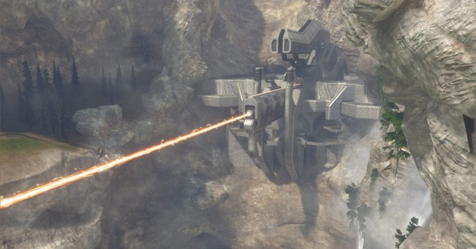
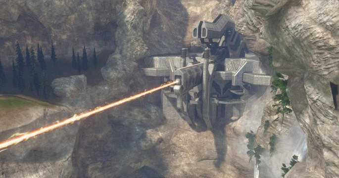
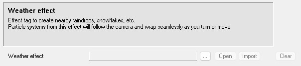
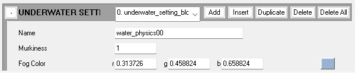

The **sky_atm_parameters** tag is used to create the atmospheric effects in a scenario. This includes light scattering from the sun in the atmosphere, fog, rain, and other effects.

These tags are created and edited using [Guerilla](~h3-guerilla).

## Related tags
* [effect](~)
* [particle](~)
* [scenario](~)
* [scenario_structure_bsp](~)
* [structure_design](~)

# Patchy Fog
This is a bitmap we can assign to our atmosphere settings to enhance the appearance of fog in our scenario. You can find some basic fog bitmaps in `levels\shared\bitmaps\nature\fog`.

| Patchy Fog Parameters | Description
|------- | -----------------------------------------------------------------------------------------------------------------------------------------------------------------------------------------------------------------------
| Texture repeat rate | Scaling factor to apply to fog UV coordinates.
| Distance between sheets | Separating distance between sheets of fog.
| Depth fade factor | Lower values (approching 0) cause a smoother fade at scene boundaries. Larger values (1 or more) make for a sharp transition.
| Cluster search radius | Distance (in world units) to search for neighboring clusters for the purpose of cross-fading atmosphere effects (20-50 seems reasonable, default = 25).
| Falloff start distance | Distance (in world units) at which to begin fading out the influence of a cluster (default = 5).
| Distance falloff power | Rate at which to begin attenuating the influence of neighboring clusters' fog settings (default = 2).
| Transparent sort distance | Distance from the camera where we sort the patchy fog effect (default = 100).

  

# Flags
This section of the tag is where the majority of the visual effects will be adjusted. Click add to create a new atmosphere index to begin adjusting values.

| Flags | Description
|------- | -----------------------------------------------------------------------------------------------------------------------------------------------------------------------------------------------------------------------
| Enable Atmosphere | Uncheck to turn off atmosphere effects
| Override Real Sun Values | Check to override physical sun (the one in the sky model)
| Patchy Fog | Check to enable patchy fog in the selected atmosphere index

| Name | Naming an atmosphere setting entry is for user convenience only, and has no use outside of the **sky_atm_parameters** tag
|------- | -----------------------------------------------------------------------------------------------------------------------------------------------------------------------------------------------------------------------

# Dominant Light Source
The Dominant Light Source field is where you can override how sun light from the sky affects the appearance of the atmosphere. The **Override Real Sun Values** flag must be checked for these values to work.

| Dominant Light Source | Description
|------- | -----------------------------------------------------------------------------------------------------------------------------------------------------------------------------------------------------------------------
| Pitch (0 to 90) | Overrides the angle of the sun.
| Heading (0 to 360) | Overrides the direction the sun light is emitting from.
| Color | Overrides the color tint of the atmosphere from the sun light.
| Intensity | Overrides how bright the color tint is.

# Scattering
The Scattering field is where you will define the thickness of the atmosphere within the scenario. 

| Scattering | Description
|------- | -----------------------------------------------------------------------------------------------------------------------------------------------------------------------------------------------------------------------
| Sea Level | In world units, set it to the lowest point of the scenario.
| Rayleigh Height Scale | In world units, height above sea level where atmosphere is 30% thick.
| Mie Height Scale | In world units, height above sea level where atmosphere is 30% thick.
| Rayleigh Multiplier | Affects scattering of light by small particles in the atmosphere.
| Mie Multiplier | Affects scattering of light by large particles in the atmopshere.
| Sun Phase Function | Scaled from 0-1, controls how focused light scattering is relative to the sun direction. 0 scatters light uniformly throughout the atmosphere, values closer to 1 focuses the scattering closer to the sun.
| Desaturation | Increase this to reduce the reddening effect.
| Distance Bias | Push the fog away from the player camera, or pull it in.
| Max Fog Thickness | The maximum distance for which non-patchy fog still increases in intensity; its effect clamps after that. Default value is usually good for most situations.

# Patchy Fog Per-Cluster Parameters
| Patchy Fog Per-Cluster Parameters | Description
|------- | -----------------------------------------------------------------------------------------------------------------------------------------------------------------------------------------------------------------------
| Sheet Density | Intensity scaling factor applied to all patchy fog sheets.
| Full Intensity Height | In world units, patchy fog will be at full intensity below this height.
| Half Intensity Height | In world units, height at which patchy fog will be attenuated to half intensity.
| Wind Direction | Direction and intensity of fog motion due to wind.

# Weather Effect
| Weather Effect | Description
|------- | -----------------------------------------------------------------------------------------------------------------------------------------------------------------------------------------------------------------------
 | You can reference [effect](~) tags with attached [particle](~) systems to create weather effects like rain, snowflakes, dust, etc.

# Underwater Settings
This section of the tag is where you can set parameters for the underwater fog effects for water physics volumes found in a scenario's [structure_design](~) tag. 

Click add to create a new entry, then set the name to match the name of a water physics volume you want the fog settings to apply to, then adjust the color and murkiness values to your liking. Create new entries and repeat this process for each water physics volume in the scenario's structure_design tag.

