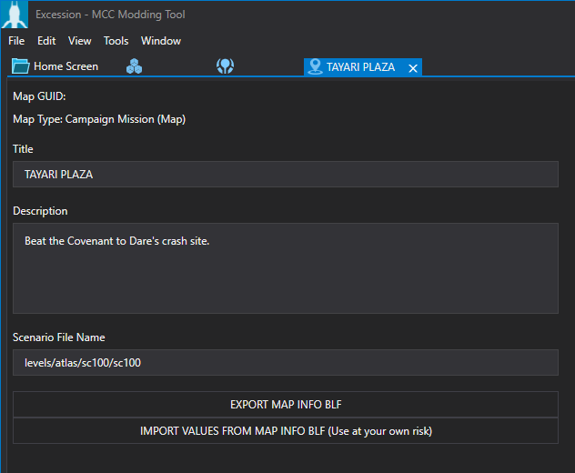

Halo 3: ODST introduced a new hs command known as `game_level_advance` which lets progress to a specified scenario, this guide will teach you how to properly set this up for use with UGC maps.

Setting up the level progression properly will fix UGC maps from returning to the vanilla Halo 3: ODST campaign after finishing a mission.

# Setup

## Guerilla
 
Open up Guerilla and navigate to the **game_progression.game_progression** tag which is located in the **globals** folder in your root tag directory.

At the bottom of the tag is where the **levels** block is located, if you're simply modifying existing levels here we simply need to change the **map id** and **campaign id** fields to **-1** for every block entry however if you're adding new entries to the block make sure to fill in the **script name** and **scenario** fields as well.

Once you've made your changes, save the tag and close Guerilla.
## Excession
In Excession, all you need to do is simply change the **Scenario File Name** field to your mission's .scenario tag WITHOUT the extension like so:

Once you've made your changes, save all files and close out of Excession.

# Finishing Up

That's all there is to it, to test out your changes make sure to compile your maps and run them in MCC!

