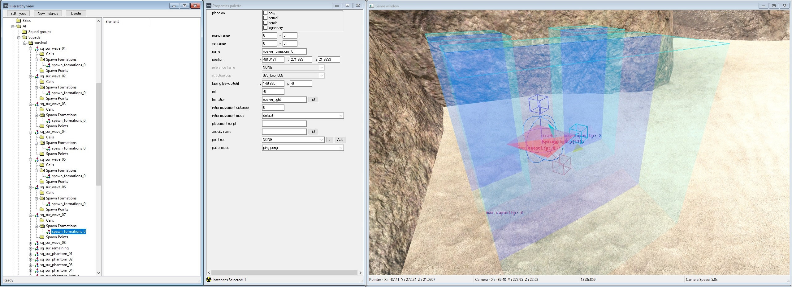

Thanks to Halo 3 ODST's new Firefight additions, it's far easier than it was previously to setup a new scenario to work with Firefight. There are just a handful of steps you need to take in order for things to work.


"A lone ODST faces an endless onslaught of Flood on this custom Firefight map."


# Sapien

## Squad groups

Firefight makes use of squad groups for spawning waves. Only one is required, but you should consider all of the following:

* A squad group for waves (**Required**)
* A squad group for remaining enemies (**Required**)
* A squad group for Phantoms
* A squad group for extra spawns in your scenario (**Required**)
* A squad group for bonus wave enemies
* A squad group for friendly characters
* A squad group for all survival units that your other squads are parented to (**Required**)

You can name each squad with whatever name you want, but it should be something memorable so you can later reference it in your scenario's scripts.

## Squads 

You will need to set up several squads for the scenario to use for spawning waves. Eight squads are needed for spawning the waves, and you'll also need a squad for the remaining enemies in a wave to be migrated to as well as a squad for the bonus wave. If you plan to have enemies spawn from Phantoms, you will also need a squad for each of them as well (max four phantoms). Squads you should have:

* 8 Squads minimum for waves (**Required**)
* 1 Squad for remaining enemies (**Required**)
* 1 Squad for the bonus wave (**Required**)
* 4 Squads maximum for Phantoms
* 1 Squad for the bonus wave Phantom

Once you've created your wave squads, each will need to be given a Spawn Formation - this is where the squad will spawn. The location you place the formation in must be within map bounds so that if players turn off dropship spawning in their gametype settings they can still complete each wave. You don't need to do this for the remaining enemies and bonus wave squads - these exist so other squads can be migrated to them. How you set up the other squads is up to you.



You can prevent different types of waves from using a squad by ticking the **excluded placement flags** in the squad's Properties palette. This allows you to specify that, for example, you do not want a flying vehicle to be spawned in a confined spawn.

Every wave squad as well as the bonus squad and remaining squads should also be given an **Objective** to at bare minimum assign them a **Zone**, **Area** and **Firing Positions** so they can move around the map. This objective will be reset by the global_survival script each time a new wave is spawned.

Note that even if you don't plan to use Phantoms in your scenario, you should still add one to your vehicle palette so that later the `global_survival` script will compile.

## Folders

For weapons, equipment, vehicles, scenery and crates, Firefight will attempt to respawn any objects within a number of folders which even if you don't plan on using you should set up in your scenario to allow scripts to compile. Unlike squads and squad groups, you should name these accordingly:

* Equipment - eq_survival
* Weapons - wp_survival
* Vehicles - v_survival
* Scenery - sc_survival
* Crates - cr_survival
* Boon Scenery - sc_survival_boons


It's recommended that you add at least one object to each folder, as empty folders are culled when Sapien loads a new scenario.

Weapons are usually spawned through scenery objects such as weapon_box and armory_shelf scenery objects instead of hand placed weapons - see the stubs section for more information.

Boons are only created when the gametype setting for them is enabled.

## Player starting points

Firefight uses different starting points to a regular campaign scenario. In order for players to be able to spawn, you need at at least one starting position for each player with the flag **survival mode** ticked. In addition, you will need to set the **insertion point index** to the one that your scenario or the one it is replacing uses. A list of insertion points used by existing Firefight maps is below:

* Alpha Site - 5
* Chasm Ten - 6
* Crater - 4
* Crater (Night) - 7
* Last Exit - 7
* Lost Platoon - 4
* Rally Point - 5
* Rally (Night) - 8
* Security Zone - 4
* Windward - 5

## Garbage Recycling

So that Firefight can periodly remove garbage objects such as destroyed vehicles and discarded weapons, you should have a **trigger volume** that covers the play area of your scenario. It's important that you give this the name `tv_sur_garbage_all` so that it can be accessed by the global survival script.

# Guerilla

## Zone Sets

A required step for survival maps to function is to have a zone set with the prefix `set_survival`. From the moment you place down a **Player starting point** with the survival flag ticked, you will need the survival zone set in order to load the map in the standalone client, even if you intend to play it as a campaign map.

To create a zone set, open your scenario file in Guerilla and navigate down to the zone sets block and add a new entry. Inside, name it `set_survival` and tick each **bsp zone flag** for each **structure bsp** that you intend to have loaded.


For maps with multiple survival areas, you can add suffixes to the set name such as `set_survival_a`.

## Designer Zones

In addition to Zone Sets, you can optionally include **Designer Zones** into your map. These can be made in Sapien within the **Caching/Zones/Resources** folder, but you are required to use Guerilla to assign them to a zone set like the one created above. Their main purpose is to separate which resources are loaded within a map at any given time - for example, in a campaign scenario you may only have a scarab within one zone set and not feature in any others, so there would be little point in loading it outside of that area.


One key usage of Designer Zones that is specific to Firefight is that once you include a vehicle that is also referenced by the **Multiplayer Globals** and add that Designer Zone to your `set_survival`, your map will also be able to use all other vehicles within Multiplayer Globals when using the Vehicle Set option in the Firefight Options menu within MCC.

Without any Designer Zones, your map will only be able to use vehicles that have been added to the palette, though this behaviour will not neccesarily be reflected when playtesting in the standalone client.

Additionally, you may notice that after you build your scenario into a cache file that it will include a Designer Zone named `dz_mp_globals`; this will contain any weapons, characters and optionally vehicles that are required by Firefight and it will automatically be added to your `set_survival` Zone Set(s).

# Scripting

In order for Firefight scripts to run on your level, you'll need to first add a mission script to your scenario to setup certain global variables, as well as add the global_survival script. You can add your mission script source in Sapien, as well as global_survival.hsc which is located in the globals folder by clicking on Scenarios and Add Mission Script.

Now inside of your mission's source file, you'll need to setup several globals for global_survival to use. For ease of use, [here is a template][template] you can use and copy containing comments to help you set up each variable. For each global being set in the mission_survival script, you should change the value to what you have set in your own scenario. 

Phantom load parameters determine how each phantom unloads its troops, which is useful if you only want Phantoms to drop off troops in a certain way. The values you can use are "**chute**", "**dual**", "**left**", "**right**" or "**null**" for if you don't intend to use phantoms. 

For the `s_atm_flood_setting_index` you should set it to the flood settings found in your scenario's `sky_atm_paramers` tag so that when Flood is spawned your level will have a matching atmosphere.

When you've set everything to your liking, head back into Sapien and hit Ctrl + Shift + C while in the Game window to recompile your scripts. If everything was done correctly, your scripts will compile without errors, if not check the output to find out what needs correcting.

## Stubs

Global survival contains several stub scripts which exist so you can override them with your scenario's scripts. These scripts are:

```
survival_scenario_weapon_drop
survival_scenario_new_wave
survival_vehicle_cleanup
survival_kill_volumes_on
survival_kill_volumes_off
```

It is up to you to decide how, if at all, you implement these scripts into your scenario. For example, you may wish to set `s_sur_dropship_type` to 0 in `survival_scenario_new_wave` if you do not want your scenario to use Phantoms or use `survival_kill_volumes_on` to prevent players from entering areas of the map not designated for survival.

You may wish to use the `survival_scenario_weapon_drop` script to respawn any items you've placed in your weapons folder as the global_survival script will not do so itself, instead preferring to spawn weaponry through scenery objects with attached weapons.

# Testing

When you've done setting everything up in your scripts and scenario file, you can try it out in tag test by placing the following commands inside init.txt which you should create inside your **H3ODSTEK** folder if it does not exist already.

```
;Difficulty
game_difficulty heroic
;Game variant
game_set_variant #variant_name_survival#
;Insertion point - set this to the one used by your starting points
game_insertion_point_set 4
;Path to your scenario file
game_start "path\to\your\scenario"
```

Your scenario will load your map using the variant from the `game_engine_settings_definition` tag and if everything is in place, Firefight will begin after a short countdown.

# Extra Information

* You can use the script command `pda_set_active_pda_definition` to change the PDA that your scenario uses to a different definition if applicable.
* Through the use of insertion points, you can create multiple different survival areas for your scenario. You can look at the scripts for h100 and sc130 for insight on how to implement this.
* It's recommended that you setup command scripts for your Phantoms so they can drop off troops and objectives for your wave squads so that they do not simply randomly patrol and instead advance towards the players position.

[template]: https://drive.google.com/file/d/1MikNcpdYAZJCALWZ7RoAG9GQHHTmI8_Y/view?usp=sharing
