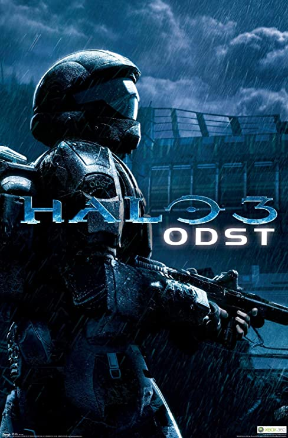

<figure>
  
  <figcaption>
    
Halo 3 ODST's box art featuring the Rookie

  </figcaption>
</figure>

**Halo 3 ODST** is the fourth instalment of the Halo game series and is set during the events of [Halo 2][h2]. It is not a direct sequel to [Halo 3][h3]. It was created by [Bungie][bungie] and initially released on the Xbox 360 in 2009 by publisher/owner [Microsoft][]. In 2015 the game was re-released as a part of *Halo: The Master Chief Collection* on the Xbox One and later in 2020 was ported to Microsoft Windows alongside other halo titles in the collection.

Like other games in the series Halo 3 ODST uses Bungie's proprietary [Blam!][engine].

## Xbox (Bungie, September 2009)
This is the classic first release of Halo 3 ODST for the Xbox 360.

### Modding
There are several tools and mods for the base game or external programs that users can grab to enhance their experience. Examples include:

* [Assembly][assembly] - A cache editing tool for various titles in the Halo series. Users can use this tool to make permanent edits to cache files and poke changes in real time. While not traditional workflow for map creation, it is a powerful tool that can be used to create interesting experiences. 
* [TagTool][tagtool] - A cache editing tool designed to allow *porting* of tag data between different versions and builds of the Blam engine, as well as importing brand new content.

Like all Halo games [tags][] play a large role in modding.

## MCC (PC and Xbox One, 343 Industries, 2015-Current day)
Halo: The Master Chief collection (MCC) is actively maintained by [343 Industries][343i] for both PC and Xbox One. It brings the Halo series under a single [Game as a Service][gaas], including unified matchmaking and progression experiences. The PC port uses [Unreal Engine][unreal] as a menu and input layer over the respective engines of each included Halo game.

In 2015, Halo 3 ODST was re-released for Xbox One as part of the Halo: The Master Chief Collection.

### Modding
There are several tools and mods for the base game or external programs that users can grab to enhance their experience. Examples include:

* [Halo 3 ODST Editing Kit][h3odst-ek] - The official editing suite released for the MCC version of Halo 3 ODST largely based on internal tools developed by Bungie and later used by 343 Industries and [Saber Interactive][saber]. Some changes were made to make the tools more user friendly and stable, as well as to support importing content from modern 3D modeling software.
* [Halo Asset Blender Development Toolset][halo-asset-blender-development-toolset] - A collection of tools for Blender that can be used to export the intermediate files used by the Halo 3 ODST Editing Kit. 
* [Assembly][assembly] - A cache editing tool for various titles in the Halo series. Users can use this tool to make permanent edits to cache files and poke changes in real time. While not traditional workflow for map creation, it is a powerful tool that can be used to create interesting experiences. 
* [TagTool][tagtool] - A cache editing tool designed to allow *porting* of tag data between different versions and builds of the Blam engine, as well as importing brand new content.

[bungie]: https://en.wikipedia.org/wiki/Bungie
[microsoft]: https://en.wikipedia.org/wiki/Xbox_Game_Studios
[saber]: https://en.wikipedia.org/wiki/Saber_Interactive
[343i]: https://en.wikipedia.org/wiki/343_Industries
[gaas]: https://en.wikipedia.org/wiki/Games_as_a_service
[unreal]: https://en.wikipedia.org/wiki/Unreal_Engine
