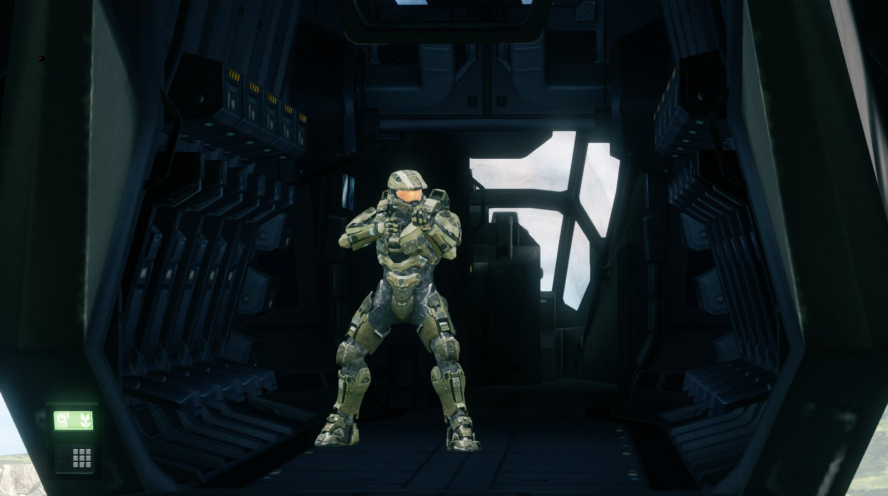

# Introduction
Halo 4's upgraded engine added many new features, one of which being the use of **vehicle airprobes**, which sample vehicle lighting to determine how nearby objects should be lit. This feature allows for players and other objects to correctly be darkened when inside a vehicle, instead of simply using the sky lighting. Vehicles can make use of multiple airprobes to allow for a number of lighting samples around the vehicle, resulting in lighting on objects inside the vehicle (such as players) being able to dynamically change based on their proximity to the nearest airprobe. See the following example for clarification:

# Setup and usage

This guide assumes you already have a basic knowledge of Blender and [Foundry](https://github.com/ILoveAGoodCrisp/Foundry-Halo-Blender-Creation-Kit). Foundry is still in active development - we will try to keep this guide up to date, but steps may become incorrect or unnecessary as the add-on changes.

## Adding airprobes in Blender
1. Using Blender with the [Foundry](https://github.com/ILoveAGoodCrisp/Foundry-Halo-Blender-Creation-Kit) addon, add a new marker (Empty) to your scene. Position it where you want to sample the vehicle lighting.
2. Parent the marker to your armature.
3. In the `Object Properties` panel, under the `Halo Object Properties` section, set the type to `Airprobe`. Alternatively, select the marker in the `3D Viewport` and use  to open the marker type radial menu. Select `Airprobe`.
4. If you wish to utitlise multiple airprobes, simply duplicate the airprobe marker as many times as necessary, moving them to different points around the vehicle where you think that there should be a change in lighting brightness/colour/etc.

## Adding a localised physics volume in Blender
As well as the airprobes themselves, the vehicle requires a localised physics volume or else the airprobes will not function. A localised physics volume is an area defined in the physics model, within which physics interactions are *local* to the vehicle. The best way to visualise this is with a flying vehicle that has an interior. Without a localised physics volume, any players standing inside the vehicle during flight will be flung around (usually completely flung out of the vehicle) as they do not accelerate with the vehicle itself. Adding a localised physics volume allows the player's physics to be calculated relative to the vehicle, meaning that they accelerate with the vehicle's movements and thus can stand and even walk around the interior during flight maneuvers without falling out.

Adding a localised physics volume to a vehicle is fairly trivial:
1. Add a new [strictly convex](~blender-object-creation-physics#strictly-convex-explanation) mesh object to your scene, parented to the armature as usual. Make it large enough such that it *completely surrounds* the interior of the vehicle. You can use multiple convex objects if needed.
2. In the `Halo Object Properties` in the `Object Properties` panel, set the type to `Physics`.
3. Set the `collision material` to something recognisable, ***that is different to the collision material used by the rest of your physics model***. For example, a new collision material named `localised`.
4. Export your scene as normal. Once the export and import process has completed, open your vehicle's `.physics_model` tag in Foundation.
5. Locate the `Phantom Types` block near the top. Add a new entry. Tick the `localizes physics` flag, and leave everything else default.
6. Scroll down to the `Materials` block. Under the entry with the same name as the new collision material you gave, e.g. `localised`, set the `Phantom Type` to the new phantom type entry you just created. This is how the game knows which physics shapes to apply the localised physics volume to, versus which shapes to treat as "standard" physics.

## Final requirements
There are three last requirements to get vehicle airprobes working - making sure the `.structure_meta` tag is assigned to the `.render_model`, the `early mover` flag in the `.vehicle` tag, and lightmapping the model. Let's get started:
1. Open your vehicle's `.render_model` tag, and scroll right to the bottom. Locate the `Structure Meta Data` field.
2. Enable `Expert Mode` with `Edit -> Expert Mode`.
3. Click the `...` next to the field, and choose your vehicle's `.structure_meta` tag. This should be in your vehicle's root folder, and is auto-generated during Foundry's export/import process.
4. Open your vehicle's `.vehicle` tag. In the `Flags` block near the top, tick `early mover` and `early mover localised physics`.
5. Open Foundation's `tool` GUI with . Set the radio button to `All Commands`. Search for or scroll down to `faux lightmap model` and select it.
6. For the `model` entry, simply select your vehicle's `.model` tag. You can leave the other two options `false`.
7. Press `Run Tool`. Wait for the GPU lightmapping GUI to appear. Set the options you wish to use - if you aren't sure what to pick, set the options as per the following image for a decent "medium" quality lightmapping result:

8. Wait for the lightmapping process to finish successfully. This should not take longer than a few minutes unless your render model is extremely complex.
9. Once the lightmapping is finished, check in-engine to see the results! If all has gone well, you should notice that the player biped (and other objects) respond correctly to the lighting inside the vehicle. You may wish to add more airprobes if the transitions are too harsh.

Halo 4 only displays model lightmapping in TagTest (Standalone). *You will not see the model lightmap or airprobe behaviour in Sapien*.
