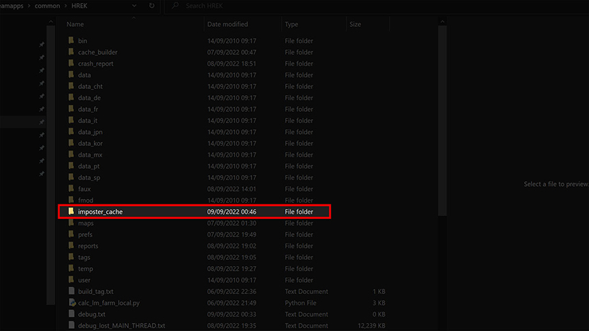
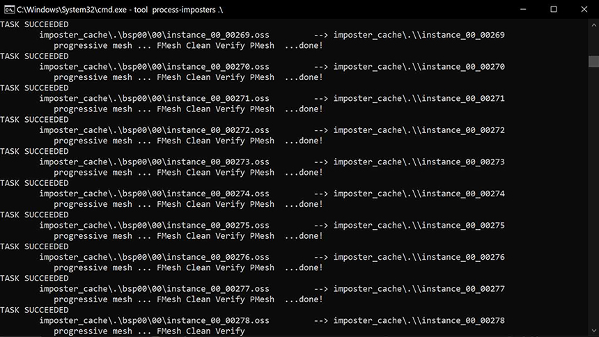
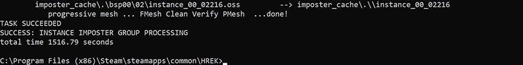
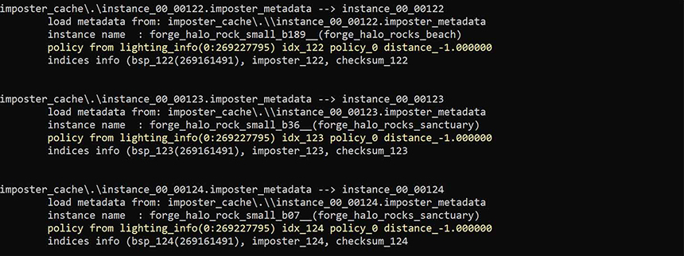
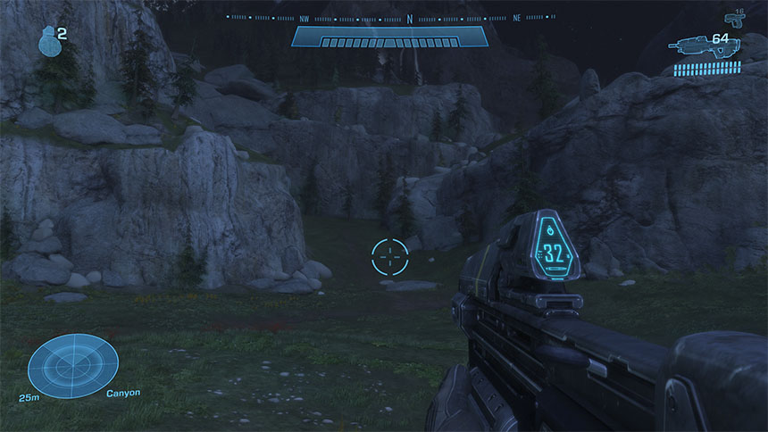

# File list
| File link                                                                                                         | Description
|------------------------------------------------------------------------------------------------------------------ | --------------------------------------------------------------------------------
[End result](https://drive.google.com/file/d/1b2upKsiYUlI3Nji-8L2UteFU3ipU1YY7/view?usp=sharing)                    | An [instance_imposter_definition](~) tag that will  match the final product of this tutorial for you to compare.
[Tutorial tags](https://drive.google.com/file/d/1tFy3f72YZ59VaFrWn8CqkEg8aRiAEJAg/view?usp=sharing)                 | Tutorial folders that contain the tags we will be using in this guide. Make sure to have them extracted to your "levels" folder.


## Introduction

**Instance imposters** are essentially low-level of detail (LOD) models of instanced geometry objects. These are usually generated when importing a map into the game for the first time, but if things change such as the skybox, lighting, or any other map changes you may want to regenerate them.

This tutorial will provide a copy of a night time Forge World with regular Forge World instance imposters and show you how to regenerate them to match the new lighting of the map.


Before we begin, if this isn't your first time following this tutorial then please make sure there is no "imposter_cache" folder in the root of your HREK folder. If there is then please delete it as this will cause issues.


# Loading the map

So, the first step of this tutorial will be to load up the night time Forge World in [Standalone](~hr-standalone-build). Once you've booted Standalone hit the  key on your keyboard, and type the following:

```console
; load tags\levels\mods\twilight_world\twilight_world.scenario:
game_start levels\mods\twilight_world\twilight_world
```

Once you have loaded into the map, you will see this:


See those brown, low-quality rocks that stick out like a sore thumb? Those are our instance imposters. Normally you wouldn't notice them this close, but Standalone has a low render distance (which is very helpful in this case). We will regenerate the imposters so they blend in with the lighting properly.

# Running the imposter snapshot command

To regenerate imposters, open the console again and enter:

```console
structure_instance_snapshot <bsp_index>
```
In this case, the BSP index we want to regnerate for is `0`, so enter `structure_instance_snapshot 0`. This field will let you dictate what BSP index you want to generate instance imposters for.

As soon as you press enter your screen will go black and you'll see a series of images flash in the top left of your screen:


This is the game taking a snapshot of every instanced imposter on the map at it's highest quality at several different angles so it can later convert it into a low quality mesh. It also takes into account the map's current lighting (you'll notice the rocks are pale blue now). Overall, process can be quite lengthy -- usually around 40 minutes depending on your PC and the amount of instance geometry, so take a break while you're waiting on imposters being snapshotted.


If standalone stalls/freezes up, don't panic. This is normal. Once done, the game will resume as normal.


# Processing the imposters

Once your Standalone has resumed, you can go ahead and close it. Now navigate to your HREK folder, and notice how there's a new folder called `imposter_cache`.



Now we want to process our imposter snapshots. To do this, open `cmd` in your HREK folder. Once done, enter the following:

```console
tool process-imposters .\
```
This command will locate the `imposter_cache` folder in the root of your HREK, and begin to process the files within. You'll see something resembling this in your `cmd` prompt:



Again, this can take some time depending on your hardware, but once done you'll see this:



Now inside your `imposter_cache` folder you'll see new files with the extension `.imposter_metadata`.


# Building a new _instance_imposter_definition_ tag

With all of the previous steps above completed, all that's left to do now is to run the command
```console
tool build-instance-imposter .\
```
from `cmd` in your HREK folder. Once done, you will see something like this:



This command is essentially taking all of those files that you've generated and replacing (or generating) a new [instance_imposter_definition](~) tag in the folder of the map you originally snapshotted them from. Once done, you'll notice that any previously existing [instance_imposter_definition](~) tag will now be timestamped to when you finished running this process.

# Admire your new imposters

Et Voila! You now have regenerated/new instanced imposters. They should now be a pale blue colour to match the rest of the map:



Keep in mind that this can be done for ANY map that you change the skybox/lighting of. So go crazy with it! Also remember to delete your `imposter_cache` folder after each regeneration to avoid any future file conflicts or bugs.

Happy impostering!