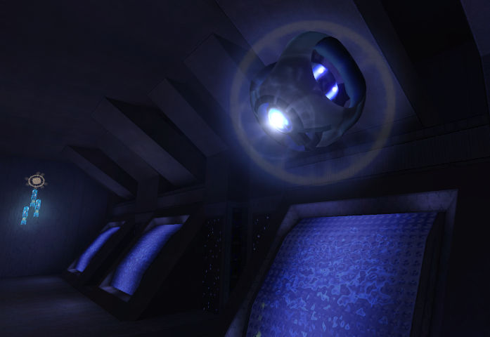

Welcome to **The Reclaimers Library** (**c20**), a project which aims to document and centralize the immense tribal knowledge of the [Halo: Combat Evolved][h1] modding community. This is an unofficial resource by modders, for modders.

_Modding_ is the modification of a game by its fans in order to change existing content, add new content, or implement unofficial bug fixes and game features. Halo 1 has a strong tradition of modding starting from Xbox, moving to PC with Custom Edition, and continuing today with H1A for MCC.

```.alert
This website is always growing!
If you would like to contribute, see our [Github project](https://github.com/Sigmmma/c20#contributing).
```

# Why mod Halo?
Halo's 2001 engine is not as generalized as _Unity_, _Source_, _Creation Engine_, and _Unreal_, but this is actually a strength. Halo provides all the foundational game systems of a sandbox shooter, yet these systems are highly data-driven by [_tag_ assets][h1/tags] which you create. No coding required!

Dip your toes in with simple modifications to existing maps, or build a complete custom content overhaul. The relative simplicity of Halo's assets means a lower barrier to entry.

Perhaps the best part is connecting with other creative, passionate fans. Knowledge sharing and collaborative work are staples of this community.

# Getting started
We cover [engine details][engine], the legacy 2003 [Halo Editing Kit][hek] and its 2021 re-release the [H1A Editing Kit][h1a-ek], community tools, and [guides][] for custom content creation.

<div class="card" style="background-image: url(/h1/guides/level-creation-advanced/1X.jpg)">

**Featured guide:** [Creating a custom map][blender-prep].

</div>
