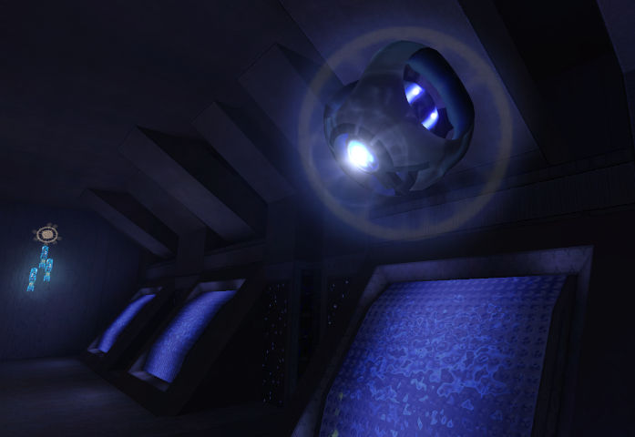

<figure>
  
  <figcaption>
    
"This installation's research facilities are most impressive! Perhaps we'll have time to see them later."

  </figcaption>
</figure>

Bienvenido a **La Biblioteca de Reclaimers**, un proyecto que tiene como objetivo documentar y centralizar el inmenso conocimiento tribal de la comunidad de modding de [Halo: Combat Evolved][h1]. Cubrimos los [detalles del motor][engine], [Halo Editing Kit][hek], herramientas de la comunidad y [guías][guides] para la creación de contenido personalizado.

# ¿Por qué mod Halo?
_Modding_ es la modificación de un juego por parte de sus jugadores. Esto puede incluir correcciones de errores no oficiales, contenido nuevo y cambios en el contenido existente.

El motor 2001 de Halo puede no ser tan flexible como los motores modernos de propósito general como _Unity_, _Source_, _Creation Engine_ y _Unreal_, pero este es en realidad uno de sus puntos fuertes. En lugar de tener que comenzar desde cero o ensamblar sistemas y activos de juego dispares, Halo proporciona la base para un juego de disparos en la zona de pruebas en el que puede escalar su participación.

Sumerja sus dedos de los pies con modificaciones simples a los mapas existentes o cree una revisión completa del contenido personalizado. La mayoría de los sistemas de juego se basan en gran medida en los datos del exclusivo [sistema de "tags"][h1/tags] de Halo, por lo que no es necesario codificar El estilo de arte retro de Halo significa que puedes concentrarte en los fundamentos; los mapas y otros activos personalizados no requieren alta fidelidad visual. El juego se presta bien a la modificación de pasatiempos o como puerta de entrada a otros motores.

Una de las mejores partes es conectarse con fanáticos creativos y apasionados y compartir su nostalgia por un gran juego. El intercambio de conocimientos y el trabajo colaborativo son elementos básicos de esta comunidad.
